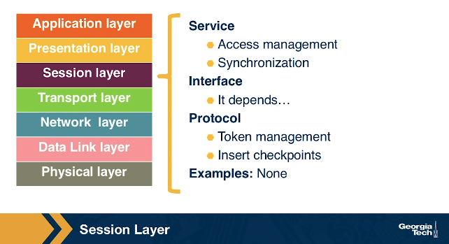
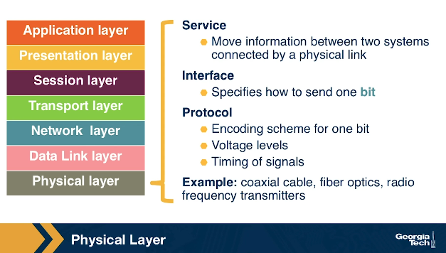

# Introduction, History, and Internet Architecture

Why Study Computer Networks?

- Internet growth
- Networks play an instrumental role in our society
- Networking is a playground for interdisciplinary research innovations

A Brief History of the Internet:

- 1962, **J.C.R. Licklider's Galactic Network**: Licklider's vision at MIT envisioned a global network where data could be accessed through interconnected computers. This laid the foundation for future developments in computer networking.
- 1969, **ARPANET**: Lawrence G. Roberts connected computers in Massachusetts and California, proving the viability of time-shared infrastructure. This led to the creation of ARPANET, linking four nodes across different universities.
- 1970, **Network Control Protocol (NCP)**: As ARPANET expanded, the need for a host-to-host protocol became evident. NCP was introduced, allowing users to start developing applications. Email emerged as one of the pioneering applications in 1972.
- 1973, **TCP/IP**: Bob Kahn's team at DARPA proposed open-architecture networking. TCP/IP, derived from the NCP, split into Transmission Control Protocol (TCP) for services and Internet Protocol (IP) for packet addressing, enhancing networking capabilities.
- 1983, **Domain Name System (DNS)**: The increasing scale of the internet demanded a scalable addressing system. DNS, introduced by Paul Mockapetris at USC, translated domain names to IP addresses in a distributed manner.
- 1990, **World Wide Web (WWW)**: Tim Berners-Lee's team introduced the World Wide Web, leveraging the internet's infrastructure to create a global system of interconnected hypertext documents.

These milestones paved the way for the modern internet, enabling global connectivity, diverse applications, and an interconnected digital world.

## The OSI Stack and the 5-Layer Internet Protocol Stack

The Internet architecture follows a layered model, where every layer provides some service to the layer above. *The interface between the application layer and the transport layer is the sockets*. It is up to the application developer to design the functionality of the overall application.

### The Application Layer

The application layer includes multiple protocols. Here are some of the most popular protocols:

- HTTP (web)
- SMTP (e-mail)
- FTP (transfers files between two end hosts)
- DNS (translates domain names to IP addresses)

At the application layer, we refer to the packet of information as a **message**.

### The Presentation Layer

The presentation layer plays the intermediate role of formatting the information that it receives from the layer below and delivering it to the application layer. For example, some functionalities of this layer are formatting a video stream or translating integers from big endian to little endian format.

### The Session Layer

The session layer is responsible for the mechanism that manages the different transport streams that belong to the same session between end-user application processes. For example, in the case of a teleconference application, it is responsible to tie together the audio stream and the video stream.

### The Transport Layer

The transport layer is responsible for the end-to-end communication between end hosts. In this layer, there are two transport protocols:

- Transmission Control Protocol (**TCP**)
- User Datagram Protocol (**UDP**)

The services that TCP offers include a connection-oriented service to the applications that are running on the layer above, guaranteed delivery of the application-layer messages, flow control which, in a nutshell, matches the sender’s and receiver’s speed, and a congestion-control mechanism, so that the sender slows its transmission rate when it perceives the network to be congested.

The UDP protocol provides a connection-less, best-effort service to the applications that are running in the layer above without reliability, flow, or congestion control.

At the transport layer, we refer to the packet of information as a **segment**.

### The Network Layer

The network layer is responsible for moving datagrams from one Internet host to another. A source host sends the segment (along with the destination address) from the transport layer to the network layer. The network layer is responsible for delivering the datagram to the transport layer at the destination host.

At the network layer, we have the **Internet Protocol (IP)** and the routing protocols. IP is often referred to as "the blue" that binds the Internet together. All Internet hosts and devices that have a network layer must run the IP protocol. It defines the fields in the datagram and how the source/destination hosts and the intermediate routers use these fields so that the datagrams that a source Internet host sends reach their destination. The routing protocols determine the routes that the datagrams can take between sources and destinations.

In this layer, we refer to the packet of information as a **datagram**.

### The Data Link Layer

The data link layer is responsible for moving the frames from one node (host or router) to the next node. More specifically, assuming we have a sender and receiver host, the network layer will route the datagram through multiple routers across the path between the sender and the receiver. At each node across this path, the network layer passes the datagram to the data link layer, which in turn delivers the datagram to the next node. Then, at that node, the link layer passes the datagram up to the network layer.

The data link layer offers services that depend on the data link layer protocol that is used over the link. Some example services include reliable delivery, which covers data transmission from one node across one link to the receiving node. We note that this specific type of reliable delivery service is different from the reliable delivery service that is offered by the TCP protocol, which offers reliability from the source host to the destination end host.

Some example protocols in this layer include Ethernet, Point-to-Point Protocol (PPP), and WiFi.

In this layer, we refer to the packets of information as **frames**.

### The Physical Layer

The physical layer facilitates the interaction with the actual hardware. It is responsible for transferring bits within a frame between two nodes that are connected through a physical link. The protocols in this layer again depend on the link and on the actual transmission medium of the link. One of the main protocols in the data link layer, Ethernet, has different physical layer protocols for twisted-pair copper wire, coaxial cable, and single-mode fiber optics.

## Layers Encapsulation / De-Encapsulation

Encapsulation is the process of taking data from one protocol and translating it into data that are used by another protocol, so the data can continue across a network. Consider the following diagram:

The sending host sends an application layer message M to the transport layer. The transport layer receives the message, and it appends the transport layer header information (HT). The application message, along with the transport layer header, is called a segment (or transport layer segment). The segment thus *encapsulates* the application layer message. This added information can help the receiving host inform the receiver-side transport layer about which application to deliver the message to, perform error detection, and determine whether bits in the message have been changed along the route.

The segment is then forwarded to the network layer, which, in turn, adds its own network header information (HN). The entire combination of the segment and the network header is called a datagram. We say that the datagram *encapsulates* the segment. The header information that the network layer appends includes the source and destination addresses of the end hosts. The same process continues for the data link layer, which in turn appends its own header information (HL). The message at the data link layer is called a frame, which is transmitted across the physical medium. At each layer, the message is a combination of two parts: the payload, which is the message from the layer above, and the new appended header information. At the receiving end, the process is reversed, with headers being stripped off at each layer. This reverse process is known as **de-encapsulation**.

The path that connects the sending and the receiving hosts may include intermediate layer-3 devices, such as **routers**, and layer-2 devices, such as **switches**. Both routers and layer-2 switches implement protocol stacks similarly to end-hosts. The difference is that routers and layer-2 switches do not implement all the layers in the protocol stack; routers implement layers one to three (physical, data link, and network), and layer-2 switches implement layers one to two (physical and data link).

## The End-to-end (e2e) Principle

The e2e principle suggests that specific application-level functions usually cannot, and preferably should not, be built into the lower levels of the system at the core of the network. In simple terms, the e2e principle is summarized as follows: the network core should be simple and minimal, while the end systems should carry the intelligence.

The e2e principle allowed the internet to grow rapidly because evolving innovation took place at the network edge, in the form of numerous applications and a plethora of services, rather than in the middle of the network, which could be hard to modify later. Moving functions and services closer to the applications that use them increases the flexibility and the autonomy of the application designer to offer these services to the needs of the specific application.

## Violations of e2e

1. **Firewalls** and traffic filters. Firewalls usually operate at the periphery of a network, and they monitor the network traffic going through. They will either allow traffic to go through or drop traffic flagged as malicious. Firewalls violate the e2e principle since they are intermediate devices operated between two end hosts and can drop the end hosts' communication.
2. **Network Address Translation (NAT)**. NAT boxes act as a temporary solution to the scarcity of internet addresses. In a NAT-enabled home router, a single public IP address is assigned to the interface facing the public Internet, while the other interface, facing the home network, receives an IP address from a private subnet (e.g., 10.0.0/8 or 192.168.0.0/24). The NAT-enabled router acts as a translator, rewriting source and destination IP addresses and ports. The translation table maps public-facing IP addresses/ports to those of hosts within the private network. However, hosts behind NAT lack global addressability, preventing other public Internet hosts from initiating connections to them.

## The Hourglass Shape of Internet Architecture

The Internet protocol stack has a layered architecture that resembles an hourglass shape.

The lower and higher layers tend to see frequent innovations, while the protocols at the waist of the hourglass appear to be “ossified”.

## The Evolutionary Architecture model (EvoArch)

**EvoArch** is an abstract model for studying protocol stacks and their evolution. The model represents an abstract internet protocol stack with layers, nodes, and dependencies. Each layer is associated with generality probabilities and evolutionary values, determining a node's survival based on competitors and a death and birth process. The EvoArch model operates in discrete rounds, introducing new nodes, updating values, and removing nodes. The width of layers in the model varies, impacting the survival and competition among protocols.

The EvoArch model sheds light on the survival of the TCP/IP stack, emphasizing its growth without direct competition with the powerful telephone network. The stability of IPv4, TCP, and UDP is explained by the model's prediction that a high birth rate above the waist leads to the demise of protocols at the waist if not chosen as substrates by new nodes. The transport layer acts as an "evolutionary shield," stabilizing IPv4 by hindering potential new transport protocols. Looking forward, EvoArch predicts that new internet architectures may evolve into an hourglass shape, leading to the emergence of ossified protocols. To prevent such ossification, the model suggests designing layers with non-overlapping but general services to avoid competition.

## Interconnecting Hosts and Networks

We have different types of devices that help to provide connectivity between hosts that are in the same network or help interconnect networks. These devices offer different services, and they operate over different layers.

**Repeaters and Hubs**: They operate on the physical layer (L1) as they receive and forward digital signals to connect different Ethernet segments. They provide connectivity between hosts that are directly connected (in the same network). The advantage is that they are simple and inexpensive devices, and they can be arranged in a hierarchy. Unfortunately, hosts that are connected through these devices belong to the same collision domain, meaning that they compete for access to the same link.

**Bridges and Layer-2 Switches**: These devices can enable communication between hosts that are not directly connected. They operate on the data link layer (L2) based on MAC addresses. They receive packets and forward them to the appropriate destination. A limitation is the finite bandwidth of the outputs. If the arrival rate of the traffic is higher than the capacity of the outputs, then packets are temporarily stored in buffers. But if the buffer space gets full, then this can lead to packet drops.

**Routers and Layer-3 Switches**: These are devices that operate on the network layer (L3) (more on these in future lectures).

## Learning Bridges

A **bridge** is a device with multiple inputs and outputs that transfers frames from an input to one (or multiple) outputs. However, it does not need to forward all the frames it receives. A **learning bridge** learns, populates, and maintains a forwarding table. The bridge consults its forwarding table so that it only forwards frames on specific ports rather than all ports. When the bridge receives any frame, this is a “learning opportunity” to know which hosts are reachable through which ports. This is because the bridge can view the port over which a frame arrives and the source host.

For example, let’s consider the topology in the following figure. When the bridge receives a frame on port 1, with source Host A and destination Host B, the bridge does not have to forward it to port 2.

Eventually, the bridge builds the following forwarding table.

## The Looping Problem in Bridges and the Spanning Tree Algorithm

Unfortunately, using bridges to connect LANs fails if the network topology results in loops (cycles). In that case, the bridges loop through packets forever! The answer to this problem is to exclude links that lead to loops by running the spanning tree algorithm. First, let’s represent the topology of the network as a graph. The bridges are represented as nodes, and the links between the bridges are represented as edges. The goal of the spanning tree algorithm is to have the bridges select which links (ports) to use for forwarding eliminating loops.

The algorithm runs in “rounds,” in each round, every node (bridge) sends a configuration message to neighbors, including its ID, perceived root ID, and the number of hops to that perceived root. Nodes track the best configuration received and compare it with messages from neighbors. Initially, each node assumes it is the root and sends a message with its ID, perceived root ID (itself), and zero hops. Message comparison follows rules: a) smaller root ID, b) equal root IDs with smaller distance, or c) equal root IDs and distances, then choose the sender with the smallest ID. Nodes cease sending messages over a link upon receiving a message indicating a different root, prioritizing a closer root or one with a smaller ID.

## Study Questions

### What are the advantages and disadvantages of a layered architecture?

- Advantages:
  - Scalability
  - Modularity
  - Flexibility to add / remove components
  - Cost-effective
- Disadvantages:
  - Some layers' functionality depends on the information from other layers, which can violate the goal of layer separation.
  - Duplicated functionality between layers
  - Additional overhead caused by the abstraction between layers

### What are the differences and similarities between the OSI model and the five-layered Internet model?

In the five-layered internet model the application, presentation, and session layers are combined into a single layer, and this combined layer is called the application layer. *The interface between the application layer and the transport layer is the sockets.*

### What are sockets?

Sockets are a programming interface (API) used for network communication between processes running on different devices, typically over a network. They provide a mechanism for processes (applications or software components) to establish communication channels and exchange data.

### Describe each layer of the OSI model

### Provide examples of popular protocols at each layer of the five-layered Internet model

### What is encapsulation, and how is it used in a layered model?

The process of taking data from one protocol and translating it into data that are used by another protocol, so the data can continue across a network.

### What is the end-to-end (e2e) principle?

Specific application-level functions usually cannot, and preferably should not, be built into the lower levels of the system at the core of the network

### What are the examples of a violation of e2e principle?

Firewalls, traffic filters, and NAT boxes.

### What is the EvoArch model?

An abstract model for studying protocol stacks and their evolution.

### Explain a round in the EvoArch model

EvoArch is a discrete-time model that is executed over rounds. At each round, we perform the following steps:

1. We introduce new nodes, and we place them randomly within the layers.
2. We examine all layers, from the top to the bottom, and we perform the following tasks:
   1. We connect the new nodes that we may have just introduced to that layer by choosing substrates based on the generality probabilities of the layer below s(l−1) and by choosing products for them based on the generality probability of the current layer s(l).
   2. We update the value of each node at each layer l, given that we may have new nodes added to the same layer l.
   3. We examine all nodes in order of decreasing value in that layer and remove the nodes that should die.
3. Finally, we stop the execution of the model when the network reaches a given number of nodes.

### What are the ramifications of the hourglass shape of the internet?

The lower and higher layers tend to see frequent innovations, while the protocols at the waist of the hourglass appear to be “ossified” (rigid, hardened, or resistant to change). Thus, many technologies that were not originally designed for the internet have been modified so that they have versions that can communicate over the internet (such as Radio over IP). Also, it has been a difficult and slow process to transition to IPv6, despite the shortage of public IPv4 addresses.

### Repeaters, hubs, bridges, and routers operate on which layers?

Repeaters and hubs operate on the physical layer (L1), bridges operate on the data link layer (L2), and routers operate on the network layer (L3).

### What is a bridge, and how does it “learn”?

Bridges enable communication between hosts that are not directly connected. When the bridge receives any frame, this is a “learning opportunity” to know which hosts are reachable through which ports. This is because the bridge can view the port over which a frame arrives and the source host.

### What is a distributed algorithm?

A distributed algorithm is a type of algorithm designed to solve a computational problem that involves multiple independent entities or components, often referred to as nodes or processes, that operate concurrently and communicate with each other through a network. These entities collaborate to achieve a common goal or solve a particular problem by exchanging information and coordinating their actions.

### Explain the Spanning Tree Algorithm

### What is the purpose of the Spanning Tree Algorithm

The main purpose of the Spanning Tree Algorithm is to establish a single, loop-free path through the network, ensuring that data frames can be forwarded without encountering infinite loops.

### Practice Quizzes

#### Some data link layer protocols, such 802.11 (WiFi), implement some basic error correction as the physical medium used is easily prone to interference and noise (such as a nearby running microwave). Is this a violation of the end-to-end principle?

No, because violations of the e2e principle typically refer to scenarios where it is not possible to implement a functionality entirely at the end hosts, such as NAT and firewalls.

In this question, we have a lower level protocol implementing error checking.

#### What are ramifications of the “hourglass shape of the internet”?

1. Many technologies that were not originally designed for the internet have been modified so that they have versions that can communicate over the internet (such as Radio over IP).
2. It has been a difficult and slow process to transition to IPv6, despite the shortage of public IPv4 addresses.

#### Consider the following statements about the Spanning Tree Algorithm (STA), a network protocol used to organize and manage network paths. Which of these statements is correct?

A. The Spanning Tree Algorithm helps to manage data flow in networks to prevent overwhelming traffic, known as 'broadcast storms'.
B.  In the Spanning Tree Algorithm, the root of the spanning tree is always positioned centrally to minimize the distance to all other network nodes.
C. When using the Spanning Tree Algorithm, data cannot be sent over a network link that the algorithm has deactivated or put into an inactive state.

- A is correct. That is the purpose of the Spanning Tree Algorithm. Although it is still possible to have broadcast storms on the network (such as from a bad network card), STA prevents broadcast storms that result from having loops present in the network topology. B is incorrect. The Spanning Tree Algorithm presented guarantees a unique spanning tree that all the nodes will agree to, but sometimes this is not optimal tree. Network administrators can configure the switch ID if they want to have a specific spanning tree. C is incorrect. Traffic can still reach the link, but the link is not used to forward traffic.
