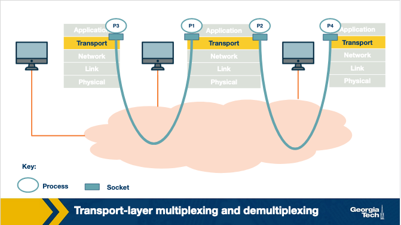

# The Transport Layer

## Intro to the Transport Layer and TCP/UDP

The transport layer provides an end-to-end connection between two applications running on different hosts. The transport layer provides this logical connection regardless of whether the hosts are in the same network. The following paragraph summarizes how this works.

The transport layer on the sending host receives a message from the application layer and appends its own header. We refer to this combined message as a **segment**. This segment is then sent to the network layer which will append (encapsulate) this segment with its header information. Then the message is sent to the receiving host via routers, bridges, switches, etc.

Why add an extra layer between the application and network layers? The network layer operates on a best-effort delivery model, lacking guarantees for packet delivery and data integrity. The transport layer bridges this gap, providing essential functionalities. It enables application developers to create applications with a standardized set of functions, ensuring compatibility across various networks despite different interfaces and potential network unreliability.

The two most common transport layer protocols are **User Datagram Protocol** (**UDP**) and **Transmission Control Protocol** (**TCP**). These protocols offer different functionalities to application developers. UDP provides basic functionality and relies on the application layer to implement the remaining. On the other hand, TCP provides strong primitives to make end-to-end communication more reliable and cost-effective. Because of these primitives, TCP is used for most applications.

## Multiplexing: Why Do We Need It?

One of the desired functionalities of the transport layer is the ability for a host to run multiple applications to use the network simultaneously, known as **multiplexing**.

Consider the need for transport layer multiplexing with a simple example: a user using Facebook and Spotify simultaneously, both involving communication with different servers. The network layer relies only on IP addresses, lacking specificity about which processes on the host should receive incoming packets. An addressing mechanism is essential to distinguish processes sharing the same IP address on the same host.

The transport layer solves this problem by using additional identifiers known as **ports**. Each application binds itself to a unique port number by opening sockets and listening for any data from a remote application. Therefore, the transport layer can do multiplexing by using ports.

There are two ways we can use multiplexing: 1. Connectionless and 2. connection-oriented multiplexing. As the name suggests, it depends if we have a connection established between the sender and the receiver or not.

## Connection and Connectionless Multiplexing/Demultiplexing

Consider the scenario shown in the figure above, which includes three hosts running an application. A receiving host that receives an incoming transport layer segment will forward it to the appropriate socket. The receiving host identifies the appropriate socket by examining a set of fields in the segment. The job of delivering the data included in the transport-layer segment to the appropriate socket, as defined in the segment fields, is called **demultiplexing**.

Similarly, the sending host will need to gather data from different sockets and encapsulate each data chunk with header information (that will later be used in demultiplexing) to create segments, and then forward the segments to the network layer. We refer to this job as **multiplexing**.
