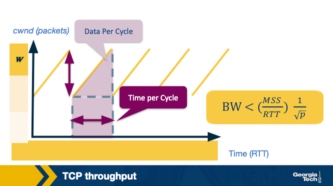

# The Transport Layer

## Intro to the Transport Layer and TCP/UDP

The transport layer provides an end-to-end connection between two applications running on different hosts. The transport layer provides this logical connection regardless of whether the hosts are in the same network. The following paragraph summarizes how this works.

The transport layer on the sending host receives a message from the application layer and appends its own header. We refer to this combined message as a **segment**. This segment is then sent to the network layer which will append (encapsulate) this segment with its header information. Then the message is sent to the receiving host via routers, bridges, switches, etc.

Why add an extra layer between the application and network layers? The network layer operates on a best-effort delivery model, lacking guarantees for packet delivery and data integrity. The transport layer bridges this gap, providing essential functionalities. It enables application developers to create applications with a standardized set of functions, ensuring compatibility across various networks despite different interfaces and potential network unreliability.

The two most common transport layer protocols are **User Datagram Protocol** (**UDP**) and **Transmission Control Protocol** (**TCP**). These protocols offer different functionalities to application developers. UDP provides basic functionality and relies on the application layer to implement the remaining. On the other hand, TCP provides strong primitives to make end-to-end communication more reliable and cost-effective. Because of these primitives, TCP is used for most applications.

## Multiplexing: Why Do We Need It?

One of the desired functionalities of the transport layer is the ability for a host to run multiple applications to use the network simultaneously, known as **multiplexing**.

Consider the need for transport layer multiplexing with a simple example: a user using Facebook and Spotify simultaneously, both involving communication with different servers. The network layer relies only on IP addresses, lacking specificity about which processes on the host should receive incoming packets. An addressing mechanism is essential to distinguish processes sharing the same IP address on the same host.

The transport layer solves this problem by using additional identifiers known as **ports**. Each application binds itself to a unique port number by opening sockets and listening for any data from a remote application. Therefore, the transport layer can do multiplexing by using ports.

There are two ways we can use multiplexing: 1. Connectionless and 2. connection-oriented multiplexing. As the name suggests, it depends if we have a connection established between the sender and the receiver or not.

## Connection and Connectionless Multiplexing/Demultiplexing

Consider the scenario shown in the figure above, which includes three hosts running an application. A receiving host that receives an incoming transport layer segment will forward it to the appropriate socket. The receiving host identifies the appropriate socket by examining a set of fields in the segment. The job of delivering the data included in the transport-layer segment to the appropriate socket, as defined in the segment fields, is called **demultiplexing**.

Similarly, the sending host will need to gather data from different sockets and encapsulate each data chunk with header information (that will later be used in demultiplexing) to create segments, and then forward the segments to the network layer. We refer to this job as **multiplexing**.

The sockets are identified based on special fields (shown below) in the segment such as the **source port number field** and the **destination port number field**.

### Connectionless multiplexing/demultiplexing (UDP)

The identifier of a UDP socket is a two-tuple that consists of a destination IP address and a destination port number. Consider two hosts, A and B, which are running two processes at UDP ports a and b, respectively. Suppose that Host A sends data to Host B. The transport layer in Host A creates a transport-layer segment with the application data, the source port, and the destination port, and then Host A forwards the segment to the network layer. In turn, the network layer encapsulates the segment into a network-layer datagram and sends it to Host B with best-effort delivery.

Let’s suppose that the datagram is successfully received by Host B. The transport layer at host B identifies the correct socket by looking at the field of the destination port. In the case host B runs multiple processes, each process will have its own UDP socket and, therefore, a distinct associated port number. Host B will use this information to demultiplex the receiving data to the correct socket. Suppose Host B receives UDP segments with a specific destination port number. In that case, it will forward the segments to the same destination process via the same destination socket, even if the segments come from different source hosts or source port numbers.

### Connection multiplexing/demultiplexing (TCP)

The identifier for a TCP socket is a four-tuple that consists of the source IP, source port, destination IP, and destination port. Let’s consider the example of a TCP client-server, as shown in the figure above. The TCP server has a listening socket that waits for connection requests coming from TCP clients. A TCP client creates a socket and sends a connection request, which is a TCP segment that has a source port number chosen by the client, a destination port number 12000, and a special connection-establishment bit set in the TCP header. Finally, the TCP server receives the connection request and creates a socket identified by the four-tuple source IP, source port, destination IP, and destination port. The server uses this socket identifier to demultiplex incoming data and forward them to this socket. Now, the TCP connection is established, and the client and server can send and receive data between one another.

Let's look at an example connection establishment.

In this example, we have three hosts: A, B, and C. Host C initiates two HTTP sessions to server B, while Host A initiates one HTTP session to server B. Hosts C and A assign port numbers to their connections independently of one another. Host C assigns port numbers 26145 and 7532. If Host A assigns the same port number as C, Host B can still demultiplex incoming data from the two connections because the connections are associated with different source IP addresses.

**Let’s add a final note about web servers and persistent HTTP**. et's assume we have a web server listening for connection requests on port 80. Clients send their initial connection requests and subsequent data with destination port 80. The web server can demultiplex incoming data based on their unique source IP addresses and source port numbers. The client and the server may be using persistent HTTP sessions, in which case they exchange HTTP messages via the same server socket. The client and the server may be using a non-persistent HTTP session, where for every request and response, a new TCP connection and a new socket are created and closed for every response/request. In the second case, a busy web server may experience severe performance impact.

## A Word About the UDP Protocol

UDP, an unreliable and connectionless protocol, lacks certain TCP mechanisms, such as congestion control and connection setup (three-way handshake). However, this absence makes UDP desirable for real-time applications requiring low delays and immediate data transfer. With no congestion control, UDP swiftly sends data to the network layer upon application handoff, reducing delays compared to TCP. The lack of connection management overhead means even fewer delays, making UDP suitable for delay-sensitive applications like DNS, VoIP, online gaming, streaming services, and certain IoT devices.

The UDP packet structure: UDP has a 64-bit header consisting of the following fields:

    1. Source port number
    2. Destination port number
    3. Length of the UDP segment (header and data).
    4. Checksum (an error checking mechanism).

The checksum provides a basic error checking since there is no guarantee for link-by-link reliability. The UDP sender adds the bits of the source port, the destination port, and the packet length. It performs a 1's complement on the sum (all 0s are turned to 1 and all 1s are turned to 0s), which is the value of the checksum. The receiver adds all the four 16-bit words (including the checksum). The result should be all 1's unless an error has occurred.

## The TCP Three-Way Handshake

Step 1: The TCP client sends a special segment (containing no data) with the SYN bit set to 1. The client also generates an initial sequence number (client_isn) and includes it in this special TCP SYN segment.

Step 2: The server, upon receiving this packet, allocates the required resources for the connection and sends back the special "connection-granted" segment which we call SYNACK segment. This packet has the SYN bit set to 1, the acknowledgement field of the TCP segment header set to client_isn+1, and a randomly chosen initial sequence number (server_isn) for the server.  

Step 3: When the client receives the SYNACK segment, it also allocates buffer and resources for the connection and sends an acknowledgment with SYN bit set to 0.

To tear down the connection:

Step 1: When the client wants to end the connection, it sends a segment with FIN bit set to 1 to the server.

Step 2: The server acknowledges that it has received the connection closing request and is now working on closing the connection.

Step 3: The server then sends a segment with FIN bit set to 1, indicating that connection is closed.

Step 4: The client sends an ACK for it to the server. It also waits for sometime to resend this acknowledgment in case the first ACK segment is lost.

## Reliable Transmission

Reliable transmission ensures in-order delivery of application-layer data without loss or corruption. While the unreliable network layer, as seen in UDP, leaves handling of losses to application developers. Prioritizing reliability, **TCP guarantees in-order delivery of the application-layer data without any loss or corruption**.

TCP's approach enhances performance by minimizing unnecessary waits or retransmissions, offering a reliable communication channel despite the inherent unreliability of the network layer.

### TCP's Reliability Implementation

1. Acknowledgments and Timeouts (ARQ)

   - TCP achieves reliability through Automatic Repeat Request (ARQ).
   - The receiver sends acknowledgments for successfully received segments.
   - If no acknowledgment is received within a timeout, the sender assumes loss and resends.

2. Stop-and-Wait ARQ

    - Simplest method where the sender waits for acknowledgment after sending a packet.
    - Timeout value, crucial for retransmission, is typically tied to the estimated Round Trip Time (RTT).

3. Sliding Window ARQ

    - Improves performance by allowing the sender to send multiple packets before waiting for acknowledgments.
    - Sender maintains a window of at most N unacknowledged packets, adjusting based on acknowledgments.

4. Concerns in Sliding Window Implementation

    - Each packet is tagged with a unique byte sequence number for identification.
    - Both sender and receiver buffer multiple packets; sender for unacknowledged ones, receiver for slower consumption (e.g., writing to disk).

### Receiver Notification and Error Handling in TCP

TCP's combination of selective ACKing, timeouts, and fast retransmit enhances reliability and efficiency, minimizing unnecessary retransmissions caused by single-packet errors.

1. Go-Back-N

    - Receiver sends ACK for the most recently received in-order packet.
    - Sender retransmits all packets from the most recent in-order packet.
    - Out-of-order received packets are discarded.

2. Selective ACKing (TCP Enhancement)

    - TCP employs selective ACKing to avoid unnecessary retransmissions.
    - Sender retransmits suspected error packets only, improving efficiency.
    - Out-of-order packets are buffered until missing packets are received.

3. Timeouts and Duplicate ACKs

    - TCP uses timeouts for potential ACK loss.
    - Duplicate ACKs indicate packet loss.
    - Fast retransmit is triggered when 3 duplicate ACKs are received, prompting immediate retransmission of the suspected lost packet.

## Transmission Control

Transmission Rate Control in the Transport Layer:

    Objective:
        Explore mechanisms in the transport layer for controlling transmission rates.

    Need for Rate Control:
        Illustrate the importance of adapting transmission rates.
        Address scenarios like sending a file on a shared link and considerations for multiple users.

    Transmission Control Function Placement:
        Discuss the option of letting application developers handle transmission control (as in UDP).
        Emphasize the transport layer's role in implementing transmission control due to its fundamental nature.

    TCP's Role and Significance:
        TCP provides mechanisms for transmission control.
        Transport layer implementation is preferred due to its convenience and ability to address fairness issues.

    Historical Context:
        TCP's transmission control mechanisms have been a focus of interest for network researchers since the inception of computer networking.

By addressing these aspects, we aim to understand how the transport layer plays a crucial role in controlling data transmission rates, ensuring efficiency, and addressing fairness concerns in network usage.

## Flow Control

Objective: Control transmission rate to protect the receiver buffer from overflowing.

1. Buffer Overflow Protection:
    TCP uses flow control to prevent receiver buffer overflow.
    Receiver buffer accumulates data as it may not be read instantly due to multiple processes.

2. Rate Control Mechanism - Flow Control:
    TCP matches sender's rate with receiver's rate of reading data.
    Sender maintains a variable, receive window (rwnd), indicating receiver's capacity.

3. Working Illustration:
    Example of two hosts, A and B, communicating over TCP.
    Receiver (Host B) allocates a receive buffer of size RcvBuffer.
    Two variables at the receiver: LastByteRead and LastByteRcvd, ensuring buffer not overflowed.

4. Receive Window (rwnd):
    rwnd = RcvBuffer - (LastByteRcvd - LastByteRead).
    Receiver advertises rwnd in each segment/ACK sent to the sender.

5. Sender's Tracking Variables:
    Sender tracks LastByteSent and LastByteAcked.
    UnACKed Data Sent = LastByteSent - LastByteAcked.

6. Overflow Prevention:
    Ensure LastByteSent – LastByteAcked <= rwnd to prevent overflow.
    Addressing a caveat: Sender continues sending segments (size 1 byte) even after rwnd = 0.
    Receiver acknowledges, specifying rwnd, allowing the sender to send data when buffer space is available.

TCP's flow control ensures efficient data transfer while preventing buffer overflow at the receiver, with mechanisms in place to address potential challenges.

## Congestion Control

Objective: Control transmission rate to prevent network congestion.

- Reason for Control:
    Transmission control aims to prevent congestion in the network.

- Network Scenario:
    Example: Multiple senders and receivers sharing a single link with capacity C.
    Objective: Ensure combined transmission rate does not exceed link capacity to avoid issues like long queues and packet drops.

- Congestion Control Mechanism:
    Congestion control is the mechanism to prevent excessive transmission rates, mitigating network congestion.

- Dynamic Network Conditions:
    Networks are dynamic, with changing user participation and data flows.
    Congestion control mechanisms must be dynamic, adapting to evolving network conditions.

Controlling the transmission rate in response to network dynamics ensures an efficient network operation, preventing congestion-related issues like long queues and packet drops.

Some properties of a good congestion control algorithm are:

1. Efficiency (high throughput, or utilization)
2. Fairness (Each user should have their fair share of the network bandwidth)
3. Low delay
4. Fast convergence (a flow should converge to its fair allocation fast)

## Congestion control flavors: E2E vs Network-assisted

Two main approaches exist for congestion control: **network-assisted** and **end-to-end**.

 1. Network-Assisted Congestion Control:
    - Relies on the network layer to provide explicit congestion feedback to the sender.
    - For example, routers may use ICMP source quench, but this feedback can be ineffective if packets are lost during severe congestion.

 2. End-to-End Congestion Control:
    - Network doesn't provide explicit congestion feedback to end hosts.
    - Hosts infer congestion from network behavior and adjust transmission rates accordingly.

TCP predominantly uses the end-to-end approach, aligning with the end-to-end principle in network design. Initially, congestion control was a transport layer primitive, residing in end nodes without network support. However, in modern networks, certain routers can provide explicit feedback using protocols like ECN and QCN.

## Signs of congestion

Congestion in a network is typically signaled by two main indicators:

1. **Packet Delay**
   - During congestion, router buffers accumulate, causing increased packet delays.
   - Elevated round trip times, derived from ACKs, can indicate network congestion.
   - However, variable packet delays in a network make relying solely on delay-based inference challenging.
2. **Packet Loss**
   - Congestion prompts routers to drop packets, serving as a clear indicator.
   - While other factors like routing errors, hardware failure, or flow control issues may cause packet loss, congestion remains a primary cause.
   - The initial implementation of TCP used packet loss as a congestion signal, leveraging its existing mechanisms for detecting and addressing packet losses to ensure reliability.

## Limiting the Sender Rate in TCP

TCP congestion control serves two key purposes for each source:

1. Determine Available Capacity
   - Understand the network's capacity to avoid contributing to congestion.
2. Choose Packet Transmission Rate
   - Decide how many packets to send without exacerbating network congestion.

Sources employ ACKs as a probing mechanism; if a receiving host acknowledges a previously sent packet, more packets are released into the network.

TCP utilizes a congestion window, akin to the receive window for flow control. This window signifies the maximum number of unacknowledged data a sending host can have in transit.

The congestion window adapts through a probe-and-adapt method. TCP increases the window under normal conditions to achieve available throughput and decreases it upon detecting congestion.

The effective transmission rate is limited by the minimum of the congestion window and the receive window:

$$ LastByteSent - LastByteAcked <= min{cwnd, rwnd} $$

In a nutshell, a TCP sender cannot send faster than the slowest component, which is either the network or the receiving host.

## Congestion Control in TCP (AIMD)

TCP congestion control operates on an "additive increase/multiplicative decrease" (**AIMD**) mechanism.

### Additive Increase

- Starts with a constant initial window, typically 2, and incrementally increases it by 1 packet every Round Trip Time (RTT).
- Incremental increase is a fraction of the Maximum Segment Size (MSS).

$$ Increment = MSS * \frac{MSS}{CongestionWindow} $$

$$ CongestionWindow += Increment $$

### Multiplicative Decrease:

- Upon detecting congestion (loss event), TCP reduces the congestion window (cwnd) to half of its previous value.
- This process repeats, halving cwnd with each subsequent loss, down to a minimum of 1 packet.

### TCP Reno

- TCP Reno, a TCP variant, identifies congestion through two types of loss events.
  - Triple duplicate ACKs signal mild congestion, leading to a halving of the congestion window.
  - Timeout, a more severe form of congestion, resets the congestion window to the initial size.
- The congestion window's size before and after these events follows a distinctive pattern.

### Probe

- TCP "probes" by increasing transmission rates to identify congestion thresholds, then backs off, repeating the process to adapt to changing congestion levels.

In summary, TCP dynamically adjusts its congestion window, employing both additive increase and multiplicative decrease strategies, while specific TCP variants like Reno use loss events to fine-tune congestion control.

## Slow start in TCP

The AIMD (Additive Increase/Multiplicative Decrease) approach effectively manages congestion when the sending host operates near network capacity, quickly reducing the congestion window to prevent overload. However, for new connections starting from scratch, TCP Reno introduces a "slow start" phase. In this phase, the congestion window grows exponentially, starting with one packet and doubling after each Round Trip Time (RTT). Despite its "slow" designation, it provides a faster initial ramp-up compared to starting with a large window.

Additionally, slow start is triggered when a connection experiences a timeout while waiting for an acknowledgment. This occurs when the source has sent sufficient data based on TCP's flow control but times out waiting for the ACK. Upon reconnection, instead of sending the entire available window at once, slow start is employed. The source uses the last-known congestion window, stored in a temporary variable called CongestionThreshold, as a target value to prevent future packet loss. Slow start involves doubling the window size after each RTT until it reaches the congestion threshold (knee point), followed by additive increase until packet loss (cliff point), at which point the window is multiplicatively decreased.

The figure below shows an example of the slow start phase.

## TCP Fairness

Fairness in congestion control, as defined for k connections sharing a common link with capacity R bps, implies each connection attaining an average throughput of R/k. In the context of TCP, fairness is achieved through the Additive Increase/Multiplicative Decrease (AIMD) approach.

Consider two TCP connections sharing a link with bandwidth R. In an ideal scenario, the throughput graph for each connection should approach the intersection of the equal bandwidth share line and full bandwidth utilization line, as depicted below:

Throughput realized by TCP connections 1 and 2

- Point A: Total utilized bandwidth is below R, allowing both connections to increase their window size without loss. The graph progresses towards B.

- Point B: Total transmission rate surpasses R, leading to potential packet loss. Both connections then decrease their window size, moving towards C.

- Point C: Total throughput is once again below R, prompting window size increase towards D, followed by packet loss at D, and so forth.

In summary, AIMD-driven TCP achieves fairness in bandwidth sharing by dynamically adjusting window sizes based on network conditions.

## Caution About Fairness

TCP fairness can be compromised in certain scenarios. One such instance arises from variations in the Round-Trip Time (RTT) among different TCP connections. TCP Reno employs an ACK-based adaptation of the congestion window, causing connections with shorter RTT values to increase their congestion window more rapidly than those with longer RTT values. Consequently, this results in an uneven distribution of bandwidth, favoring connections with shorter RTTs.

Another situation contributing to unfairness occurs when a single application utilizes multiple parallel TCP connections. For instance, if nine applications share a link with a rate of R, each using one TCP connection, the transmission rate for each application would be R / 10. However, if a new application establishes a connection on the same link and employs 11 parallel TCP connections, it would receive an inequitable allocation surpassing R / 2. This exemplifies how the number of parallel connections can significantly impact the fair distribution of bandwidth among competing applications.

## Congestion Control in Modern Network Environments: TCP CUBIC

Networks have evolved, witnessing substantial increases in link speeds over the years. In response, TCP congestion control mechanisms have undergone modifications to enhance link utilization. TCP Reno exhibits reduced network utilization, particularly in high-bandwidth or high-delay networks, commonly known as high bandwidth delay product networks.

To address these limitations, various enhancements to TCP congestion control have been proposed. One such version, TCP CUBIC, implemented in the Linux kernel, employs a CUBIC polynomial as its growth function.

In the event of a triple duplicate ACK, indicative of network congestion at window=Wmax, TCP CUBIC employs a multiplicative decrease, reducing the window to half (Wmin) to maintain TCP fairness. To optimize window size, TCP CUBIC adopts an aggressive initial increase, slowing down as it approaches Wmax, where the previous packet loss occurred. Assuming no loss is detected, the window continues to increase gradually. If no further loss occurs, indicating a potential transient congestion or non-congestion related event, TCP CUBIC allows for more aggressive window growth.

TCP CUBIC approximates this window growth strategy using a cubic function:

$$ W(t) = C(t - K)^3 + W_{\text{max}} $$

Networks have evolved, witnessing substantial increases in link speeds over the years. In response, TCP congestion control mechanisms have undergone modifications to enhance link utilization. TCP Reno exhibits reduced network utilization, particularly in high-bandwidth or high-delay networks, commonly known as high bandwidth delay product networks.

To address these limitations, various enhancements to TCP congestion control have been proposed. One such version, TCP CUBIC, implemented in the Linux kernel, employs a CUBIC polynomial as its growth function.

In the event of a triple duplicate ACK, indicative of network congestion at window=Wmax, TCP CUBIC employs a multiplicative decrease, reducing the window to half (Wmin) to maintain TCP fairness. To optimize window size, TCP CUBIC adopts an aggressive initial increase, slowing down as it approaches Wmax, where the previous packet loss occurred. Assuming no loss is detected, the window continues to increase gradually. If no further loss occurs, indicating a potential transient congestion or non-congestion related event, TCP CUBIC allows for more aggressive window growth.

TCP CUBIC approximates this window growth strategy using a cubic function:

W(t)=C(t−K)3+WmaxW(t)=C(t−K)3+Wmax

Here, Wmax is the window size when the loss was detected, C is a scaling constant, and K is the time period for the function to increase W to Wmax in the absence of further loss. The calculation for K is given by:

$$ K = \sqrt[3]{\frac{W \times \text{max}(B)}{C}} $$

Notably, time in TCP CUBIC represents the time elapsed since the last loss event, differing from the ACK-based timer used in TCP Reno. This design choice also contributes to TCP CUBIC's RTT fairness.

## TCP Throughput

In a previous discussion, we observed the sawtooth pattern of the congestion window in TCP. The congestion window increases by 1 packet every round-trip time (RTT) until reaching the maximum value WW. Upon detecting a loss at this point, the congestion window (cwndcwnd) is halved.

To create a simple model predicting TCP connection throughput, we introduce the parameter pp, representing the loss probability. We assume that the network successfully delivers 1/p1/p consecutive packets, followed by a single packet loss.

As the congestion window size increases by a constant rate of 1 packet per RTT, the sawtooth's height is W/2W/2, and the base's width is also W/2W/2, equivalent to W/2W/2 round trips or RTT×W/2RTT×W/2.

The area under the sawtooth represents the number of packets sent in one cycle, determining the total number of packets sent.

$$ (\frac{W}{2})^2 + \frac{1}{2}(\frac{W}{2})^2 = \frac{3}{8}W^2$$

As stated in our assumptions about our lossy network, it delivers 1/p packets followed by a loss. So we have

$$ \frac{1}{p} = \frac{3}{8}W^3 $$

and solving for W gives the maximum value

$$ W = \sqrt{\frac{8}{3p}} = 2 * \sqrt{\frac{2}{3p}} $$

The rate that data that is transmitted, i.e., throughput/bandwidth, BW, is computed as:

BW = data per cycle / time per cycle

Substituting from above:

$$ BW = \frac{data per cycle}{time per cycle} = \frac{MSS*\frac{3}{8}W^2}{RTT*\frac{W}{2}} = \frac{\frac{MSS}{p}}{RTT\sqrt{\frac{2}{3p}}} $$

We can collect all of our constants into

$$ C = \sqrt{\frac{3}{2}} $$

and compute the bandwidth

$$ BW = \frac{MSS}{RTT}*\frac{C}{\sqrt{p}} $$

In practice, because of additional parameters, such as small receiver windows, extra bandwidth availability, and TCP timeouts, our constant term C is usually less than 1. This means that bandwidth is bounded:

$$ BW < \frac{MSS}{RTT} * \frac{1}{\sqrt{p}} $$

## Quizzes

### As we have seen, UDP and TCP use port numbers to identify the sending application and destination application. Why don’t UDP and TCP just use process IDs rather than define port numbers?

    Process IDs are specific to operating systems and therefore using process IDs rather than a specially defined port would make the protocol operating system dependent. Also, a single process can set up multiple channels of communications and so using the process ID as the destination identifier wouldn’t be able to properly demultiplex, Finally, having processes listen on well-known ports (like 80 for http) is an important convention.

### UDP and TCP use 1’s complement for their checksums. But why is it that UDP takes the 1’s complement of the sum – why not just use the sum? Exploring this further, using 1’s complement, how does the receiver compute and detect errors? Using 1’s complement, is it possible that a 1-bit error will go undetected? What about a 2-bit error?

    To detect errors, the receiver adds the four words (the three original words and the checksum). If the sum contains a zero, the receiver knows there has been an error. While all one-bit errors will be detected, but two-bit errors can be undetected (e.g., if the last digit of the first word is converted to a 0 and the last digit of the second word is converted to a 1).

### TCP utilizes the Additive Increase Multiplicative Decrease (AIMD) policy for fairness. Other possible policies for fairness in congestion control would be Additive Increase Additive Decrease (AIAD), Multiplicative Increase Additive Decrease (MIAD), and Multiplicative Increase Multiplicative Decrease (MIMD). **Would these other policies converge? If so, how would their convergence behavior differ from AIMD?**

    In AIAD and MIMD, the plotted throughput line will oscillate over the full bandwidth utilization line but will not converge as was shown for AIMD. On the other hand, MIAD will converge.

    None of the alternative policies are as stable. The decrease policy in AIAD and MIAD is not as aggressive as AIMD, so those will not effectively address congestion control. In contrast, the increase policy in MIAD and MIMD is too aggressive.

### Explain how in TCP Cubic the congestion window growth becomes independent of RTTs.

    The key feature of CUBIC is that its window growth depends only on the time between two consecutive congestion events. One congestion event is the time when TCP undergoes fast recovery. This feature allows CUBIC flows competing in the same bottleneck to have approximately the same window size independent of their RTTs, achieving good RTT-fairness.
