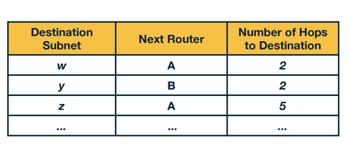

# Intra-Domain Routing

## Routing Algorithms

In this lesson we examine the algorithms that we need so that when a packet leaves the default router of a sending host, it will travel over a path towards the default router of a destination host.

As a packet travels from a sending host to a destination host, each intermediate router along the packet's path is responsible for forwarding that packet to the next router. When a packet arrives at a router, the router consults its **forwarding table** to determine the outgoing link over which it should forward the packet. In this context, **forwarding** refers to transferring a packet from an incoming link to an outgoing link within a *single* router.

On the other hand, **routing** refers to how routers work together using routing protocols to determine the best routes over which the packets travel from the source to the destination router. When we have routers that belong to the same administrative domain, we refer to the routing as **intra-domain** routing. When routers belong to different administrative domains, we refer to the routing as **inter-domain**. This lesson focusing on intra-domain routing algorithms, also referred to as *Interior Gateway Protocols*.

The two major classes of algorithms that we have are:

1. **Link-State**
2. **Distance-Vector**

We use a *graph* to understand these algorithms. Routers are represented as *nodes* and links between routers as *edges*, where each edge has an associated cost.

## Link-State Routing Algorithm (Dijkstra’s)

In link-state algorithms, the link costs and the network topology are known to all nodes (e.g., by broadcasting the values). By **u** we represent our source node and by **v** we represent every other node in the network.**D(v)** represents the cost of the current least cost path from **u** to **v**. By **p(v)** we represent the previous node along the current least cost path from **u** to **v**. By **c(u,v)**, we represent the cost from **u** to directly attached neighbor **v**. By **N'**, we represent the subset of nodes along the current least-cost path from **u** to **v**.

**Initialization step**: Initialize all the currently known least-cost paths from **u** to its directly attached neighbors. For nodes in the network that are not directly attached to **u**, we initialize the cost path to infinity. Also, initialize the set **N'** to include only the source node **u**.

**Iteration steps**: Runs for every destination node **v** in the network. At each iteration, look at the set of nodes not included in **N'**, and identify the node **w** with the least cost path from the previous iteration and add **w** to **N'**. For every neighbor **v** of **w**, update **D(v)** with the new cost, which is the minimum of either the old cost from **u** to **v** from the previous iteration, or the known least-cost path from source node **u** to **w** plus the cost from **w** to **v**.

The algorithm exits by returning the shortest paths and their costs from the source node **u** to every other node **v** in the network.

## Link-State Routing Algorithm Example

We have the graph below and we consider our source node to be **u**. Our goal is to compute the least-cost paths from **u** to all nodes **v** in the network.

We start with the initialization step, where we set all the currently known least-cost paths from **u** to it’s directly attached neighbors **v**, **x** and **w**. For the rest of the nodes in the network we set the cost to infinity, because they are not immediate neighbors to source node **u**. We also initialize the set **N'** to include only the source node **u**.

| **Step** | **N'** | **D(v),p(v)** | **D(w),p(w)** | **D(x),p(x)** | **D(y),p(y)** | **D(z),p(z)** |
|:--------:|:------:|:-------------:|:-------------:|:-------------:|:-------------:|:-------------:|
| 0        |   u    |      2, u     |          5, u |          1, u |             ∞ |             ∞ |

In the first iteration, we look among the nodes that are not yet in **N'**, and we select the node with the least-cost from the previous iteration, **x**. Then we update the distance for all the immediate neighbors of x, **v**, **w**, and **y**. For example, we update **D(w)** as the minimum between: the cost we had from the previous iteration which is 5, and the cost from **u** to **x** (1) plus cost from **x** to **w** (3). The minimum between the two is 4. We update the second row in our table.

| **Step** | **N'** | **D(v),p(v)** | **D(w),p(w)** | **D(x),p(x)** | **D(y),p(y)** | **D(z),p(z)** |
|:--------:|:------:|:-------------:|:-------------:|:-------------:|:-------------:|:-------------:|
| 0        |   u    |      2, u     |          5, u |          1, u |             ∞ |             ∞ |
| 1        | ux     | 2, u          | 4, x          |          1,u  | 2,x           | ∞             |

We continue in a similar manner for the rest of the nodes in the table. The algorithm exits in the 5th iteration.

|   **Step** | **N'** | **D(v),p(v)** | **D(w),p(w)** | **D(x),p(x)** | **D(y),p(y)** | **D(z),p(z)** |
|:----------:|:------:|:-------------:|:-------------:|:-------------:|:-------------:|:-------------:|
| 0          |   u    |      2, u     |          5, u |          1, u |             ∞ |             ∞ |
| 1          | ux     | 2, u          | 4, x          |          1, u | 2, x          | ∞             |
| 2          | uxy    | 2, u          | 3, y          |          1, u | 2, x          | ∞             |
| 3          | uxyv   | 2, u          | 3, y          | 1, u          | 2, x          | 4, y          |
| 4          | uxyvw  | 2, u          | 3, y          | 1, u          | 2, x          | 4, y          |
| 5          | uxyvwz | 2, u          | 3, y          | 1, u          | 2, x          | 4, y          |

## Computational Complexity of the Link-State Routing Algorithm

In the first iteration we need to search through all nodes to find the node with the minimum path cost. But as we proceed in the next iterations, this number decreases. So in the second iteration we search through $(n-1)$ nodes. This decrease continues at every step. So by the end of the algorithm, after we go through all the iterations, we will need to search through $\frac{n(n+1)}{2}$ nodes. Thus the complexity of the algorithm is: $O(n^2)$

## Distance Vector Routing (DV)

The DV routing algorithm is *iterative* (the algorithm iterates until the neighbors do not have new updates to send to each other), *asynchronous* (the algorithm does not require the nodes to be synchronized with each other), and *distributed* (direct nodes send information to one another, and then they resend their results back after performing their own calculations, so the calculations are not happening in a centralized manner).

The DV algorithm is based on the Bellman Ford Algorithm. Each node maintains its own distance vector, with the costs to reach every other node in the network. Then, from time to time, each node sends its own distance vector to its neighbor nodes. The neighbor nodes in turn, receive that distance vector and they use it to update their own distance vectors. In other words, the neighboring nodes exchange their distance vectors to update their own view of the network.

Each node **x** updates its own distance vector using the Bellman Ford equation:

$$ Dx(y) = min\ (c(x,v) + Dv(y)) $$

for each destination node **y** in the network. In other words, A node **x**, computes the least cost to reach destination node **y**, by considering the options that it has to reach **y** through each of its neighbor **v**. So node **x** considers the cost to reach neighbor **v**, and then it adds the least cost from that neighbor **v** to the final destination **y**. It calculates that quantity over all neighbors **v** and it takes the minimum.

Formally, the DV algorithm is as follows:

## Distance Vector Routing Example

Consider the three node network shown here:

In the first iteration, each node has its own view of the network, which is represented by an individual table. Every row in the table is the distance vector of each node. Node **x** has it’s own table, and the same is true for nodes **y** and **z**. We note that in the first iteration, node **x** does not have any information about **y** or **z’s** distance vectors, thus these values are set to infinity.

In the second iteration, the nodes exchange their distance vectors and they update their individual views of the network. Node **x** computes its new distance vector, using the Bellman Ford equation for every destination node **y** and **z**. For each destination, node **x** compares the cost to reach that destination through a neighbor node.

$$ dx(y) = min\ (c(x,y) + dy(y),\ c(x,z)+dz(y)) $$
$$ dx(y) = min\ (2+0,\ 7+1) = 2 $$

At the same time, node **x** receives the distance vectors from **y** and **z** from the first iteration. So it updates its table to reflect its view of the network accordingly. Nodes **y** and **z** repeat the same steps to update their own tables.

In the third iteration, the nodes process the distance vectors received from the previous iteration (if they have changed), and they repeat the same calculations. Finally, each node has its own routing table.

Finally, at this point, there are no further updates sent from the nodes. Thus, the nodes are not doing any further calculations on their distance vectors. The nodes enter a waiting mode, until there is a change in the link costs.

## Link Cost Changes and Failures in DV - Count to Infinity Problem

Let’s consider the following example topology below where the link cost x-y changes to 1:

At time t0, **y** detects that cost to **x** has changed from 4 to 1, so it updates its distance vector and sends it to its neighbors. At time t1, **z** receives the update from **y**. Now **z** thinks it can reach **x** through **y** with a cost of 2, so it sends its new distance vector to its neighbors. At time t2, **y** receives the update from **z** and **y** does not change its distance vector, so it does not send any update. In this scenario, note that there was a decrease in the link cost which propagated quickly among the nodes in only a few iterations.

Unfortunately, this is not always the case. Let’s consider the following scenario where a link cost increases by a large amount:

At t0, **y** detects that the cost has changed, and now it will update its distance vector thinking that it can still reach **x** through **z** with a total cost of 5+1=6. At t1, we have a routing loop where **z** thinks it can reach **x** through **y**, and **y** thinks it can reach **x** through **z**. This will cause the packets to be bouncing back and forth between **y** and **z** until their tables change. Nodes **z** and **y** keep updating each other about their new cost to reach **x**. For example, **y** computes its new cost to be 6 and then informs **z**. Then **z** computes its new cost to be 7, and then informs **y**, and so on.

This back and forth continues for a total of 44 iterations, at which point **z** computes its cost to be larger than 50, and at that point it will prefer to reach **x** directly rather than through **y**. In contrast to the previous scenario, this link cost change took a long time to propagate among the nodes of the network. This is known as the **count-to-infinity problem**.

## Poison Reverse

**Poison Reverse** is a solution to the count-to-infinity problem. Since **z** reaches **x** through **y**, **z** will advertise to **y** that the distance to **x** is infinity ($Dz(x) = ∞$). However **z** knows that this is not true and: $Dz(x)=5$. **z** tells this lie to **y**, as long as it knows that it can reach to **x** via **y**. Since **y** assumes that **z** has no path to **x** except via **y**, it will never send packets to **x** via **z**. So **z** *poisons* the path from **z** to **y**.

Things change when the cost from **x** to **y** changes to 60. **y** will update its table and send packet to **x** directly with cost:  $Dy(x)=60$. It will inform **z** about its new cost to **x**, after this update is received. Then **z** will immediately shift its route to **x** to be via the direct (z,x) link at cost 50. Since there is a new path to **x**, **z** will inform **y** that:  $Dz(x)=50$.

When **y** receives this update from **z**, **y** will update:  $Dy(x)=51=c(y,z)+Dz(x)$. Since **z** is now on least cost path of **y** to reach **x**, **y** *poisons* the reverse path from **z** to **x**. **y** tells **z** that:  $Dy(x)=∞$, even though **y** knows that:  $Dy(x)=51$.

This technique **will solve the problem with 2 nodes**, however poisoned reverse **will not solve the problem with 3 or more nodes** that are not directly connected.

## DV Routing Protocol Example: Routing Information Protocol (RIP)

**RIP** is based on the Distance Vector protocol. The metric for choosing a path could be shortest distance, lowest cost, or a load-balanced path. In RIP, routing updates are exchanged between neighbors periodically, using a RIP response message, as opposed to distance vectors in the DV Protocols. These messages, called RIP advertisements, contain information about sender’s distances to destination subnets.

The figure below shows a portion of a network. Here, **A**, **B**, **C** and **D** denote the routers and *w*, *x*, *y* and *z* denote the subnet masks. Each router maintains a **routing table**, which contains its own distance vector as well as the router's forwarding table. 

The routing table of D has three columns: destination subnet, identification of the next router along the shortest path to the destination, and the number of hops to get to the destination along the shortest path. A routing table will have one row for each subnet in the **Autonomous System (AS)**. An AS is a very large network or group of networks with a single routing policy.

Now if D receives from A the advertisement (the routing table information of A) shown in the figure below:

D learns that there is now a path through A to subnet z that is shorter than the path through B. Therefore, D updates its table to account for the new shortest path. The updated routing table is shown in the figure below:

Nodes maintain a RIP Table with one row for each subnet in the AS. RIP version 2 allows subnet entries to be aggregated. If a router doesn't hear from a neighbor within 180 seconds, it's considered unreachable; the local routing table is updated, and changes are propagated. RIP uses UDP on port 520, layered on the network-layer IP protocol. RIP is implemented as an application-level process, facing challenges like route updates, convergence time reduction, and loop prevention.

## Link-State Routing Protocol Example: Open Shortest Path First (OSPF)

**OSPF**, a link-state routing protocol, finds optimal paths using a Dijkstra algorithm. It surpasses RIP, featuring authentication, support for multiple same-cost paths, and hierarchical configuration into areas. The backbone area in OSPF's hierarchy handles inter-area traffic. Routing between areas involves traversing area border routers, the backbone, and another area's border router.

In operation, OSPF constructs a topological map, and each router computes the shortest path tree using Dijkstra's algorithm. Link costs, pre-configured by administrators, determine the least-cost path. OSPF updates all routers on any link state change, periodically broadcasting states even without changes.

LSAs (Link State Advertisements) communicate local topology to routers in the same OSPF area, building a link state database. The refresh rate for LSAs is typically 30 minutes, with routers handling multiple copies during this period.

## Processing OSPF Messages in the Router

Consider a simple model of a router given in the figure above. The router consists of a route processor (which is the main processing unit) and interface cards that receive data packets which are forwarded via a switching fabric. Let us break down router processing in a few steps:

   1. Initially, the link-state update packets which contain LSAs from a neighboring router reaches the current router's OSPF. As the LS Updates reach the router, a consistent view of the topology is being formed and this information is stored in the link-state database. Entries of LSAs correspond to the topology which is actually visible from the current router.
   2. Using this information from the link-state database, the current router calculates the shortest path using shortest path first (SPF) algorithm. The result of this step is fed to the Forwarding Information Base (FIB).
   3. The information in the FIB is used when a data packet arrives at an interface card of the router, where the next hop for the packet is decided and its forwarded to the outgoing interface card.

To further understand OSPF processing, look at the following flow chart and view it in time slices (T1, T2, …, T7):

Upon receiving an LS update packet (T1), OSPF checks LSAs for duplicates, updating the database for new ones, scheduling SPF calculation (T2), and determining the flooding interface. In modern routers, LSA flooding timing may rely on a timer.

Once all LSAs are processed (T3), they are flooded in an LS Update packet to the next router (T4). SPF calculation (T5 and T6) is a CPU-intensive task, so it's scheduled over time, usually when LSAs change, to manage CPU costs. After SPF calculation, the FIB is updated (T7).

## Hot Potato Routing

In large networks, routers rely both on inter-domain and intra-domain routing protocols to route the traffic. Routers employ intra-domain routing protocols to determine optimal paths for internal network traffic. If the destination is external, traffic moves toward network exit points (egress points) before leaving. Multiple egress points may be equally good, providing similar external paths to the final destination.

In this case, **hot potato** routing is a technique of choosing a path within the network, by choosing the closest egress point based on intra-domain path cost (Interior Gateway Protocol/IGP cost).

In the network diagram above, a router in Dallas must forward traffic to a destination, choosing between egress points New York and San Francisco. Assuming both offer equal BGP path costs, the router, utilizing hot potato routing, selects the egress point with the lower IGP path cost—San Francisco (9 vs. New York's 10). Hot potato routing simplifies computations, ensures path consistency, and optimizes network resource consumption by swiftly directing traffic out.

## Practice Quizzes

1. In this lecture, we discuss intra-domain routing, where all the nodes and subnets are owned and managed by the same organization. (In contrast, inter-domain routing is about routing between different organizations – such as between two ISPs.) Before we begin talking about intra-domain routing algorithms, what could the weights on the graph edges represent in these diagrams, when we are seeking the least-cost path between two nodes?

    - Length of the cable
    - Time delay to traverse the link
    - Monetary cost
    - Business relationships
    - Link capacity
    - Current load on the link

    

        
Click to reveal the answer

            - Length of the cable
            - Time delay to traverse the link
            - Monetary cost
            - Link capacity
            - Current load on the link
    

2. A packet is __________ when it is moved from a router’s input link to the appropriate link.

    - Routed
    - Forwarded
    - Dropped
    - Acknowledged

    

        
Click to reveal the answer

            Forwarded
    

3. Determine which action is network-wide (i.e. involves multiple routers).

    - Routing
    - Forwarding

    

        
Click to reveal the answer

            Routing
    

4. Intra-domain routing must involves multiple administrative domains.

    - True
    - False

    

        
Click to reveal the answer

            False
    

5. In the previous example, node u was the source node, and distances were calculated from u to each other node. Consider the same example, but let x be the source node. Notice that node x has more direct neighbors than u does. Suppose x is executing the link-state algorithm as discussed, and has just finished the initialization step. Which of the following statements are true?

    

   - Node x will execute fewer iterations than node u did, as there were fewer “infinity distance nodes” after initialization.
   - Node x will execute the same number of iterations that node u did, as the number of immediate neighbors has no impact on the number of iterations the algorithm requires.
   - Node x will execute more iterations than node u did, as there are more immediate neighbors to consider.

    

        
Click to reveal the answer

            Node x will execute the same number of iterations that node u did, as the number of immediate neighbors has no impact on the number of iterations the algorithm requires.

            Note that the algorithm continues iterating until

            N’ = N – 1

            that is, until every node is the graph is in N’. As there are 6 nodes, there will always be 5 iterations after initialization.
    

6. Upon termination of Dijkstra’s algorithm, all nodes in a network are aware of the entire network topology.

    - True
    - False

    

        
Click to reveal the answer

            False
    

7. Consider the following topology. Let b be the source node. Use Dijkstra’s algorithm to determine the cost of the least cost path from node b to all other nodes in the network upon termination of the algorithm.

    

    

        
Click to reveal the answer

            Cost to node a: 3

            Cost to node c: 4

            Cost to node d: 6

            Cost to node e: 8

            Cost to node f: 9
    

8. Select the words that can be used to describe the distance vector algorithm.

    - Distributed
    - Centralized
    - Iterative
    - Asynchronous
    - Synchronous
    - Non-terminating

    

        
Click to reveal the answer

            Distributed
            Iterative
            Asynchronous
    

9. Determine which of the following can cause the count-to-infinity problem.

    - Poison reversing
    - Routing Loops
    - Hot potato routing
    - Dropped packets

    

        
Click to reveal the answer

            Routing Loops
    

10. Dijkstra’s algorithm is a  _______ (1) routing algorithm which is also reffered to as a _______ (2) algorithm.

    (1) Decentralized or Global?
    (2) Link-State or Distance Vector?

    

        
Click to reveal the answer

            (1) Global (2) Link-State
    

11. The Bellman Ford equation is used by the ______________ algorithm.

    - Link-State
    - Distance Vector

    

        
Click to reveal the answer

            Distance Vector
    

12. Select all statements that correctly complete the sentence:   The Routing Information Protocol (RIP) is an example of ______________.

    - A link-state algorithm
    - A distance vector algorithm
    - Poison reverse
    - An inter-domain routing algorithm
    - An intra-domain routing algorithm

    

        
Click to reveal the answer

            - A distance vector algorithm
            - An intra-domain routing algorithm
    

13. There may be multiple egress points from an administrative domain to an external destination.

    - True
    - False

    

        
Click to reveal the answer

            True
    

14. Hot potato routing always selects the egress point that is geographically closest to the ingress point.

    - True
    - False

    

        
Click to reveal the answer

            False

            Hot potato routing is a technique/practice of choosing a path within the network, by choosing the closest egress point based on intra-domain path cost (Interior Gateway Protocol/IGP cost).
    

