# Autonomous Systems Relationships and Inter-Domain Routing

In this lesson, we learn about the **Border Gateway Protocol (BGP)**, the different interconnection types based on business relationships between networks, and Internet Exchange Points.

## Autonomous Systems and Internet Interconnection

### The Internet as an Ecosystem

The basis of this ecosystem includes **Internet Service Providers (ISPs)**, **Internet Exchange Points (IXPs)**, and **Content Delivery Networks (CDNs)**.

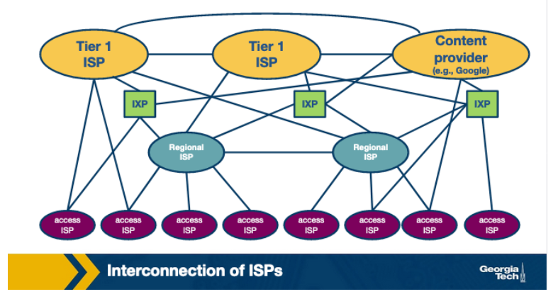

ISPs can be categorized into three types:

  1. Large-scale Tier-1 that operate at a global scale which form the "backbone" network over which smaller networks can connect (e.g. AT&T, Sprint, etc. ).
  2. Regional ISPs (Tier-2)
  3. Access ISPs (Tier-3)

Access ISPs connect to Regional, which connect to Large-Scale ISPs.

IXPs are interconnection infrastructures that provide the physical infrastructure where multiple networks (e.g. ISPs / CDNs) can interconnect and exchange traffic locally.

CDNs are networks that content providers create with the goal of having greater control of how content is delivered to the end-users while reducing connectivity costs (e.g. Google / Netflix). These networks have multiple data centers where each houses typically hundreds of servers that are distributed across the world.

### Competition and Cooperation Among Networks

This ecosystem operates hierarchically, with smaller networks connecting to larger ones. Access ISPs connect to Tier-2 ISPs, forming a customer-provider relationship. Competition exists at all levels, with Tier-1 and regional ISPs competing among themselves. However, ISPs also cooperate to provide global connectivity to their customers, deploying various interconnection strategies based on network size and geographic location.

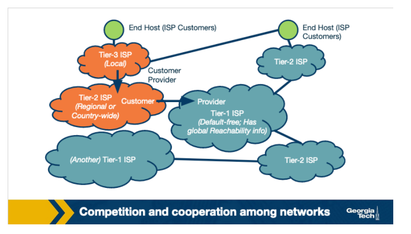

In today's Internet ecosystem, ISPs utilize various interconnection options such as Points of Presence (PoPs), multi-homing, and peering. PoPs are routers within a provider's network allowing customer networks to connect. Multi-homing involves connecting to one or more provider networks, while peering involves a settlement-free agreement between ISPs for direct traffic exchange.

The Internet topology has shifted from hierarchical to flatter due to the influence of Internet Exchange Points (IXPs) and Content Delivery Networks (CDNs).

Autonomous Systems (ASes) encompass networks like ISPs and CDNs, operating under a single administrative authority. ASes implement their own policies, traffic engineering, and interconnection strategies. Border Gateway Protocol (BGP) is used for inter-AS routing, while **Interior Gateway Protocols (IGPs)** like OSPF, IS-IS, RIP, and E-IGRP optimize routing within ASes. This lesson focuses on BGP.

## AS Business Relationships

1. **Provider-Customer (or transit)**: This relationship is based on a financial settlement that determines how much the customer will pay the provider. The provider forwards the customer's traffic to destinations found in the provider's routing table (including the opposite direction of the traffic).
2. **Peering**: In peering, two ASes share a subset of routing tables, typically limited to their respective customers. This agreement remains viable unless traffic exchange becomes highly asymmetric. Peering occurs among Tier-1 ISPs and smaller ISPs, requiring similar sizes and traffic proportions for Tier-1 peers. Smaller ISPs benefit by saving on provider costs through direct traffic exchange, particularly when substantial traffic is exchanged between them or their customers.

### How do providers charge customers?

Peering allows networks to forward traffic without cost, while providers aim to maximize revenue by forwarding customer traffic. Providers typically charge based on fixed prices within a bandwidth range or by actual bandwidth usage, often using the 95th percentile of measured data. Complex routing policies may aim to increase traffic from customers to providers to boost provider revenue.

## BGP Routing Policies: Importing and Exporting Routes

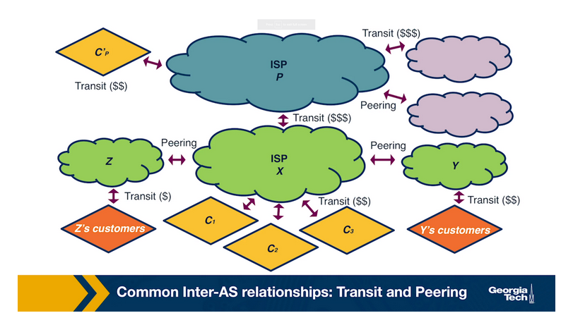

### Exporting Routes

Deciding which routes to export is crucial for business and financial reasons. Route advertisement, controlled through route filters, determines which routes an AS's router should share with neighboring ASes. Let's look at the different types of routes an AS (let's call it X) decides whether to export:

  1. **Customer routes**: X advertises routes received from customers to maximize reachability, potentially increasing revenue by attracting more traffic.
  2. **Provider routes**: X doesn't advertise routes received from providers to peers or other providers, but shares them with customers, as there's no financial incentive to carry provider traffic.
  3. **Peer routes**: Similarly, X doesn't advertise routes received from peers to providers, avoiding becoming a transit point without revenue, ensuring its own financial interest.

### Importing Routes

ASes selectively import routes based on the advertising AS and the nature of the business relationship. They receive route advertisements from customers, providers, and peers. When multiple routes to the same destination are received from different ASes, ASes prioritize importing routes in the following order:

  1. Customer routes, which ensure direct connectivity without incurring unnecessary costs.
  2. Peer routes are then preferred as they often come without cost under peering agreements.
  3. Lastly, provider routes are imported only when necessary for connectivity, as they may involve additional costs.

## BGP and Design Goals

1. **Scalability**: Managing Internet growth while ensuring timely convergence and loop-free paths.
2. **Express routing policies**: Using route attributes for route filtering and ranking, enabling confidential and independent routing decisions for each AS.
3. **AS cooperation**: Allowing ASes to maintain confidentiality while making local routing decisions.
4. **Security**: Originally lacking, BGP now requires protection against malicious attacks, misconfiguration, and faults. Efforts include protocols like S-BGP, additional infrastructure like registries, and research into machine learning-based solutions. Adoption challenges persist due to protocol transitions and lack of incentives.

## BGP Protocol Basics

A pair of routers, known as **BGP peers**, exchange routing information over a semi-permanent TCP port connection called a **BGP session**. n order to begin a BGP session, a router will send an OPEN message to another router. Then the sending and receiving routers will send each other announcements from their routing tables. The time it takes to exchange routes varies from a few seconds to several minutes, depending on the number of routes exchanged.

A BGP session between a pair of routers in two different ASes is called an **external BGP (eBGP)** session, and a BGP session between routers that belong to the same AS is called an **internal BGP (iBGP)** session.

In the following diagram, we can see three different ASes along with iBGP (e.g., between 3c and 3a) and eBGP (e.g., between 3a and 1c ) sessions between their border routers.

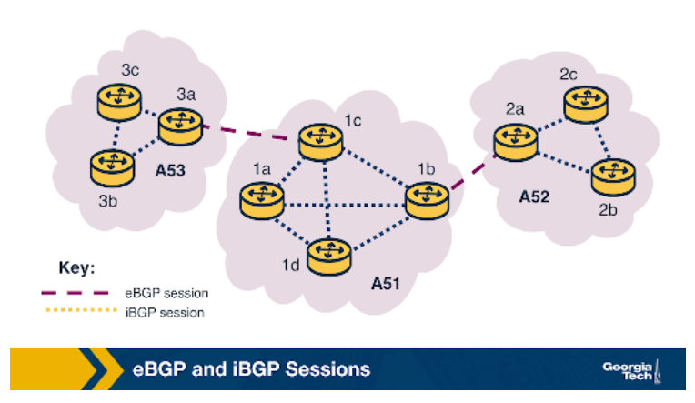

After BGP peers establish a session,  they can exchange BGP messages to provide reachability information and enforce routing policies. We have two types of BGP messages:

   1. **UPDATE** messages convey route changes, including:
    - *Announcements*: New or updated routes with standardized attributes.
    - *Withdrawals*: Removal of previously announced routes due to failures or policy changes.
   2. **KEEPALIVE** messages maintain session connectivity between peers.

**BGP Prefix Reachability**: Destinations in BGP are represented by IP prefixes. eBGP gateway routers advertise reachable IP prefixes based on export policies to neighboring ASes. iBGP sessions disseminate external routes to internal routers based on import policies. Internal routers propagate external routes to other internal iBGP routers.

**Path Attributes and BGP Routes**: In addition to the reachable IP prefix field, advertised **BGP routes** consist of several **BGP attributes**. Two notable attributes are AS-PATH and NEXT-HOP.

- **AS-PATH**: Each AS is identified by its **autonomous system number (ASN)**. As an announcement passes through various ASes, their identifiers are included in the ASPATH attribute. This attribute prevents loops and is used to choose between multiple routes to the same destination, the route with the shortest path.
- **NEXT-HOP**: specifies the next-hop router's IP address along the path. Internal routers forward traffic to external destinations through the border router, based on AS routing policies.

## iBGP and eBGP

iBGP: For sessions between internal routers of the same AS.
eBGP: For sessions are between border routers of neighboring ASes.

Both protocols are used to disseminate routes for external destinations.

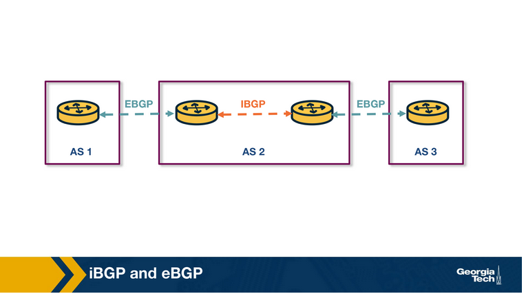

The dissemination of routes within the AS is done by establishing a full mesh of iBGP sessions between the internal routers. Each eBGP speaking router has an iBGP session with every other BGP router in the AS to send updates about the routes it learns (over eBGP).

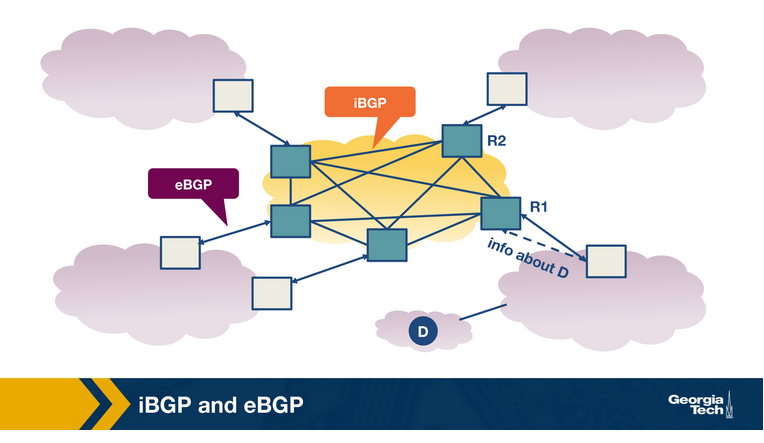

Note, iBGP is not another IGP-like protocol (e.g., RIP or OSPF). IGP-like protocols are used to establish paths between the internal routers of an AS based on specific costs within the AS. In contrast, iBGP is only used to disseminate external routes within the AS.

## BGP Decision Process: Selecting Routes at a Router

Let's zoom into what is happening as the routers exchange BGP messages to select routes. Conceptually, we can consider the model of a router as in the figure below:

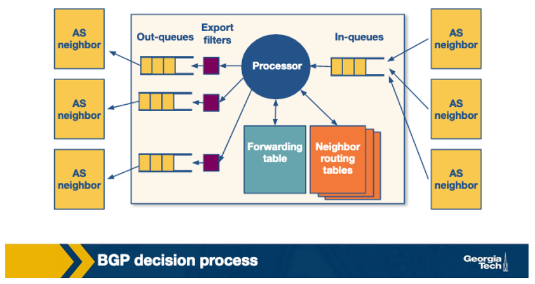

A router receives incoming BGP messages and processes them. When a router receives advertisements, it first applies the import policies to exclude routes from further consideration. Then the router implements the decision process to select the best routes that reflect the policy in place. Next, the newly selected routes are installed in the forwarding table. Finally, the router decides which neighbors to export the route to by applying the export policy.

### The Router's Decision Process

In a nutshell, the decision process is how the router compares routes. It goes through the list of attributes in the route advertisements. A router compares a pair of routes by going through the list of attributes, as shown in the figure below. For each attribute, it selects the route with the attribute value that will help apply the policy. If for a specific attribute, the values are the same, then it goes to the next attribute.

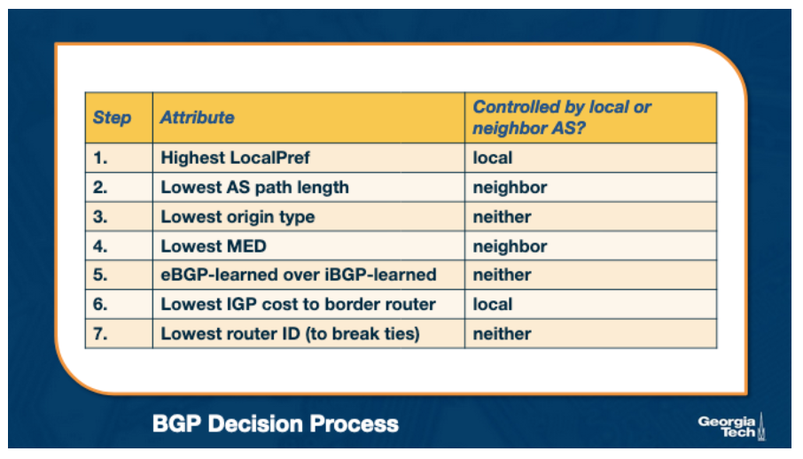

### Influencing The Route Decision Using the LocalPref

Let's focus on two attributes, LocalPref and MED (Multi-Exit Discriminator), and let's see how we can use them to influence the decision process. The LocalPref attribute is used to prefer routes learned through a specific AS over other ASes for *outbound* traffic. Consider the following example:

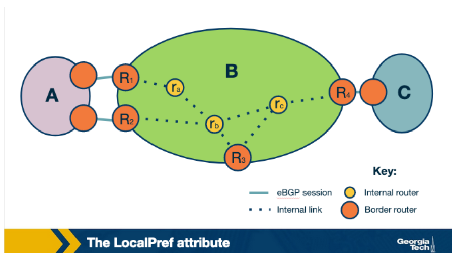

Suppose AS B learns of a route to the same destination x via A and C. If B prefers to route its traffic through A, due to peering or business, it can assign a *higher* LocalPref value to routes it learns from A. And therefore, by using LocalPref, AS B can control where the traffic exits the AS. In other words, it will influence which routers will be selected as exit points for the traffic that leaves the AS (outbound traffic).

An operator can assign a non-overlapping range of values to the LocalPref attribute according to the type of relationship. So assigning different LocalPref ranges will influence which routes are imported. The following image shows a scheme that can be used to reflect the business relationships:

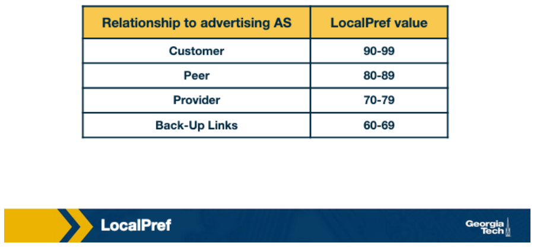

### Influencing the Route Decision Using the MED Attribute

The **MED (Multi-Exit Discriminator)** value is used by ASes connected by multiple links to designate which links are preferred for *inbound* traffic. We have seen in the previous topics that an AS does not have an economic incentive to export routes that it learns from providers or peers to other providers or peers. An AS can reflect this by tagging routes with a MED value to "staple" the type of business relationship. Also, an AS filters routes with specific MED values before exporting them to other ASes. Finally, we note that influencing the route exports will also affect how the traffic enters an AS (the routers that are entry points for the traffic that enters the AS).

Assuming that all other attributes are equal, if one route has a *lower* MED value it will be preferred.

The attributes are set either (a) locally by the AS (e.g., LocalPref), (b) by the neighboring AS (e.g., MED), (c) or by the protocol (e.g., if a route is learned through eBGP or iBGP).

## Challenges with BGP: Scalability and Misconfigurations

The BGP protocol can encounter significant issues in practice, notably misconfigurations and faults. These can lead to excessive updates, causing route instability, overloading of router resources, outages, and failures. ASes mitigate these risks by:

  1. Limiting Routing Table Size:
    - ASes employ filtering to restrict routing table size, encouraging route aggregation.
    - Routers can cap the number of prefixes per session, and smaller ASes may opt for **default route** configurations.
    - ASes protect others by aggregating routes and exporting less specific prefixes.

  2. Managing Routing Changes:
    - **Flap damping** reduces the propagation of unstable routes by tracking updates to specific prefixes over time.
    - ASes strategically adjust thresholds for suppressing routes, considering factors like prefix specificity and destination criticality.

## Peering at IXPs

IXPs are physical infrastructures that provide the means for ASes to interconnect and directly exchange traffic with one another. The ASes that interconnect at an IXP are called participant ASes. The physical infrastructure of an IXP is usually a network of switches located either in the same physical location or distributed over a region or even at a global scale. Typically, the infrastructure has a fully redundant switching fabric that provides fault tolerance. The equipment is usually located in facilities such as data centers, which provide reliability, sufficient power, and physical security.

For example, in the figure below we see an IXP infrastructure (2012), called DE-CIX that is located in Frankfurt, Germany. The figure shows the core of the infrastructure (noted as 3 and 6) and additional sites (1-4 and 7) that are located at different co-location facilities in the area.

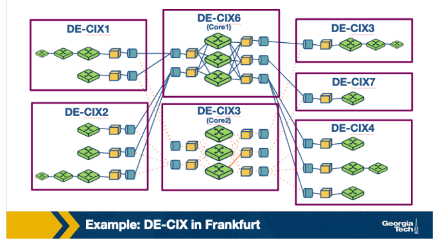

IXPs are increasingly popular and crucial to study for several reasons:

1. They serve as interconnection hubs handling massive traffic volumes. Some large IXPs rival global Tier 1 ISPs in daily traffic.
2. IXPs play a vital role in mitigating DDoS attacks by observing and intercepting traffic before it reaches participant ASes, acting as a shield against attacks.
3. They offer real-world infrastructures for research, providing insights into the evolving Internet landscape and serving as research playgrounds for various applications, including security and Software Defined Networking.
4. IXPs are active marketplaces and technology innovation hubs, offering services beyond interconnection such as DDoS mitigation and SDN-based services, evolving into centers for technological advancement.

Steps for an AS to peer at an IXP:

1. Obtain a public Autonomous System Number (ASN).
2. Bring a router to the IXP facility and connect it to the IXP switch.
3. Ensure the router can run BGP for route exchange.
4. Agree to the IXP's General Terms and Conditions (GTC).

Networks can peer at an IXP by:

1. Incurring one-time costs to establish a circuit to the IXP.
2. Paying monthly charges for the chosen IXP port, where higher speeds incur higher costs.
3. Possibly paying an annual membership fee to the IXP.
4. Exchanging traffic over a public peering link at the IXP typically involves no payment between parties.
5. IXPs generally do not interfere with participants' bilateral relationships unless they violate the GTC.
6. Time to establish a public peering link can vary from a few days to a couple of weeks, depending on the IXP.

Why do networks choose to peer at IXPs?

- They are keeping local traffic local. In other words, the traffic exchanged between two networks do not need to travel unnecessarily through other networks if both networks are participants in the same IXP facility.  
- Lower costs. Typically peering at an IXP is offered at a lower cost than relying on third parties to transfer the traffic, which is charged based on volume.
- Network performance is improved due to reduced delay.
- Incentives. Critical players in today’s Internet ecosystem often “incentivize” other networks to connect at IXPs.

Services offered at IXPs:

1. Public peering: Networks use the IXP's infrastructure for traffic exchange, with one-time setup costs, monthly port charges, and possibly annual membership fees. IXPs generally don't charge based on traffic volume, offer better performance, and attract participants with incentives.
2. Private peering: Direct traffic exchange between parties without using the IXP's infrastructure, suitable for high-volume and stable traffic.
3. Route servers and SLAs: IXPs provide SLAs and free use of route servers for instant peering with multiple networks under a single agreement/BGP session.
4. Remote peering through resellers: Third parties resell IXP ports to enable remote peering, extending IXP services to networks with little traffic or in distant locations.
5. Mobile peering: Support for interconnecting mobile GPRS/3G networks.
6. DDoS black-holing: Some IXPs offer customer-triggered black-holing to mitigate the effects of DDoS attacks.
7. Free value-added services: IXPs like Netnod offer free services such as Internet Routing Registry, broadband speed tests, DNS root name servers, ccTLD nameservers, and NTP time distribution for the benefit of the Internet community.

## Peering at IXPs: How Does a Route Server Work?

Generally, two ASes exchange traffic through the switching fabric utilize a two-way BGP session, called a **bilateral** BGP session. However, since many ASes are peering at an IXP, we have another challenge to accommodate a rising number of BGP sessions. As a result, this option does not scale with many participants. To mitigate this, some IXPs operate a route server, which helps to make peering more manageable. In summary, a **Route Server (RS)** does the following:
  
- It collects and shares routing information from its peers or participants of the IXP that connect to the RS.
- It executes its own BGP decision process and re-advertises the resulting information (e.g., best route selection) to all RS's peer routers.

The figure below shows a **multi-lateral BGP peering session**, an RS that facilitates and manages how multiple ASes can "talk" on the control plane simultaneously.

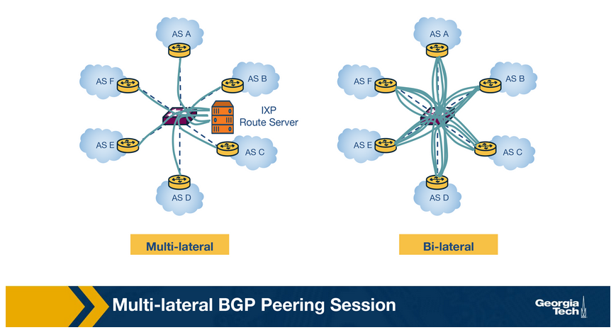

### How a route server (RS) maintains multi-lateral peering sessions

A typical routing daemon maintains a **Routing Information Base (RIB)**, which contains all BGP paths that it receives from its peers - the Master RIB. In addition, the route server also maintains AS-specific RIBs to keep track of the individual BGP sessions they maintain with each participant AS.

Route servers maintain two types of route filters. Import filters are applied to ensure that each member AS only advertises routes that it should advertise. And export filters are typically triggered by the IXP members themselves to restrict the set of other IXP member ASes that receive their routes.

Consider the following example where AS X and AS Z exchange routes through a multi-lateral peering session that the route server holds:

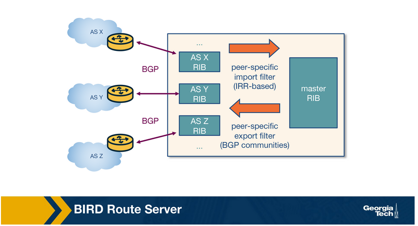

1. AS X advertises a prefix p1 to the RS, which is added to the route server's RIB specific to AS X.
2. The route server uses the peer-specific import filter to check whether AS X is allowed to advertise p1. If it passes the filter, the prefix p1 is added to the Master RIB.
3. The route server applies the peer-specific export filter to check if AS X allows AS Z to receive p1, and if true, it adds that route to the AS Z-specific RIB.
4. The route server advertises p1 to AS Z with AS X as the next hop.

## Practice Quizzes

1. The internet topology has been evolving from a _________ structure into a _________ structure.

    - Hierarchical, flat
    - Flat, hierarchical

    

        
Click to reveal the answer

            Hierarchical, flat
    

2. An Autonomous System is a group of routers that operate under _________ administrative _________.

    - Multiple, authorities
    - The same, authority

    

        
Click to reveal the answer

            The same, authority
    

3. Autonomous Systems implement their own set of policies, make their own traffic engineering decisions and interconnection strategies, and determine how traffic leaves and enters the network.

    - True
    - False

    

        
Click to reveal the answer

            True
    

4. The BGP protocol is used within an AS and focuses on optimizing a path metric within the network. Examples of BGP protocols are Open Shortest Paths First (OSPF) and Routing Information Protocol.

    - True
    - False

    

        
Click to reveal the answer

            False
    

5. In a peering relationship, the traffic exchanged between the two peers must be highly asymmetric so that there is enough incentive for both parties to peer with each other.

    - True
    - False

    

        
Click to reveal the answer

            False
    

6. A customer-provider relationship between ASes is based on a financial settlement, which determines how much the customer will pay the provider. The provider takes care of connecting the customer network with destinations found in the provider's routing table. The customer pays regardless of the direction of the traffic.  

    - True
    - False

    

        
Click to reveal the answer

            True
    

7. There is no incentive for smaller ISPs to peer with each other.

    - True
    - False

    

        
Click to reveal the answer

            False
    

8. Provider ASes have a financial incentive to forward as much of their customers’ traffic as possible.

    - True
    - False

    

        
Click to reveal the answer

            False
    

9. Select the correct order for an AS to import its routes based on their incentive.

    - Routes learned from: customers -> providers -> peers (A)
    - Routes learned from: customers -> peers -> providers (B)
    - Routes learned from: peers -> customers -> providers (C)
    - Routes learned from: peers -> providers -> customers (D)
    - Routes learned from: providers -> customers -> peers (E)
    - Routes learned from: providers -> peers -> customers (F)

    

        
Click to reveal the answer

          - Routes learned from: customers -> peers -> providers (B)
    

10. What is the difference between iBGP and eBGP?

    

        
Click to reveal the answer

        Both flavors (iBGP and eBGP) take care of disseminating *external* routes. An eBGP session is established between two border routers that belong to different ASes. An iBGP session is established between routers that belong to the same AS. Once a router hears about a route that is learned through eBGP, then it disseminates that route to other internal routers in the same AS, using iBGP. 
    

11. What is the difference between iBGP and IGP?

    

        
Click to reveal the answer

          IGP-like protocols are used to establish paths between the internal routers of an AS based on specific costs within the AS. In contrast, iBGP is only used to disseminate external routes within the AS.
    

12. A router within an AS decides which route to export by first applying import policies to exclude routes entirely from further consideration.

    - True
    - False

    

        
Click to reveal the answer

          True
    

13. The LocalPref attribute is used to prefer routes learned through a specific AS over other ASes for ________ traffic.

    - Inbound
    - Outbound

    

        
Click to reveal the answer

          Outbound
    

14. Assume that AS X learns of a route to the same destination a via AS Y and AS Z. If X prefers to route its traffic through Z due to peering or business, it can assign a ________ LocalPref value to routes it learns from Z, and thus using LocalPref, AS X can control where traffic exits the AS.

    - Lower
    - Higher

    

        
Click to reveal the answer

          Higher
    

15. The MED (Multi-Exit Discriminator) value is used by ASes connected by multiple links to designate with of those links are preferred for ________ traffic.

    - Inbound
    - Outbound

    

        
Click to reveal the answer

          Inbound
    

16. Assume that AS X prefers routes advertised to AS Y to go through R1 as opposed to R2. For AS Y to be influenced to choose R1 to forward traffic to AS X, R1 must have a _________ MED value, assuming that all other attributes are equal.

    - Lower
    - Higher

    

        
Click to reveal the answer

          Lower
    

17. One of the services offered by IXPs is protection against ________ attacks.

    - BGP Hijacking
    - DDoS
    - Malware
    - Phishing

    

        
Click to reveal the answer

          DDoS
    

18. Participation of an AS in an IXP is free.

    - True
    - False

    

        
Click to reveal the answer

          False
    

19. IXPs handle large volumes of traffic.

    - True
    - False

    

        
Click to reveal the answer

          True
    

20. One of the reasons why networks choose to peer at IXPs is because critical players in today’s Internet ecosystem often “incentivize” other networks to connect at IXPs.

    - True
    - False

    

        
Click to reveal the answer

          True
    

21. Private peering PIs do not use the IXP’s public peering infrastructure.

    - True
    - False

    

        
Click to reveal the answer

          True
    

22. IXPs users may use route servers for an additional cost.

    - True
    - False

    

        
Click to reveal the answer

          False
    

