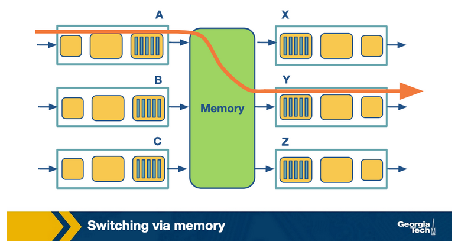
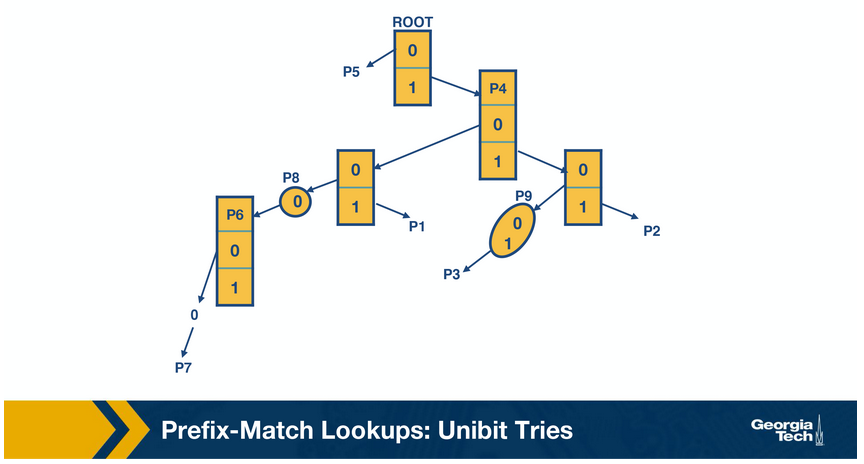

# Router Design and Algorithms (Part 1)

In this lesson we delve into router architecture and its primary task: transferring packets from input to output interfaces based on destination IP addresses (implementing the forwarding plane functions and the control plane functions). This process involves consulting a forwarding table. However, scaling this task presents challenges, especially with high-volume traffic and diverse service requirements. Routers must handle packets based on various criteria, including quality of service and security. We'll explore algorithms like longest prefix matching, packet classification, and scheduling to address these challenges, with the first lesson covering longest prefix match and the second focusing on packet classification and scheduling.

## What's Inside a Router?

- **Forwarding (or switching) function**
  - The router's action to transfer a packet from an input link interface to the appropriate output link interface. Forwarding occurs at short timescales (ns) and is typically done in hardware.
  
- **Input ports**
  - Physically terminate the incoming links to the router
  - Decapsulate the packets in the data link processing unit
  - Most importantly, perform the lookup function. The input ports consult the forwarding table to ensure that each packet is forwarded to the appropriate output port through the switch fabric.
- **Switching fabric**
  - Moves the packets from input to output ports and makes the connections between the input and the output ports.
  - There are three types of switching fabrics: memory, bus, and crossbar.
- **Output ports**
  - Receive and queue packets from the switching fabric and then send them to the outgoing link.
  
- **Router control plane functions**
  - By control plane functions, we refer to implementing the routing protocols, maintaining the routing tables, computing the forwarding table. All these functions are implemented in software in the routing processor, or as we will see in the SDN chapter, these functions could be implemented by a remote controller.
  

## Router Architecture

Note in the figure above the input/output links are shown separately but often they are put together. When a packet arrives at an input link, the most time-sensitive tasks are lookup, switching, and scheduling.

**Lookup**: When a packet arrives at the input link,  the router looks at the destination IP address and determines the output link by looking at the forwarding table (or Forwarding Information Base or FIB). The FIB provides a mapping between destination prefixes and output links.The routers use the longest prefix matching algorithms to resolve any disambiguities. We will see these algorithms soon. Also, some routers offer a more specific and complex type of lookup, called packet classification, where the lookup is based on destination or source IP addresses, port, and other criteria.

**Switching**: After lookup, the switching system takes over to transfer the packet from the input link to the output link. Modern routers use crossbar switches for this task. Although scheduling the switch (matching available inputs with outputs) is difficult because multiple inputs may want to send packets to the same output.

**Queuing**: After the packet has been switched to a specific output, it will need to be queued (if the link is congested). The queue may be as simple as First-In-First-Out (FIFO), or it may be more complex (e.g., weighted fair queuing) to provide delay guarantees or fair bandwidth allocation.

The less time-critical tasks within the router are:

**Header validation and checksum**: The router verifies the packet's version number, reduces the time-to-live (TTL) field, and recalculates the header checksum.

**Route processing**: Routers construct their forwarding tables through routing protocols like RIP, OSPF, and BGP, which are executed in the routing processors.

**Protocol Processing**: Routers implement various protocols for specific functionalities

- Simple Network Management Protocol (SNMP) facilitates remote inspection through a set of counters.
- TCP and UDP enable remote communication with the router.
- Internet Control Message Protocol (ICMP) is utilized for transmitting error messages, such as TTL expiration.

## Different Types of Switching

The switching fabric is the brain of the router, as it performs the main task to switch (or forward) the packets from an input port to an outport port. There are three main ways this is accomplished:

1. Switching via memory
   - Input/Output ports operate as I/O devices in an operating system, controlled by the routing processor. When an input port receives a packet, it sends an interrupt to the routing processor, and the packet is copied to the processor's memory. Then the processor extracts the destination address and looks into the forward table to find the output port, and finally, the packet is copied into that output's port buffer.
   
2. Switching via bus
   - In this case, the routing processor does not intervene as we saw the switching via memory. When an input port receives a new packet, it puts an internal header that designates the output port, and it sends the packet to the shared bus. Then all the output ports will receive the packet, but only the designated one will keep it. When the packet arrives at the designated output port, the internal header is removed from the packet. Only one packet can cross the bus at a given time, so the speed of the bus limits the speed of the router.
   
3. Switching via interconnection network
   - A crossbar switch is an interconnection network that connects N input ports to N output ports using 2N buses. Horizontal buses meet the vertical buses at crosspoints controlled by the switching fabric. For example, let's suppose that a packet arrives at port A that will need to be forwarded to output port Y, the switching fabric closes the crosspoint where the two buses intersect so that port A can send the packets onto the bus, and then the packet can only be picked up by output port Y. Crossbar network can carry multiple packets at the same time, as long as they are using different input and output ports. For example, packets can go from A-to-Y and B-to-X simultaneously.
   

## The Challenges Routers Face

1. Bandwidth and Internet population scaling, caused by:
   1. An increasing number of devices connected to the internet
   2. Increasing volumes of network traffic from new applications
   3. New technologies, such as optical links, which can accommodate higher volumes of traffic
2. Services at high speeds
   - New applications require services such as protection against delays in the presence of congestion and protection during attacks or failures. But offering these services at very high speeds is a challenge for routers.

Consider the figure below detailing the bottlenecks that routers face:

The main categories are the following:

1. Longest prefix matching
   - Routers need to look up a packet’s destination address to forward it. The increasing number of Internet hosts and networks has made it impossible for routers to have explicit entries for all possible destinations. So instead, routers group destinations into prefixes. As a result, routers must use more complex algorithms for efficient longest prefix matching.
2. Service differentiation
   - Routers also offer service differentiation, which means different quality-of-service (or security guarantees) to different packets. In turn, this requires the routers to classify packets based on more complex criteria beyond destination.
3. Switching limitations
   - A fundamental operation of routers is to switch packets from input ports to output ports. A way to deal with high-speed traffic is to use parallelism by crossbar switching. But at high speeds, this comes with its problems and limitations (e.g., head of line blocking).
4. Bottlenecks about services
   - Providing performance guarantees (quality of service) at high speeds is nontrivial, as is providing support for new services such as measurements or security guarantees

## Prefix-Match Lookups

Prefix-matching helps with the scalability problem by “grouping” multiple IP addresses by the same prefix.

The different ways to denote prefix are:

1. Dot decimal

    Example of the 16-bit prefix: 132.234

    The binary form of the first octet: 10000100

    Binary of the second octet: 11101010

    The binary prefix of 132.234: 1000010011101010*

    The * indicates wildcard character to say that the remaining bits do not matter.

2. Slash notation

    Standard notation: A/L (where A=Address, L=Length)

    Example: 132.238.0.0/16

    Here, 16 denotes that only the first 16 bits are relevant for prefixing.

3. Masking

    We can use a mask instead of the prefix length.

    Example: The prefix 123.234.0.0/16 is written as 123.234.0.0 with a mask 255.255.0.0

    The mask 255.255.0.0 denotes that only the first 16 bits are important.

Why variable-length prefixes? In the early internet, we relied on fixed-length prefixes for IP addressing. As IP addresses depleted, CIDR was introduced in 1993, allowing arbitrary-length prefixes. CIDR reduced router table size but introduced a new issue: longest-matching-prefix lookup.

To forward an incoming packet, a router first checks the forwarding table to determine the port and then does switching to send the packet. There are various challenges that the router needs to overcome when performing a lookup to determine the output port. These challenges revolve around lookup speed, memory, and update time.

The table below mentions some basic observations around network traffic characteristics. The table shows the consequence (inference) that motivates and impacts the design of prefix lookup algorithms for every observation.

The four takeaway observations are:

1. Measurement studies on network traffic had shown a large number of concurrent flows of short duration. This already large number has only been increasing, and as a consequence, caching solutions will not work efficiently.
2. The important element of any lookup operation is how fast it is done (lookup speed). A large part of the cost of computation for lookup is accessing memory.
3. An unstable routing protocol may adversely impact the update time in the table: add, delete or replace a prefix. Inefficient routing protocols increase this value up to additional milliseconds.
4. A vital trade-off is memory usage. We can use expensive fast memory (cache in software, SRAM in hardware) or cheaper but slower memory (e.g., DRAM, SDRAM).

## Unibit Tries

To start our discussion on prefix matching algorithms, we will use an example prefix database with nine prefixes, as shown below.

One of the simplest techniques for prefix lookup is the unibit trie. For the example database we have, the figure below shows a unibit trie:

Every node has a 0 or 1 pointer. Starting with the root, 0-pointer points to a subtrie for all prefixes that begin with 0, and similarly, 1-pointer points to a subtrie for all prefixes that start with 1. Moving forward similarly, we construct more subtries by allocating the remaining bits of the prefix.

When we do prefix matching, we follow the path from the root node down to the trie. So let’s take an example from the above table and see how we can do prefix matching in the unibit trie.

For example:

  Assume we are doing the longest prefix match for P1=101* (from our prefix database). We start at the root node and trace a 1-pointer to the right, then a 0-pointer to the left, and then a 1-pointer to the right.

  For P7=100000*, we start at the root node and trace a 1-pointer to the right, then five 0-pointers on the left.

These are the steps we follow to perform a prefix match:

  1. We begin the search for a longest prefix match by tracing the trie path.
  2. We continue the search until we fail (no match or an empty pointer)
  3. When our search fails, the last known successful prefix traced in the path is our match and our returned value.

Two final notes on the unibit trie:

  1. If a prefix is a substring of another prefix, the smaller string is stored in the path to the longer (more specific prefix). For example, P4 = 1* is a substring of P2 = 111*, and thus P4 is stored inside a node towards the path to P2.
  2. One-way branches. There may be nodes that only contain one pointer. For example, let’s consider the prefix P3 = 11001. After we match 110 we will be expecting to match 01. But in our prefix database, we don’t have any prefixes that share more than the first 3 bits with P3. So if we had such nodes represented in our trie, we would have nodes with only one pointer. The nodes with only one pointer each are called one-way branches. For efficiency, we compress these one-way branches to a single text string with 2 bits (shown as node P9).

## Multibit Tries

While a unibit trie is very efficient and offers advantages such as fast lookup and easier updates, its most significant problem is the number of memory accesses required to perform a lookup. For 32 bit addresses, we can see that looking up the address in a unibit trie might require 32 memory accesses, in the worst case. Assuming a 60 ns latency, the worst-case search time is 1.92 microseconds. This could be very inefficient in high-speed links.

Instead, we can implement lookups using a stride. The stride is the number of bits that we check at each step.  So an alternative to unibit tries are multibit tries. A multibit trie is a trie where each node has 2k  children, where k is the stride. Next, we will see that we can have two flavors of multibit tries: *fixed-length stride* tries and *variable-length stride* tries.

## Prefix Expansion

Consider a prefix such as 101* (length 3) and a stride length of 2 bits. If we search in 2-bit lengths, we will miss out on prefixes like 101*. To combat this, we use a strategy called *controlled prefix expansion*, where we expand a given prefix to more prefixes. We ensure that the expanded prefix is a multiple of the chosen stride length. At the same time, we remove all lengths that are not multiples of the chosen stride length. We end up with a new database of prefixes, which may be larger (in terms of the actual number of prefixes) but with fewer lengths. So, the expansion gives us more speed with an increased cost of the database size.

In the figure below, we have expanded our original database of prefixes while considering a stride length of three. Initially, we had five different prefix lengths (1, 3, 4, 5, and 6), but now we have more prefixes but only two lengths (3 and 6).

For example, we substitute (expand) P3 = 11001* with 110010* and 110011*. 

When we expand our prefixes, there may be a collision, i.e., when an expanded prefix collides with an existing prefix. In that case, that expanded prefix gets dropped. For example, in the figure, we see that the fourth expansion of P6=1000* collides with P7 and thus gets removed.

## Multibit tries: Fixed-Stride

We introduced multibit tries in the previous section. Here, we will look at a specific example of a fixed-stride trie of length 3. Every node has 3 bits.

We are using the same database of prefixes as in the previous section. We can see that the prefixes (P1, P2, P3, P5, P6, P7, P8, and P9) are all represented in the expanded trie.

Some key points to note here:

- Every element in a trie represents two pieces of information: a pointer and a prefix value.
- The prefix search moves ahead with the preset length in n-bits (3 in this case)
- When the path is traced by a pointer, we remember the last matched prefix (if any).
- Our search ends when an empty pointer is met. At that time, we return the last matched prefix as our final prefix match.

Example: We consider an address A, which starts with 001. The search for A starts with the 001 entry at the root node of the trie. Since there is no outgoing pointer, the search terminates here and returns P5. Whereas if we search for 100000, the search will terminate with P7.

## Multibit Tries: Variable Stride

In this topic, we will discuss a more flexible version of the algorithm, which offers us a variable number of strides. With this scheme, we can examine a different number of bits every time. We encode the stride of the trie node using a pointer to the node. The root node stays as is (in the previous scheme).

Some key points about variable stride:

1. Every node can have a different number of bits to be explored.
2. The optimizations to the stride length for each node are all done to save trie memory and the least memory accesses.
3. An optimum variable stride is selected by using dynamic programming

We note that the rightmost node still needs to examine 3 bits because of P7.

But at the leftmost node needs only to examine 2 bits because P3 has 5 bits in total. So we can rewrite the leftmost node as in the figure above.

So now we have four fewer entries than our fixed stride scheme. So by varying the strides, we could make our prefix database smaller and optimize for memory.

## Quiz Questions

1. The data plane functions of a traditional router are implemented in _______________.

    - Hardware
    - Software

    

        
Click to reveal the answer

          Hardware
    

2. The control plane functions of a traditional router are implemented in _______________.

    - Hardware
    - Software

    

        
Click to reveal the answer

          Software
    

3. Which plane operates on a shorter timescale?

    - Control
    - Data
    - Management
    - All planes operate on the same timescale.

    

        
Click to reveal the answer

          Data
    

4. Classify each function as an operation of either the **data plane** or **control plane**.

    1. Computing paths based on a protocol
    2. Forwarding packets at Layer 3
    3. Switching packets at layer 2
    4. Running protocols to build a routing table
    5. Running the Spanning Tree protocol
    6. Decrementing Time To Live
    7. Computing an IP header checksum
    8. RUnning a protocol/logic to configure a middle box device for load balancing
    9. Forwarding packets according to installed rules in a middle-box device

    

        
Click to reveal the answer

          1. Control Plane
          2. Data Plane
          3. Data Plane
          4. Control Plane
          5. Control Plane
          6. Data Plane
          7. Data Plane
          8. Control Plane
          9. Data Plane
    

5. Which, if any, of the following types of switching can send multiple packets across the fabric in parallel?

    - Memory
    - Bus
    - Interconnection Network / Crossbar
    - None of the above

    

        
Click to reveal the answer

          Interconnection Network / Crossbar
    

6. Consider a router with the following forwarding table:

    | Prefix Match | Output Link |
    |--------------|-------------|
    | 101*         | A           |
    | 111*         | B           |
    | 1100 1*      | C           |
    | otherwise    | D           |

    Given that the router uses longest prefix matching. Determine the output link for packet with given destination IP address. Determine the letter of the output link.

    1.) 11100001 10000000 0001 0001 0111 1001

    2.) 1111 0001 1111 0000 1010 0001 0111 0111

    3.) 1010 1010 1010 1010 1010 1010 1010 1010

    4.) 1100 1001 1000 0000 0001 0001 0111 0111

    

        
Click to reveal the answer

          1.) B
              111* matches the first three bits.

              11001* matches the first five bits.

              1100 1* matches the first six bits.

              Thus, C is the answer.
          2.) B
          3.) A
          4.) C
    

7. Determine the mask for the address 192.168.0.1/24

    - 255.255.255.0
    - 255.255.0.0
    - 255.0.0.0
    - 192.168.0.24

    

        
Click to reveal the answer

          The "/24" notation indicates that the first 24 bits of the address represent the network portion, leaving 32 - 24 = 8 bits for the host portion.

          In binary, the first 24 bits are all ones, followed by 8 bits of zeros:
          11111111.11111111.11111111.00000000

          In decimal notation, this corresponds to:
          255.255.255.0

          So, the mask for the address 192.168.0.1/24 is 255.255.255.0.
    

8. Consider the following unibit trie. Nodes in blue represents stored prefixes.

    

    For each prefix look up, determine the node we return.

    1. 0*
    2. 1*
    3. 01*
    4. 00*
    5. 0000*
    6. 00011*

    

        
Click to reveal the answer

          1. a
          2. b
          3. c
          4. a
          5. e
          6. h (Recall that we remember the longest prefix matched so far.)
    

9. Consider the following prefix database.

        P1   =>   101*
        P2   =>   0*
        P3   =>   1*
        P4   =>   10101*  

    Consider expanding each prefix with stride length 3, so that we construct a fixed length multibit trie. Which of the following prefixes are associated with P3? Select all that apply.

    1. 110*
    2. 10*
    3. 100*
    4. 101*
    5. 001*
    6. 011*
    7. 111*

    

        
Click to reveal the answer

          1. 110*
          3. 100*
          7. 111*

          The full expanded prefix table:

      
    

10. Consider the following prefix database that provides a mapping between nodes (a,b,c,..) and prefixes (eg 0*,1*, etc).

        a => 0* 
        b => 01000* 
        c => 011* 
        d => 1* 
        e => 100* 
        f => 1100* 
        g => 1101* 
        h => 1110* 
        i => 1111*

    Construct the following variable-stride multibit trie. Based on the above database, fill in the nodes (eg n1, n2, n3, etc.) with the corresponding nodes from the database (a, b, c, etc.).  If the node does not have a corresponding node in the database, answer "none",  without the quotation marks.

    

        n1:   n10: 
        n2:   n11: 
        n3:   n12: 
        n4:   n13: 
        n5:   n14: 
        n6:   n15: 
        n7:   n16: 
        n8:   n17: 
        n9: 

    

        
Click to reveal the answer

        n1: none  n10: e
        n2: a     n11: none
        n3: a     n12: f
        n4: d     n13: g
        n5: d     n14: h
        n6: none  n15: i
        n7: none  n16: b
        n8: c     n17: none
        n9: c
    

11. A multibit trie is _____ (1) than a unibit trie representing the same prefix database and requires _____ (2) memory accesses to perform a lookup.

    (1) Shorter or taller
    (2) Fewer or more

    

        
Click to reveal the answer

        Taller
        Fewer
    

12. Fixed-length multibit tries can support an arbitrary number of prefix lengths.

    - True
    - False

    

        
Click to reveal the answer

        False

        To use a given multibit trie, the prefix set must be transformed into an equivalent set with the prefix lengths allowed by the new structure.
    

