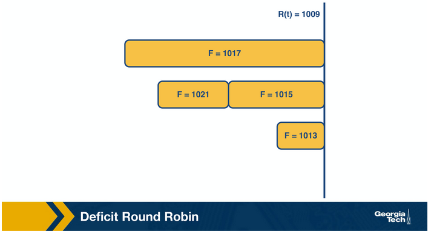

# Router Design and Algorithms (Part 2)

## Why We Need Packet Classification

As the Internet becomes increasingly complex, networks require quality-of-service and security guarantees for their traffic. Packet forwarding based on the longest prefix matching of destination IP addresses is insufficient. We need to handle packets based on multiple criteria such as TCP flags, source addresses, and so on. We refer to this finer packet handling as packet classification.

Some of packet classification examples include the following:

1. Firewalls
2. Resource reservation protocols
3. Routing based on traffic type

As an example of routing based on traffic type, consider the following figure:

In this topology, the networks are connected through router R and the destinations are shown as S1, S2, X, Y, and D. L1 and L2 denote specific connection points for router R. Classification rules are listed in the table above. The first rule is for routing video traffic from S1 to D via L1. The second rule drops all traffic from S2, for example, in the scenario that S2 was an experimental site. Finally, the third rule reserves 50 Mbps of traffic from prefix X to prefix Y, which is an example of a rule for resource reservation.

## Simple Packet Classification Algorithms

### Linear Search

Firewall implementations perform a linear search of the rules database and keep track of the best-match rule. This solution can be reasonable for a few rules, but the time to search through a large database that may have thousands of rules can be prohibitive.

### Caching

Another approach is to cache the results so that future searches can run faster. This has two problems:

1. Although the cache-hit rate may be high (around 80-90%), there will still be a need to conduct searches for missed hits.
2. Even with a cache hit rate as high as 90%, the performance can be hindered by the sluggishness of a linear search across the rule space. For instance, if searching the cache takes 100 nanoseconds (equivalent to one memory access), while a linear search through 10,000 rules consumes 1,000,000 nanoseconds (1 millisecond), the average search time with a 90% cache hit rate would still be 0.1 milliseconds—considered slow.

### Passing Labels

The Multiprotocol Label Switching (MPLS) and DiffServ use this technology. MPLS is useful for traffic engineering. First, a label-switched path is set up between sites A and B. Then, before traffic leaves site A, a router does packet classification and maps the web traffic into an MPLS header. Then the intermediate routers between A and B apply the label without having to redo packet classification. DiffServ follows a similar approach, applying packet classification at the edges to mark packets for special quality-of-service.

## Fast Searching Using Set-Pruning Tries

Let's assume that we have a two-dimensional rule. For example, we want to classify packets using both the source and the destination IP addresses. The table below represents our two-dimensional rule:

The simplest way to approach the problem would be to build a trie on the destination prefixes in the database, and then for every leaf-node at the destination trie to "hang" source tries. We start building a trie that looks like this figure below:

We denote the source prefix of each rule as S1 for rule R1, S2 for rule R2, and so forth. Consequently, for every destination prefix D in the destination trie, we narrow down the set of rules to those compatible with D, a process we refer to as "pruning."

Initially, we locate the destination IP address in a packet within the destination trie. Subsequently, we traverse the corresponding source trie to identify the longest prefix match for the source IP. Throughout this process, the algorithm maintains a record of the rule with the lowest cost. Ultimately, the algorithm concludes by selecting the rule with the least cost.

However, a significant challenge arises: determining which source prefixes to store at the source tries. For instance, consider the destination D = 00*. Both rules R4 and R5 feature D as the destination prefix. Consequently, the source tries for D must encompass the source prefixes 1* and 11*.

Yet, restricting the source prefixes to 1\* and 11\* proves insufficient. This limitation arises because the prefix 0*, which matches 00*, is also present in rules R1, R2, R3, and R7. Hence, all corresponding source prefixes must be included.

Moving forward, the issue with the set pruning tries lies in memory explosion. This is because a source prefix may appear in multiple destination tries, leading to significant memory usage.

## Reducing Memory Using Backtracking

The set pruning approach has a high cost in memory to reduce time. The opposite approach is to pay in time to reduce memory.

Let's assume a destination prefix D. The backtracking approach has each destination prefix D point to a source trie that stores the rules whose destination field is exactly D. The search algorithm then performs a "backtracking" search on the source tries associated with all ancestors of D.

So first, the algorithm goes through the destination trie and finds the longest destination prefix D matching the header. Then it works its way back up the destination trie and searches the source trie associated with every ancestor prefix of D that points to a nonempty source trie.

Since each rule is stored exactly once, the memory requirements are lower than the previous scheme. But, the lookup cost for backtracking is worse than for set-pruning tries.

## Grid of Tries

We've explored two solutions for the two-dimensional problem, *set pruning*, and *backtracking*. Set pruning incurs high memory costs due to constructing tries for both destination and source prefixes. Meanwhile, backtracking is time-intensive as it involves traversing the destination trie for the longest prefix match, then retracing steps to find associated source tries.

With the *grid of tries* approach, we can reduce the wasted time in the backtracking search by using pre-computation. When there is a failure point in a source trie, we pre-compute a switch pointer. Switch pointers take us directly to the next possible source trie containing a matching rule.

Let’s look at an example. Consider searching for the packet with a destination address 001 and source address 001. We start the search with the destination trie, which gives us D = 00 as the best match. The search at that point for the source trie fails. Instead of backtracking, the grid of tries has a switch pointer (labeled 0) that points to x. At which point it fails again. We follow another switch pointer to node y. At that point, the algorithm terminates.

So the precomputed switch pointers allow us to take shortcuts. We avoid backtracking to find an ancestor node and then traversing the source trie. We still proceed to match the source, and we keep track of our current best source match. But we are skipping source tries with source fields that are shorter than our current source match.

## Scheduling and Head of Line Blocking

Let’s assume that we have an N-by-N crossbar switch with N input lines, N output lines, and N2 crosspoints. Each crosspoint needs to be controlled (on/off), and we need to make sure that each input link is connected with at most one output link. Also, we want to maximize the number of input/output link pairs that communicate in parallel for better performance.

A simple scheduling algorithm is the **take-the-ticket algorithm**. Each output line maintains a distributed queue for all input lines that want to send packets to it. When an input line intends to send a packet to a specific output line, it requests a ticket. Then, the input line waits for the ticket to be served. At that point, the input line connects to the output line, the crosspoint is turned on, and the input line sends the packet.

For example, let’s consider the figure below, which shows three input lines that want to connect to four output lines. Next to each input line, we see the queue of the output lines it wants to connect with. For example, input lines A and B want to connect with output lines 1, 2, and 3.

In the first round, the input lines make ticket requests. For example, line A requests a ticket for output link 1. The same goes for B and C. So output link 1 grants three tickets, and it will process them in order. First, the ticket for A, then for B, and then for C. Input A observes that its ticket is served, so it connects to output link 1 and sends the packet.

In the second round, A repeats the process to request a ticket and connect with link 2. Also, B uses its ticket T2 from round 1 to connect with output link 1.

In the third round, A and B move forward, repeating the steps for their next connection. C gets the chance to make its first request and connect with output link 1. All this time, C was blocked, waiting for A and B.

The following figure shows how the entire process progresses. We can see the timeline for each output link as it connects with input links. The empty spots mean there was no packet sent at the corresponding time.

As we see, while A sends its packet in the first iteration, the entire queue for B and C is waiting. We refer to this problem as **head-of-line (HOL) blocking** because the entire queue is blocked by the progress of the head of the queue.

## Avoiding Head of Line Blocking

There are two main ways to avoid:

1. Via **output queuing**
   - Suppose that we have an N-by-N crossbar switch. Can we send the packet to an output link without queueing? If we could, then assuming that a packet arrives at an output link, it can only block packets sent to the same output link. We could achieve that if we have the fabric running N times faster than the input links.
   - A implementation of this approach is the *Knockout scheme*. Packets are broken into fixed sizes (cells). We assume that the same output rarely receives N cells, and the expected number is k (smaller than N). The fabric runs k times as fast as an input link instead of N. To accommodate scenarios where the expected case is violated, we have one or more primitive switching elements that randomly picks the chosen output:
     - k = 1 and N = 2. Randomly pick the output that is chosen. The switching element, in this case, is called a *concentrator*.
     - k = 1 and N > 2. One output is chosen out of N possible outputs. We can use the same strategy of multiple 2-by-2 concentrators in this case.
     - k needs to be chosen out of N possible cells, with k and N arbitrary values. We create k knockout trees to calculate the first k winners.
   - The drawback with this approach is that is it is complex to implement.

2. Via **parallel iterative matching**
   - We still allow queueing for the input lines, but in a way that avoids the head-of-line blocking. We schedule both the head of the queue and more packets so that the queue makes progress in case the head is blocked.
   - We achieve this by breaking down the single queue into virtual queues, with one virtual queue per output link.
   - Let's consider the following graph that shows A, B, C input links and 1, 2, 3, 4 output links. The algorithm runs in three rounds.
   
   - In the first round, all inputs send requests in parallel to all outputs they want to connect with. This is the request phase of the algorithm. In the grant phase, the outputs that receive multiple requests pick a random input, so the output link 1 randomly chooses B. Similarly, the output link 2 randomly chooses A (between A and B). Finally, in the accept phase, inputs that receive multiple grants randomly pick an output to send to. Two output ports (2 and 3) chose the same input (A). A randomly chooses port 2. B and C choose 1 and 4, respectively.
   - In the second round, the algorithm repeats by having each input send to two outputs:
   
   - And finally, the third round has each input send to one output:
   
   - Thus, all the traffic is sent in four cell times (of which the fourth cell time is sparsely used and could have been used to send more traffic). This is more efficient than the take-a-ticket.

## Scheduling Introduction

Busy routers rely on scheduling to handle routing updates, management queries, and data packets. Note that this scheduling is done in real-time. Due to the increasing link speeds, scheduling decisions need to be made in the minimum inter-packet times.

One method for router scheduling is **FIFO with tail drop**:

- Simplest method
- Packets enter a router on input links which are then looked up using the address lookup component – which gives the router an output link number. The switching system within the router then places the packet in the corresponding output port. This port is a FIFO queue.
- If the output link buffer is full, incoming packets to the tail of the queue are dropped. This results in fast scheduling decisions but a potential loss in important data packets.

There are other methods of packet scheduling such as priority, round-robin, etc. These methods are useful in providing quality of service (QoS) guarantees to a flow of packets on measures such as delay and bandwidth. A flow of packets refers to a stream of packets that travels the same route from source to destination and requires the same level of service at each intermediate router and gateway. In addition, flows must be identifiable using fields in the packet headers.

The reasons to make scheduling decisions more complex than FIFO with tail drop are:

1. Router support for congestion
2. Fair sharing of links among competing flows
3. Providing QoS guarantees to flows

## Bit-by-bit Round Robin

Round-robin avoids dropping flows (unlike FIFO). To avoid some flows getting serviced more frequently than others, researchers developed **bit-by-bit round robin**.

Imagine a system wherein a single round, one bit from each active flow is transmitted in a round-robin manner. This would ensure fairness in bandwidth allocation. However, since it’s not possible to split up the packets in the real world, we consider an imaginary bit-by-bit system to calculate the packet-finishing time and send a packet as a whole.

Let R(t) be the current round number at time t. If the router can send µ bits per second and the number of active flows is N, the rate of increase in round number is given by

$$ \frac{dR}{dt} = \frac{µ}{N} $$

The rate of increase in round number is inversely proportional to the number of active flows. An important takeaway is that *the number of rounds required to transmit a packet does not depend on the number of backlogged queues*.

Consider a flow α. Let a packet of size p bits arrive as the i-th packet in the flow. If it arrives at an empty queue, it reaches the head of the queue at the current round R(t). If not, it reaches the head after the packet in front of it finishes it. Combining both the scenarios, the round number at which the packet reaches the head is given by

$$ S(i) = max(R(t), F(i-1)) $$

where R(t) is the current round number, and F(i−1) is the round at which the packet ahead of it finishes. The round number at which a packet finishes, which depends only on the size of the packet, is given by

$$ F(i) = S(i) + p(i) $$

where p(i) is the size of the i-th packet in the flow. Using the above two equations, the finish round of every packet in a queue can be calculated.

## Packet-level Fair Queuing

This strategy emulates the bit-by-bit fair queueing by sending the packet with the smallest finishing round number. At any round, the packet chosen to be sent out is garnered from the previous round of the algorithm. The packet which had been starved the most while sending out the previous packet from any queue is chosen. Let’s consider the following example:

The figure above shows the state of the packets along with their finishing numbers (F) in their respective queues, waiting to be scheduled. The packet with the smallest finishing number (F=1002) is transmitted. This represents the packet that was the most starved during the previous round of scheduling.

Similarly, in the next round, the packet with F=1007 is transmitted:

In the subsequent round, the packet with F=1009 is transmitted:

Although this method provides fairness, it also introduces new complexities. We will need to keep track of the finishing time at which the head packet of each queue would depart and choose the earliest one. This requires a priority queue implementation, which has a time complexity that is logarithmic in the number of flows! Additionally, if a new queue becomes active, all timestamps may have to change – an operation with time complexity linear in the number of flows. Thus, the time complexity of this method makes it hard to implement at gigabit speeds.

## Deficit Round Robin (DRR)

This method uses a simple constant-time round-robin algorithm with a modification to ensure fairness. We assign a quantum size, Qi, and a deficit counter, Di, for each flow. The quantum size determines the share of bandwidth allocated to that flow. For each turn of round-robin, the algorithm will serve as many packets in the flow i with size less than (Qi + Di). If packets remain in the queue, it will store the remaining bandwidth in Di for the next run. However, if all packets in the queue are serviced in that turn, it will clear Di to 0 for the next turn.

Consider the following example of deficit round robin:

In this router, there are four flows – F1, F2, F3, and F4. The quantum size for all flows is 500. Initially, the deficit counters for all flows are set to 0. Initially, the round-robin pointer points to the first flow. The first packet of size 200 will be sent through. However, the funds are insufficient to send the second packet of size 750. Thus, a deficit of 300 will remain in D1. For F2, the first packet of size 500 will be sent, leaving D2 empty.

Similarly, the first packets of F3 and F4 will be sent with D3 = 400 and D4 = 320 after the first iteration. For the second iteration, the D1+ Q1 = 800, meaning there are sufficient funds to send the second and third packets through. Since there are no remaining packets, D1 will be set to 0 instead of 30 (the actual remaining amount).

## Traffic Scheduling: Token Bucket

There are scenarios where we want to set bandwidth guarantees for flows in the same queue without separating them. For example, we can have a scenario where we want to limit a specific type of traffic (e.g., news traffic) in the network to no more than X Mbps without putting this traffic into a separate queue.

We will start by describing the idea of token bucket shaping. This technique can limit the "burstiness" of a flow by limiting the average rate, and limiting the maximum burst size.

The bucket shaping technique assumes a bucket per flow that fills with tokens with a rate of R per second, and it also can have up to B tokens at any given time. If the bucket is full with B tokens, additional tokens are dropped. When a packet arrives, it can go through if there are enough tokens (equal to the size of the packet in bits). If not, the packet needs to wait until enough tokens are in the bucket. Given the max size of B, a burst is limited to B bits per second.

In practice, the bucket shaping idea is implemented using a counter (can’t go more than max value B, and gets decremented when a bit arrives) and a timer (to increment the counter at a rate R).

The problem with this technique is that we have one queue per flow. This is because a flow may have a full token bucket, whereas other flows may have an empty token bucket and, therefore, will need to wait.

We use a modified version of the token bucket shaper to maintain one queue, called token bucket policing. Here, if a packet arrives and there are no tokens in the bucket, it is dropped.

## Traffic Scheduling: Leaky Bucket

Traffic policing and traffic shaping are mechanisms to limit the output rate of a link. The output rate is controlled by identifying traffic descriptor violations and then responding to them in two different ways.

**Policer**: When the traffic rate reaches the maximum configured rate, excess traffic is dropped, or the packet's setting or "marking" is changed. The output rate appears as a saw-toothed wave.

**Shaper**: A shaper typically retains excess packets in a queue or a buffer, and this excess is scheduled for later transmission. The result is that excess traffic is delayed instead of dropped. Thus, the flow is shaped or smoothed when the data rate is higher than the configured rate. Traffic shaping and policing can work in tandem.

This figure shows the difference in the appearance of the output rate in the case of traffic policing and shaping:

### Leaky Bucket

Leaky Bucket is an algorithm that can be used in both traffic policing and traffic shaping. The leaky bucket algorithm is analogous to water flowing into a leaky bucket, with the water leaking at a constant rate. The bucket, say with capacity b, represents a buffer that holds packets, and the water corresponds to the incoming packets. The leak rate, r, is the rate at which the packets are allowed to enter the network, which is constant irrespective of the rate at which packets arrive.

If an arriving packet does not cause an overflow when added to the bucket, it is said to be conforming. Otherwise, it is said to be non-conforming. Packets classified as conforming are added to the bucket, while non-conforming packets are discarded. So if the bucket is full, the new packet that arrives to the bucket is dropped.

Irrespective of the input rate of packets, the output rate is constant, which leads to uniform distribution of packets sent to the network. This algorithm can be implemented as a single server queue.

The figure below shows the analogy between a leaky bucket of water and an actual network. In this figure, the faucet corresponds to the unregulated packet sending rate into the bucket. The output from the bucket, as a result of the applied algorithm, is a constant flow of packets (droplets).

