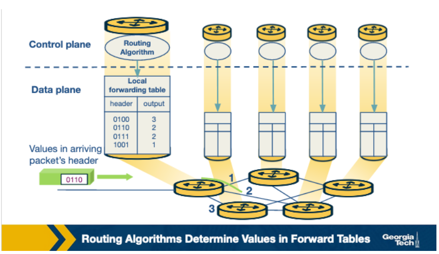
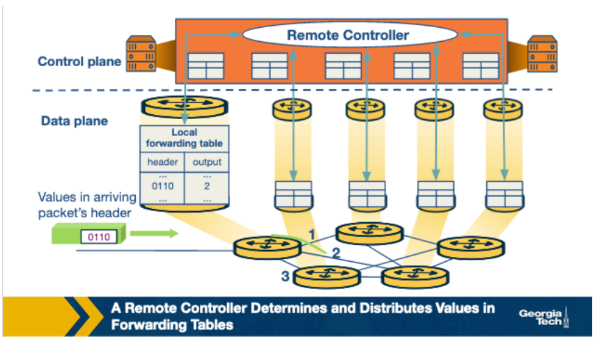
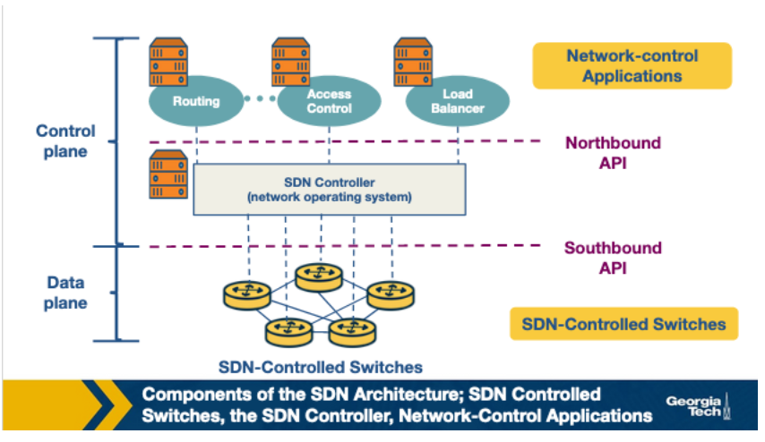
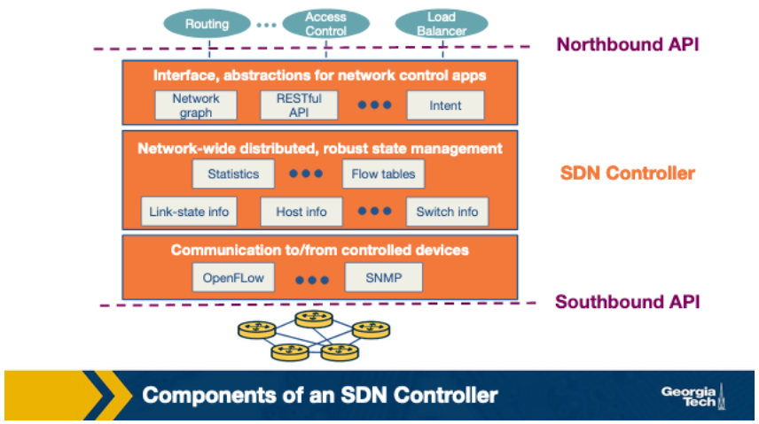
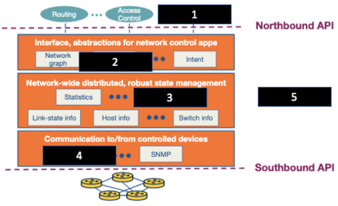

# Lesson 7: SDN (Part 1)

This lesson we need examine Software Defined Networking (SDN).

## What led us to SDN?

Software Defined Networking (SDN) arose as part of the process to make computer networks more programmable. Computer networks are very complex and especially difficult to manage for two main reasons:

1. **Diversity of equipment**

    The network has to handle different software adhering to different protocols for each of these equipment, making network management very complex.

2. **Proprietary Technologies**

    Equipment like routers and switches tend to run software which is closed and proprietary. This makes it harder for the network to manage all these devices centrally.

These characteristics of computer networks made them highly complex, slow to innovate, and drove up the costs of running a network. SDN employs separation of tasks and divides the network between the control and data plane to simplify management and speed up innovation.

## A Brief History of SDN: The Milestones

The history of SDN can be divided into three phases:

1. Active networks
2. Control and data plane separation
3. OpenFlow API and network operating systems

### Active networks

Active networks emerged in the mid-1990s to early 2000s amid the rapid growth of the internet. This phase was characterized by experimentation to enhance network services, driven by frustration with the slow standardization process of new protocols by the IETF. Active networks aimed to open up network control through programmable interfaces, introducing two models: the in-band capsule model and the out-of-band programmable router/switch model.

Technological advancements such as reduced computation costs, improved programming languages like Java, and funding from agencies like DARPA facilitated the development of active networking. Its adoption was fueled by the desire to expedite the development and deployment of new network services, meet individual application needs dynamically, support large-scale experimentation, and unify control over diverse middle-box functions.

Despite its ambitious goals, active networking faced challenges such as the requirement for end users to write Java code, concerns about safety, and insufficient focus on performance and security. This led to limited deployment compared to subsequent efforts that separated control and data planes, facilitating more targeted innovation. However, active networking contributed to concepts like programmable functions in the network, network virtualization, and the vision of a unified architecture for middle-box orchestration, influencing developments in SDN and network function virtualization (NFV).

### Control and Data Plane Separation

Control and data plane separation, spanning from 2001 to 2007, responded to escalating network traffic and the imperative for enhanced reliability and performance. Addressing the challenge of tightly integrated control and data planes in existing routers and switches, initiatives aimed to separate them to enable more efficient network management.

Technological advances, including faster backbone network speeds and increased server resources, facilitated this separation. Open source routing software further lowered barriers to implementation. Two key innovations emerged: an open interface between control and data planes and logically centralized control of the network.

Unlike active networking, this phase prioritized innovation for network administrators, focusing on programmability in the control domain and network-wide visibility and control. Pull factors included optimizing network paths based on traffic load, minimizing disruptions during routing changes, and enhancing security by redirecting or dropping suspicious traffic.

Despite initial skepticism, the separation of control and data planes laid the groundwork for concepts like logically centralized control and distributed state management. This paved the way for projects exploring clean-slate architecture and the development of APIs like OpenFlow, despite concerns about operational reliability and network state visibility.

### OpenFlow API & Network OS

The era of OpenFlow API and network operating systems, spanning from 2007 to 2010, marked a pivotal shift towards programmable network experimentation at scale while ensuring practical deployment. OpenFlow, emerging from research interest and funding, struck a balance between full programmability and real-world feasibility by leveraging existing hardware functionalities, albeit with some limitations.

OpenFlow switches operated based on packet-handling rules stored in tables, determining actions for incoming packets based on rule priorities and patterns. Unlike its predecessors, OpenFlow gained industry adoption due to several factors. Pre-existing support for switch control by chipset vendors facilitated easier integration, enabling firms to deploy OpenFlow through firmware upgrades without designing new hardware.

The adoption of OpenFlow was driven by the need for large-scale network experimentation, especially in academic and data center environments. Testbed deployments across college campuses showcased its efficacy, while data centers sought its capabilities for managing network traffic at scale. Additionally, the shift towards investing in control programming rather than proprietary switches democratized the market, empowering smaller players to compete by supporting OpenFlow features.

Key outcomes of the OpenFlow era included the generalization of network devices and functions, the conceptualization of network operating systems, and the advancement of distributed state management techniques. These developments laid the groundwork for future innovations in network programmability and management.

## Why Separate the Data Plane from the Control Plane?

The control plane contains the logic that controls the forwarding behavior of routers such as routing protocols and network middlebox configurations. The data plane performs the actual forwarding as dictated by the control plane.

The reasons we separate the two are:

1. Independent evolution and development
   - In the traditional model, routers handle both routing and forwarding, necessitating hardware upgrades for any changes. In the new approach, routers solely handle forwarding, enabling independent innovation in design and routing algorithms without affecting existing hardware. By separating these functions, development becomes more straightforward.
2. Control from high-level software program
   - In SDN, software computes forwarding tables, allowing for higher-level program control of router behavior and facilitating easier debugging. Separation of control and data planes enables independent evolution and development, allowing software aspects to evolve separately from hardware. This separation enables the use of higher-level software programs for control, simplifying network behavior debugging and checking.

The separation of control from the data plane in SDN creates opportunities in various domains:

1. *Data centers*: SDN simplifies network management in large data centers with thousands of servers and VMs.
2. *Routing*: Unlike the constrained BGP protocol, SDN offers more control over inbound and outbound traffic, facilitating easier route selection based on multiple criteria.
3. *Enterprise networks*: SDN enhances security applications, enabling easier protection against volumetric attacks like DDoS by strategically dropping attack traffic within the network.
4. *Research networks*: SDN enables research networks to coexist with production networks.

## Control Plane and Data Plane Separation

Two important functions of the network layer are:

1. Forwarding
   - This involves determining the outgoing link for a packet based on its header, typically done within nanoseconds at the router's hardware level. Forwarding may also involve blocking suspicious packets or duplicating them for multiple output links.
2. Routing
   - This process, managed by routing algorithms, determines the path from sender to receiver across the network. Unlike forwarding, routing occurs at the software level and encompasses the end-to-end process for networks, usually taking place within seconds.

**In the traditional approach**, the routing algorithms (control plane) and forwarding function (data plane) are closely coupled. The router runs and participates in the routing algorithms. From there it is able to construct the forwarding table which consults it for the forwarding function.

**In the SDN approach**, on the other hand, there is a remote controller that computes and distributes the forwarding tables to be used by every router. This controller is physically separate from the router. It could be located in some remote data center, managed by the ISP or some other third party. The routers are solely responsible for forwarding, and the remote controllers are solely responsible for computing and distributing the forwarding tables. The controller is implemented in software, and therefore we say the network is software-defined.

## The SDN Architecture

The figure below contains the main components of a SDN network:

- **SDN-controlled network elements**
  - Sometimes this is referred to as the infrastructure layer, it is responsible for the forwarding of traffic in a network based on the rules computed by the SDN control plane.
- **SDN controller**
  - A logically centralized entity that acts as an interface between the network elements and the network-control applications.
- **Network-control applications**
  - Programs that manage the underlying network by collecting information about the network elements with the help of SDN controller.

Let's examine the four defining features of an SDN architecture:

1. **Flow-based forwarding**: SDN-controlled switches compute forwarding rules based on multiple header field values, allowing for more granular packet forwarding compared to traditional methods, such as considering up to 11 header field values with OpenFlow.

2. **Separation of data plane and control plane**: SDN-controlled switches handle data plane operations while software on separate servers computes, installs, and manages flow table rules.

3. **Network control functions**: The SDN control plane, distributed across multiple servers, comprises a controller and network applications. The controller maintains network state information and provides it to applications for monitoring and controlling network devices.

4. **Programmable network**: Network applications serve as the intelligence of the SDN control plane, managing various network functions like management, traffic engineering, security, and automation, for instance, through algorithms like Dijkstra's for path determination.

## The SDN Controller Architecture

The SDN controller is a part of the SDN control plane and acts as an interface between the network elements and the network-control applications. An SDN controller can be broadly split into three layers:

1. Communication
   - Protocol for SDN controller-device communication (southbound interface), e.g., OpenFlow.
2. Network-wide state-management
   - Maintains network state, including host, link, and switch information, and flow tables.
3. Interface to the network-control application
   - Enables interaction between SDN controller and network-control applications (northbound interface), facilitating reading/writing of network state and flow tables, and event notification handling. Example: REST interface.

The SDN controller, although viewed as a monolithic service by external devices and applications, is implemented by distributed servers to achieve fault tolerance, high availability and efficiency. Despite the issues of synchronization across servers, many modern controllers such as OpenDayLight and ONOS have solved it and prefer distributed controllers to provide highly scalable services.

## Quiz Questions

1. The main reason why SDNs were created was because of the increase of internet users.

    True or False

    

            
Click to reveal the answer
 False
    
 

2. SDNs divide the network in two planes: control plane and data plane, to ease management and speed up innovation.

    True or False

    

            
Click to reveal the answer
 True
    
 

3. The Active Networks phase consisted mainly of creating a programming interface that exposed resources/network nodes and supported customization of functionalities for subsets of packets passing through the network.

    True or False

    

            
Click to reveal the answer
 True
    
 

4. One of the main differences between the Active Networks phase and the separation of the Control and Data plane phase is that the former is focused on network-wide visibility and control and the latter is focused on device-level configurations.

    True or False

    

            
Click to reveal the answer
 False
    
 

5. An OpenFlow switch has a table of packet-handling rules, and whenever it receives a packet, it determines the highest priority matching rule, performs the action associated with it and increments the respective counter.

    True or False

    

            
Click to reveal the answer
 True
    
 

6. One of the downfalls of OpenFlow when it was first created was that it was hard to deploy and scale it easily.

    True or False

    

            
Click to reveal the answer
 False
    
 

7. SDNs use ________________ to control the routers’ behavior (e.g., the path selection process).

    Software or Hardware
    

            
Click to reveal the answer
 Software
    
 

8. With the separation of the control plane and the data plane, any change to the forwarding functions on a router is independent from the routing functions of the control plane.

    True or False
    

            
Click to reveal the answer
 True
    
 

9. In the SDN approach, the controller that computes and distributes the forwarding tables to be used by the routers is  _______________________.

    a. Located within each router

    b. Physically separate from the routers
    

            
Click to reveal the answer
 Physically separate from the routers
    
 

10. Software implementations in SDN controllers are increasingly open and publicly available, which _______________ innovation in the field.

    Speeds up  or Slows down
    

            
Click to reveal the answer
 Speeds up
    
 

11. The network-control applications use the information about the network devices and elements, provided by the controller, to monitor and control the network devices.

    True / False
    

            
Click to reveal the answer
 True
    
 

12. In an SDN, the controller is responsible for the _______________ of the traffic, and the SDN-controlled network elements such as the switches are responsible for the _______________ of the traffic.

    Forwarding, routing

    Routing, forwarding
    

            
Click to reveal the answer
 Routing, forwarding
    
 

13. Traffic forwarding can be based on any number of header field values in various layers like the transport-layer, network-layer and link-layer.

    True / False
    

            
Click to reveal the answer
 True
    
 

14. SDN controllers operate on the _____________ plane.

    Control / Data
    

            
Click to reveal the answer
 Control
    
 

15. Match the number of the missing components in the following image with their respective name/example.

    

    Options: Load balancer, flow tables, OpenFlow, SDN Controller, RESTful API.
    

            
Click to reveal the answer

            1. Load balancer
            2. RESTful API
            3. Flow Tables
            4. OpenFlow
            5. SDN controller
    
 

16. The northbound interface is used by the controller and the network-control applications to interact with each other.

    True / False
    

            
Click to reveal the answer
 True
    
 

17. A REST interface is an example of a southbound API.

    True / False
    

            
Click to reveal the answer
 False
    
 

18. SDN controllers that are implemented by centralized servers are more likely to achieve fault tolerance, high availability and efficiency.

    True / False
    

            
Click to reveal the answer
 False
    
 

## Study Guide Questions

1. What spurred the development of Software Defined Networking (SDN)?
    

        
Click to reveal the answer

        Diversity of equipment and proprietary technologies caused computer networks to be highly complex, slow to innovate, and costly. SDN solves this and simplifies management while speeding up innovation.
    
 

2. What are the three phases in the history of SDN?
    

        
Click to reveal the answer

        1. Active networks
        2. Control and data plane separation
        3. OpenFlow API and network operating systems
    
 

3. Summarize each phase in the history of SDN.

    SEE NOTES

4. What is the function of the control and data planes?
    

        
Click to reveal the answer

        The control plane contains the logic that controls the forwarding behavior of routers such as routing protocols and network middlebox configurations.

        The data plane performs the actual forwarding as dictated by the control plane.
    
 

5. Why separate the control from the data plane?
    

        
Click to reveal the answer

        Separating the control from the data plane in SDN enables independent evolution and development of both, simplifies debugging, and allows for the use of higher-level software programs to control router behavior.
    
 

6. Why did the SDN lead to opportunities in various areas, such as data centers, routing, enterprise networks, and research networks?
    

        
Click to reveal the answer

        SDN led to opportunities in the listed areas by enabling simplified network management, providing more control over traffic routing, enhancing security applications, and facilitating the coexistence of research and production networks.
    
 

7. What is the relationship between forwarding and routing?
    

        
Click to reveal the answer

        Forwarding involves determining the outgoing link for a packet, usually occurring at the hardware level within nanoseconds. Routing, on the other hand, determines the path from sender to receiver across the network, typically occurring at the software level and encompassing the end-to-end process.
    
 

8. What is the difference between a traditional and SDN approach in terms of coupling of control and data plane?
    

        
Click to reveal the answer

        In a traditional approach, the control and data plane are closely coupled, with routers executing routing algorithms and constructing forwarding tables locally. In SDN, however, the control and data plane are decoupled, with software on remote servers computing and distributing forwarding rules to SDN-controlled switches.
    
 

9. What are the main components of an SDN network and their responsibilities?
    

        
Click to reveal the answer

        - SDN-controlled network elements: Packet forwarding
        - SDN controller: Network state management
        - Network-control applications: Network management and control
    
 

10. What are the four defining features of an SDN architecture?
    

        
Click to reveal the answer

        - Flow-based forwarding
        - Separation of data plane and control plane
        - Network control functions
        - Programmable network
    
 

11. What are the three layers of SDN controllers?
    

        
Click to reveal the answer

        - Communication
        - Network-wide state-management
        - Interface to the network-control application
    

