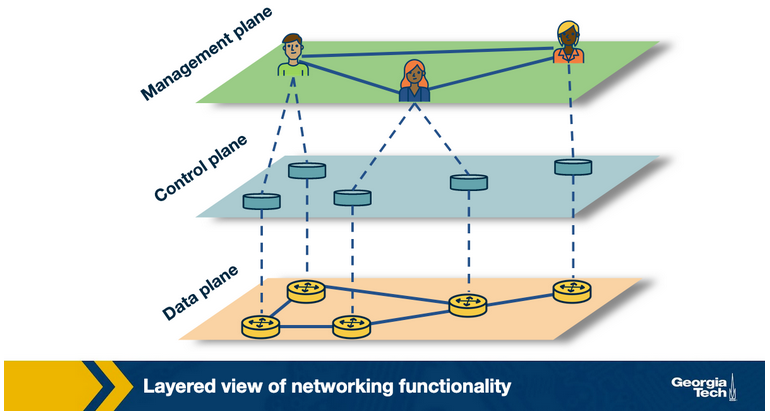
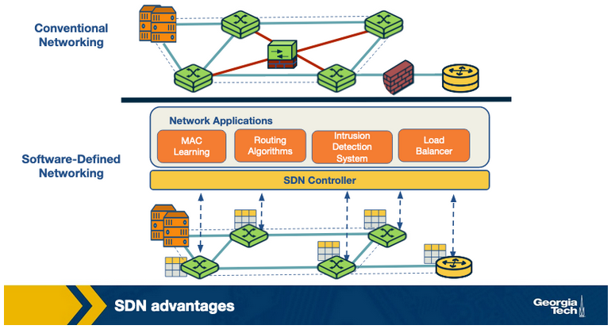
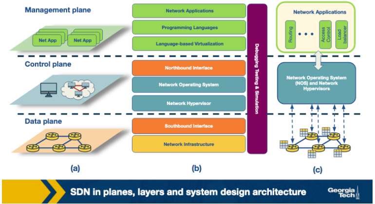
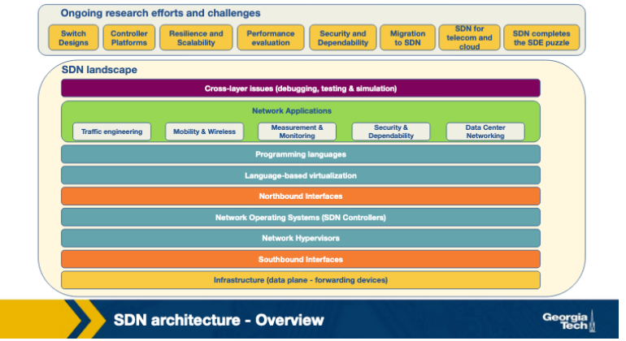
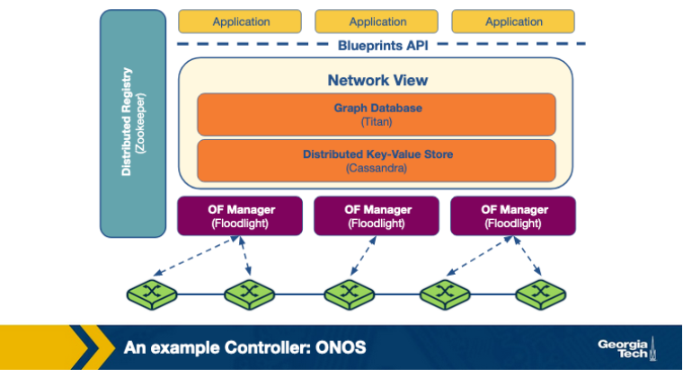
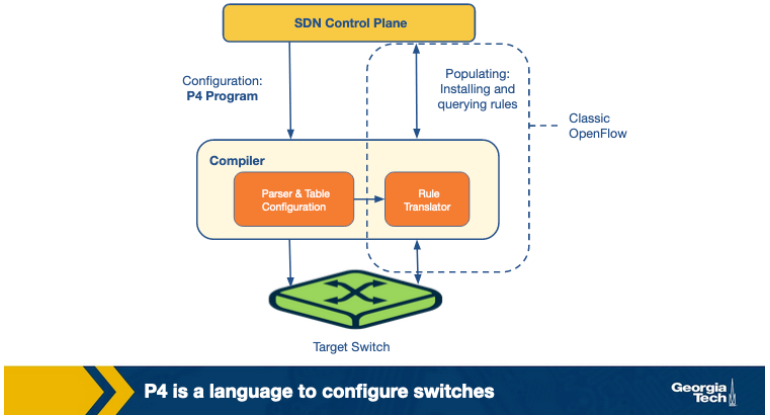
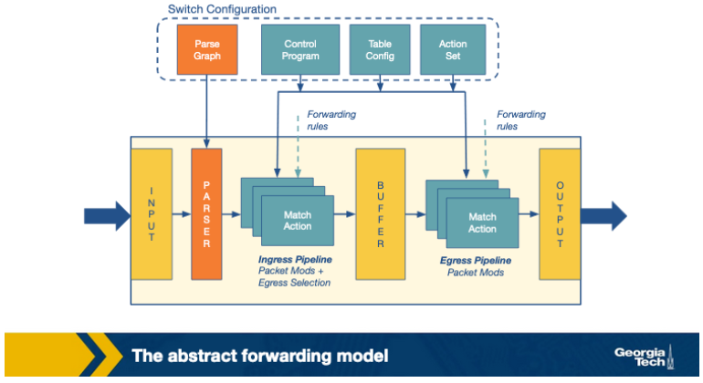
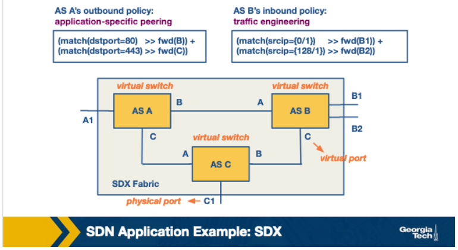

# SDN  (Part 2)

## Revisiting the Motivation for SDN

SDN emerged to address challenges faced by traditional IP networks due to their growing complexity and tightly coupled architecture. Traditional networks required manual configuration for policy changes, lacked automatic response mechanisms, and were slow to adopt updates due to their bundled control and data planes.

SDN separates control logic from the data plane, enabling centralized control and programmable switches. This separation allows for easier network reconfiguration and policy enforcement, achieved through APIs like OpenFlow. SDN introduces a separation of concerns between policy definition, implementation, and traffic forwarding, facilitating innovation and simplifying network management.

Traditionally viewed, computer networks have three planes of functionality, which are all abstract logical concepts:

1. **Data Plane**
   - Functions and processes that forward data in the form of packets or frames.
2. **Control Plane**
   - Functions and processes that determine which path to use by using protocols to populate forwarding tables of data plane elements.
3. **Management Plane**
   - Services that are used to monitor and configure the control functionality, e.g. SNMP-based tools.

If a network policy is defined in the management plane, the control plane enforces the policy and the data plane executes the policy by forwarding the data accordingly.

## SDN Advantages

In conventional networks, the data and control planes are tightly coupled, requiring modifications to all control plane devices for new features, often necessitating specialized equipment like middleboxes. These middleboxes, however, are difficult to reconfigure due to their placement constraints.

In contrast, SDN separates the control plane, isolating it as an external entity (SDN controller). Middlebox services become SDN controller applications, offering advantages such as shared abstractions for easier programming, consistent network information across applications, flexibility in middlebox placement, and simplified integration of networking applications.

## The SDN Landscape

Each layer performs its own functions through different technologies. The figure above presents three perspectives of the SDN landscape: (a) a plane-oriented view, (b) the SDN layers, and (c) a system design perspective.

Next, for each layer, we are providing an overview of the technologies that have been developed. Also, for some representative technologies we are referencing links to actively maintained tutorials.

1. **Infrastructure:** SDN infrastructure comprises forwarding elements controlled by a centralized system. Examples include OpenFlow switches like SwitchLight and Open vSwitch. For further details, see OpenFlow tutorials [here](https://github.com/mininet/openflow-tutorial/wiki).

2. **Southbound interfaces:** These interfaces connect control and forwarding elements, crucial for separating control and data plane functions. Popular implementations include OpenFlow, ForCES, OVSDB, POF, OpFlex, and OpenState. For OVSDB tutorials, visit [here](http://docs.openvswitch.org/en/latest/ref/ovsdb.7/).

3. **Network virtualization:** SDN aims for complete network virtualization, with technologies like VxLAN, NVGRE, FlowVisor, and FlowN offering advancements beyond VLANs and NAT. 

4. **Network operating systems:** SDN utilizes logically centralized controllers known as network operating systems (NOS), providing abstractions and common APIs. Popular NOSs include OpenDayLight, OpenContrail, Onix, Beacon, and HP VAN SDN. Find OpenDayLight tutorials [here](https://www.opendaylight.org/technical-community/getting-started-for-developers/tutorials).

5. **Northbound interfaces:** These interfaces, still an open problem, are meant to provide a software ecosystem with language and controller independence. Examples include Floodlight, Trema, NOX, Onix, and SFNet. For Floodlight tutorials, see [here](https://floodlight.atlassian.net/wiki/spaces/floodlightcontroller/pages/1343514/Tutorials).

6. **Language-based virtualization:** Virtualization allows expressing modularity and abstraction. Examples include Pyretic, libNetVirt, AutoSlice, RadioVisor, and OpenVirteX.

7. **Network programming languages:** High-level languages like Pyretic, Frenetic, Merlin, and Nettle offer abstractions for easier, modular development. Tutorials for Frenetic can be found [here](http://frenetic-lang.github.io/tutorials/Introduction/) and for Pyretic [here](https://github.com/frenetic-lang/pyretic/wiki).

8. **Network applications:** SDN enables various applications such as routing, load balancing, security enforcement, and QoS. Solutions include Hedera, Aster*x, OSP, OpenQoS, Pronto, Plug-N-Serve, SIMPLE, FAMS, FlowSense, OpenTCP, NetGraph, FortNOX, FlowNAC, and VAVE.

## SDN Infrastructure Layer

In the SDN infrastructure layer, networking equipment, including routers, switches, and appliances, solely perform forwarding tasks without embedded intelligence or control. Control is centralized in a Network Operating System (NOS). These networks utilize open and standard interfaces for configuration and communication, ensuring compatibility and interoperability among different devices. Unlike traditional networks with proprietary interfaces, SDN networks can dynamically program heterogeneous devices.

SDN architecture features data plane devices responsible for packet forwarding and controllers running on commodity hardware. OpenFlow serves as the predominant model for SDN data plane devices, employing flow tables with matching rules, actions, and counters. Other specifications include Protocol-Oblivious Forwarding (POF) and Negotiable Datapath Models (NDMs).

In an OpenFlow device, packet lookup begins in the first table and ends with a match or miss. Possible actions include forwarding the packet to an outgoing port, encapsulating and sending it to the controller, dropping it, sending it to normal processing, or forwarding it to the next flow table.

## SDN Southbound Interfaces

Southbound interfaces serve as the bridge between the control plane and data plane functionality. Traditionally, the development of new switches could take up to two years, largely due to the complexities of southbound APIs. However, standards like OpenFlow have been well-received, promoting interoperability and vendor-agnostic device deployment.

OpenFlow stands as the most widely accepted southbound standard for SDNs, facilitating communication between data and control plane devices and providing specifications for OpenFlow-enabled forwarding devices. It offers three key information sources: event-based messages for link or port changes, flow statistics, and packet messages for unknown incoming flows, crucial for providing flow-level information to the Network Operating System (NOS).

While OpenFlow dominates the landscape, other API proposals such as ForCES, OVSDB, POF, OpFlex, and OpenState also exist. ForCES, for instance, offers flexibility in network management without requiring a centralized controller, potentially keeping control and data planes within the same network element. OVSDB complements OpenFlow or Open vSwitch, enabling the creation of vSwitch instances, setting QoS policies, managing interfaces, configuring tunnel interfaces, queuing, and statistics collection.

## SDN Controllers: Centralized vs Distributed

Traditional networks rely on low-level, device-specific configurations and proprietary operating systems, hindering device-agnostic developments and abstraction. SDN addresses these challenges through logically centralized control, where controllers play a critical role in generating network configurations based on defined policies.

Key network control functionalities include topology, statistics, notifications, device management, shortest path forwarding, and security mechanisms, ensuring basic isolation and enforcement between services.

SDN controllers can be categorized by architecture, either centralized or distributed:

1. **Centralized controllers**, like Maestro and Beacon, manage all forwarding devices from a single point, albeit susceptible to scaling issues. Multi-threaded designs and cloud computing nodes aid in scalability.

2. **Distributed controllers**, offering scalability, can be centralized clusters or physically distributed elements. Properties include weak consistency semantics and fault tolerance.

## An example Controller: ONOS

In the previous topic, we discussed various SDN controller types, while now focusing on an example of a distributed controller, ONOS (Open Networking Operating System).

ONOS, a distributed SDN control platform, aims to provide a global network view to applications, along with scale-out performance and fault tolerance. Utilizing a distributed architecture, multiple ONOS instances run in a cluster, sharing network state information to maintain a global view.

Applications consume this view for forwarding and policy decisions, with changes propagated to switches via OpenFlow managers. Titan, a graph database, and Cassandra, a distributed key-value store, implement the network view, accessed through the Blueprints graph API.

The distributed architecture enables scale-out performance and fault tolerance, with each ONOS instance serving as the master controller for a group of switches. Workload distribution occurs by adding more instances to the cluster, while fault tolerance is achieved through redistribution of work upon instance failure. Zoopkeeper maintains mastership between switches and controllers.

## Programming the Data Plane: The Motivation

In this topic, we explore the necessity for programmability on the data plane, introducing P4 (Programming Protocol-independent Packet Processors).

P4 is a high-level programming language designed to configure switches, working alongside SDN control protocols like OpenFlow. Originally, OpenFlow provided a basic rule table to match packets based on header fields, but as its specification expanded, so did the need for an extensible approach to parse packets and match header fields.

P4 serves as a general interface between switches and controllers, allowing controllers to dictate switch operations. Its primary goals include reconfigurability, protocol independence, and target independence, enabling controllers to modify packet parsing and processing while remaining agnostic to specific protocols and underlying devices.

## Programming the Data Plane: P4's Forwarding Model

In this discussion, we delve into P4 and its proposed forwarding model.

P4 enables switches to utilize a programmable parser and match+action tables for packet forwarding. Unlike OpenFlow's fixed parsers and sequential match+action tables, P4 allows for flexible table access in series or parallel.

This model facilitates generalized packet processing across diverse forwarding devices like routers and load balancers, utilizing various technologies such as fixed function switches and NPUs. A common language is employed to write device-agnostic packet processing programs, which are then compiled for different forwarding devices.

The P4 forwarding model encompasses two key operations:

1. **Configure**: Programs the parser to process header fields and determines the order of match+action stages.
2. **Populate**: Modifies entries in match+action tables to define packet policies.

In essence, configuration defines packet processing and supported protocols, while population establishes packet policies.

## SDN Applications: Overview

1. Traffic Engineering
   - SDN optimizes traffic flow to minimize power consumption, utilize network resources efficiently, and perform load balancing. Applications like ElasticTree and Plug-n-Serve automate network management, reducing routing table growth and enabling dynamic scaling.

2. Mobility and Wireless
   - SDN simplifies wireless network management by dynamically allocating resources, offering on-demand virtual access points (VAPs), and enabling seamless mobility between access points. Frameworks like OpenRadio and Odin enhance wireless network management and mobility.

3. Measurement and Monitoring
   - SDN enhances measurement systems and monitoring frameworks by adding features and improving efficiency. APIs like OpenSketch enable flexible network measurements, while frameworks such as OpenSample and PayLess optimize data plane statistics collection.

4. Security and Dependability
   - SDN improves network security by enforcing policies at network entry points, detecting and mitigating DDoS attacks, and monitoring cloud infrastructures. Further research is needed to enhance SDN security.

5. Data Center Networking
   - SDN revolutionizes data center networking with features like live migration of networks, real-time monitoring, and anomaly detection. Applications like LIME facilitate live migration, while FlowDiff detects abnormalities in data center networks.

## SDN Application Example: A Software Defined Internet Exchange

In this topic, we explore how SDN can enhance the operation of Internet Exchange Points (IXPs), focusing on a specific SDN application for IXPs called SDX.

The limitations of the Border Gateway Protocol (BGP) in Internet routing, such as routing only on destination IP prefix and limited control over end-to-end paths, can be addressed using SDN. SDN allows for flexible packet handling based on various header fields, unlike BGP.

SDX, an SDN-based architecture proposed for IXPs, facilitates multiple applications including:

1. Application-specific peering
    - Custom peering rules for specific applications like high-bandwidth video services.
2. Traffic engineering
    - Control of inbound traffic based on source IP or port numbers.
3. Traffic load balancing
    - Rewriting destination IP addresses to balance load.
4. Traffic redirection through middleboxes
   - Directing subsets of traffic to middleboxes.

In the SDX architecture, each Autonomous System (AS) has its virtual SDN switch connecting to other participant ASes, enabling independent policy definition. SDX combines policies from multiple participants into a single policy for the physical switch, using the Pyretic language to express packet matching and actions.

Consider the example in the picture above, AS A's outbound policy forwards HTTP traffic with destination port 80 to AS B and HTTPS traffic with port 443 to AS C, expressed through packet matching and forwarding functions.

## SDN Applications: Wide Area Traffic Delivery

In this section, we delve into the applications of SDN, particularly SDX, in wide area traffic delivery:

1. Application-specific peering
    - ISPs can prioritize certain high-volume traffic, like that from YouTube or Netflix, by configuring custom rules at the SDX. This eliminates the need for additional configuration at ISP edge routers.

2. Inbound traffic engineering
    - SDN switches can direct traffic based on source IP and port, giving ASes control over how traffic enters their networks. This contrasts with BGP's destination-based routing, offering more flexibility without BGP's limitations.

3. Wide-area server load balancing
    - SDX can efficiently balance server loads by modifying packet headers. An anycast IP can be assigned to a service, with SDX redirecting packets to specific backend servers based on load, bypassing the need for DNS caching.

4. Redirection through middleboxes
    - SDX addresses challenges in using middleboxes like firewalls and load balancers. Unlike traditional methods relying on fixed middlebox placement, SDX dynamically directs traffic through a sequence of middleboxes, overcoming limitations of static routing protocols like internal BGP.

## Quiz Questions

1. In a software defined networking, every device (switch, router, middlebox, etc.) must be able to make decisions in the forwarding process.
   - True
   - False
    

            
Click to reveal the answer
 False
    
 
2. The transition to IPv6 would be faster with a software defined networking paradigm compared to a conventional networking paradigm.
   - True
   - False
    

            
Click to reveal the answer
 True
    
 
3. An OpenFlow switch may also be used for routing.
   - True
   - False
    

            
Click to reveal the answer
 True
    
 
4. The management plane ___________ a network policy.
   - Defines
   - Enforces
   - Executes
   - Ignores
    

            
Click to reveal the answer
 Defines
    
 
5. The control plane ___________ a network policy.
   - Defines
   - Enforces
   - Executes
   - Ignores
    

            
Click to reveal the answer
 Enforces
    
 
6. The data plane ___________ a network policy.
   - Defines
   - Enforces
   - Executes
   - Ignores
    

            
Click to reveal the answer
 Executes
    
 

7. Load balancing is only possible with software defined networking.
   - True
   - False
    

            
Click to reveal the answer
 False
    
 

8. In software-defined networking, integrations of networking applications are smoother. For example, load balancing and routing applications can be combined sequentially.Describe a scenario where routing would take precedence over load balancing, and vice versa.
    

            
Click to reveal the answer

            For example, in a network with high traffic volume and complex routing requirements, routing policies may take precedence over load balancing. Conversely, in a network with high availability requirements, load balancing may be a higher priority.
    
 
9. In conventional networking, which device can implement an intrusion detection system (IDS)?
    - Switches
    - Routers
    - Middleboxes
    - All of the above
    

            
Click to reveal the answer
 Middleboxes
    
 

10. The northbound interfaces separate the...
    - Management plane and control plane
    - Management plane and data plane
    - Data plane and control plane
    

            
Click to reveal the answer
 Management plane and control plane
    
 

11. The southbound interfaces separate the...
    - Management plane and control plane
    - Management plane and data plane
    - Data plane and control plane
    

            
Click to reveal the answer
 Data plane and control plane
    
 

12. OpenFlow is used in the ___________ (a) plane, and it is an example of a ___________ (b) interface.
    - a: Data / Control / Management
    - b: Northbound / Southbound
    

            
Click to reveal the answer
 a: Data, b: southbound
    
 

13. What action does an OpenFlow device take when an incoming flow does NOT match any rules in any of the flow tables in the pipeline?
    - Drops the packets
    - Creates a new rule for the packets
    - Holds the packet until the controller is updated with a rule to handle it
    - Sends a message to the controller
    

            
Click to reveal the answer
 Sends a message to the controller
    
 

14. Which type of message sent by an OpenFlow device to the network OS allows for quality of service (QoS) policies to be implemented?
    - An event-based message
    - Flow statistics
    - A packet message
    - None of the above
    

            
Click to reveal the answer
 Flow statistics
    
 

15. Which type of message would be sent by an OpenFlow device to the network OS in when it receives new routing information?
    - An event-based message
    - Flow statistics
    - A packet message
    - None of the above
    

            
Click to reveal the answer
 An event-based message
    
 

16. A network controller prioritizes the rules generated by various services.
    - True
    - False
    

            
Click to reveal the answer
 True
    
 

17. Which architecture provides the best throughput?
    - A centralized controller
    - A distributed controller with a centralized cluster of nodes
    - A distributed controller with a physically distributed set of elements
    

            
Click to reveal the answer
 A distributed controller with a centralized cluster of nodes
    
 

18. Which architecture provides the highest level of fault tolerance?
    - A centralized controller
    - A distributed controller with a centralized cluster of nodes
    - A distributed controller with a physically distributed set of elements
    

            
Click to reveal the answer
 A distributed controller with a physically distributed set of elements
    
 

19. Which architecture has the strongest consistency semantics?
    - A centralized controller
    - A distributed controller with a centralized cluster of nodes
    - A distributed controller with a physically distributed set of elements
    

            
Click to reveal the answer
 A centralized controller
    
 

20. How does ONOS handle faults?
    - ONOS is a centralized controller and therefore not fault tolerant.
    - If an ONOS instance fails, its switches must be manually reassigned by the management plane.
    - If an ONOS instance fails, its switches are randomly select a new master instance.
    - If an ONOS instance fails, the other instances elect a new master for each of the switches that were previously controlled by the failed instance.
    

            
Click to reveal the answer
 If an ONOS instance fails, the other instances elect a new master for each of the switches that were previously controlled by the failed instance.
    
 

21. The P4 programming language can also be used with a conventional network paradigm.
    - True
    - False
    

            
Click to reveal the answer
 False
    
 

22. The P4 language is being developed as a replacement for OpenFlow.
    - True
    - False
    

            
Click to reveal the answer
 False
    
 

23. The P4 language allows programmers to use multiple header fields to parse, match, and perform actions on packets.
    - True
    - False
    

            
Click to reveal the answer
 True
    
 

24. The P4 language is used to program the _______________ plane.
    - management
    - control
    - data
    

            
Click to reveal the answer
 data
    
 

25. A multiport switch and a SmartNIC are two devices that can be programmed using P4. This is possible to which of the three primary goals of the language?
    - Reconfigurability
    - Protocol independence
    - Target independence
    

            
Click to reveal the answer
 Target independence
    
 

26. The forwarding model used by P4 is a pipeline.
    - True
    - False
    

            
Click to reveal the answer
 True
    
 

27. The match+action tables in P4 are more flexible than those in current version of OpenFlow.
    - True
    - False
    

            
Click to reveal the answer
 True
    
 

28. What are the two operations in the P4 forwarding model?
    - Match, Act
    - Configure, Forward
    - Parse, Populate
    - Configure, Populate
    

            
Click to reveal the answer
 Configure, Populate
    
 

29. The SDX architectures provides which of the following benefits?
    - It provides an AS more flexibility for managing traffic.
    - It scales easily with more participants.
    - It provides faster peering compared to a conventional IXP.
    - All of the above
    

            
Click to reveal the answer
 It provides an AS more flexibility for managing traffic
    
 

30. In the SDX architecture, each participant AS must use the same network applications for traffic engineering.
    - True
    - False
    

            
Click to reveal the answer
 False
    
 

31. In the SDX architecture, two autonomous systems can choose to only exchange video traffic.
    - True
    - False
    

            
Click to reveal the answer
 True
    
 

32. Which of the follow are applications of the SDX architecture?
    - Inbound traffic engineering
    - Wide-area server load balancing
    - Redirection of traffic through middleboxes
    - All of the above
    

            
Click to reveal the answer
 All of the above
    
 

33. Most SDN applications can be grouped into one of the five categories: traffic engineering, mobility and wireless, measurement and monitoring, security and dependability, and data center networking. Classify each application into an appropriate category.
    - Load Balancing
    - Interference management
    - Traffic matrix estimation tool
    - Optimize network utilization
    - Minimizing power consumption
    - DoS attack mitigation
    

            
Click to reveal the answer

                - Load Balancing: Traffic engineering
                - Interference management:  Mobility and wireless
                - Traffic matrix estimation tool: Measurement and monitoring
                - Optimize network utilization: Data center networking
                - Minimizing power consumption: Traffic engineering
                - DoS attack mitigation: Security and dependability
    
 

## Study Guide Questions

1. Describe the three perspectives of the SDN landscape.
2. Describe the responsibility of each layer in the SDN layer perspective.
3. Describe a pipeline of flow tables in OpenFlow.
4. What’s the main purpose of southbound interfaces?
5. What are three information sources provided by the OpenFlow protocol?
6. What are the core functions of an SDN controller?
7. What are the differences between centralized and distributed architectures of SDN controllers?
8. When would a distributed controller be preferred to a centralized controller?
9. Describe the purpose of each component of ONOS (Open Networking Operating System) a distributed SDN control platform.
10. How does ONOS achieve fault tolerance?
11. What is P4?
12. What are the primary goals of P4?
13. What are the two main operations of P4 forwarding model?
14. What are the applications of SDN? Provide examples of each application.
15. Which BGP limitations can be addressed by using SDN?
16. What’s the purpose of SDX?
17. Describe the SDX architecture.
18. What are the applications of SDX in the domain of wide-area traffic delivery?
