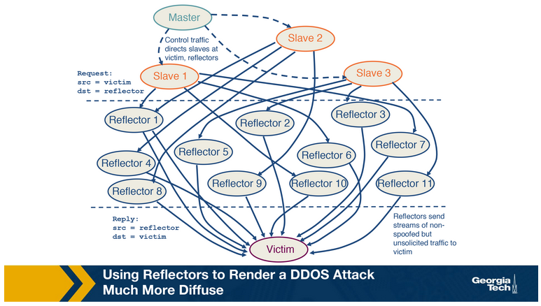

# Internet Security

The Internet was originally developed without security considerations, leading to vulnerabilities exploited by adversaries. Today, internet security is a vast research field. In this lesson, we examine specific topics within this domain, such as attacks on DNS protocols and infrastructure, misuse of BGP for traffic attraction, techniques for inferring network reputation, and Denial of Service (DoS) attacks. We particularly focus on recent DDoS defense techniques at Internet Exchange Points (IXPs) due to their increasing popularity. Attacks aim to compromise secure communications, illustrated by vulnerabilities in DNS systems, including Round Robin DNS (RRDNS) and Content Distribution Networks (CDNs). We delve into Fast Flux networks, BGP hijacking, and mitigation strategies like Prefix deaggregation and Multiple Origin AS (MOAS). Through a real-world case study, the "Linktel Incident," we analyze the impact of BGP hijacking. Additionally, we discuss Distributed Denial of Service (DDoS) attacks and mitigation tactics such as filtering, scrubbing, and FlowSpec at IXPs, including the use of BGP blackholing as a defense mechanism, despite its limitations.

## Properties of Secure Communication

The following properties are important to consider so that communication is secure even in the presence of attackers:

1. Confidentiality
   - Ensuring that communication remains private between sender and receiver, preventing eavesdropping or interception. Encryption of messages enhances confidentiality by rendering intercepted messages meaningless to attackers.
2. Integrity
   - Maintaining the integrity of messages during transit, guarding against unauthorized modifications, insertions, or deletions. Mechanisms can be implemented to verify message integrity.
3. Authentication
   - Verifying the identities of communicating parties to prevent impersonation attacks. Authentication mechanisms are employed to confirm user identities.
4. Availability
   - Ensuring that communication channels and services remain accessible despite potential disruptions like power outages, hardware failures, or denial of service attacks. Measures are taken to handle such failures and maintain system availability.

## DNS Abuse

Attackers have developed techniques abusing the DNS protocol to extend the uptime of domains that are used for malicious purposes and remain undetectable for longer. The techniques used by attackers have their roots in legitimate DNS-based techniques that legitimate businesses and administrators use.

### Round Robin DNS (RRDNS)

This method is used by large websites to distribute the load of incoming requests to several servers at a single physical location. It responds to a DNS request with a list of DNS A records, which it then cycles through in a round-robin manner. The DNS client can then choose a record using different strategies. Each A record also has a Time to Live (TTL) for this mapping, which specifies the number of seconds the response is valid. If the lookup is repeated while the mapping is still active, the DNS client will receive the same set of records, albeit in a different order.

### DNS-based content delivery

CDNs distribute the load amongst multiple servers at a single location but also distribute these servers across the world. When accessing the name of the service using DNS, the CDN computes the ‘nearest edge server’ and returns its IP address to the DNS client. CDNs also use sophisticated techniques based on network topology and current link characteristics to determine the nearest server. This results in the content being moved ‘closer’ to the DNS client, which increases responsiveness and availability.

### Fast-Flux Service Networks (FFSN)

FFSNs are an extension of the ideas behind RRDNS and CDN. As its name suggests, it is based on a ‘rapid’ change in DNS answers, with a TTL lower than that of RRDNS and CDN. One key difference between FFSN and the other methods is that after the TTL expires, it returns a different set of A records from a larger set of compromised machines. These compromised machines act as proxies between the incoming request and control node/mothership, forming a resilient, robust, one-hop overlay network.

The figure below shows the content retrieval process of a benign HTTP server. The DNS lookup returns the IP address of the control node of that domain, and the request – HTTP GET is sent to this control node. The control node responds directly to the incoming request with the content of the domain.

The figure below shows the content-retrieval process for content hosted in a FFSN.

The domain ‘www.thearmynext.info’ was found in a spam email. Here, the mothership is the control node where the actual content of the scam is being hosted. The DNS lookup from the client returns several different IP addresses, all belonging to compromised machines in the network (flux agents). Each time the TTL expires, the lookup returns completely different IP addresses. The flux-agent then relays the request it receives (HTTP GET) to the control node, which sends content to the flux-agent. Lastly, the content is delivered to the client. It is interesting to note that these flux agents, although seemingly close to each other, are usually located in different countries and belong to different Autonomous Systems (AS).

An important aspect of Internet abuse is the infrastructure that attackers use to support the abuse. For example, the attackers need Internet infrastructure to support illegal content hosting, C&C infrastructure hosting, etc.

## How to Infer Network Reputation: Evidence of Abuse

In this section, we discuss FIRE – FInding Rogue nEtworks, a system that monitors the Internet for rogue networks. Rogue networks are networks whose main purpose is malicious activity such as phishing, hosting spam pages, hosting pirated software, etc. It uses three main data sources to identify hosts that likely belong to rogue networks:

1. Botnet command and control providers
   - A bot-master would prefer to host their C&C on networks where it is unlikely to be taken down. The two main types of botnets this system considers are IRC-based botnets and HTTP-based botnets.
2. Drive-by-download hosting providers
   - A method of malware installation without interaction with the user. It commonly occurs when the victim visits a web page that contains an exploit for their vulnerable browser.
3. Phish housing providers
   - This data source contains URLs of servers that host phishing pages. Phishing pages usually mimic authentic sites to steal login credentials, credit card numbers and other personal information. These pages are hosted on compromised servers and usually are up only for a short period of time.

The key difference between rogue and legitimate networks is the longevity of malicious behavior. Legitimate networks are usually able to remove the malicious content within a few days, whereas rogue networks may let the content be up for weeks to more than a year! By disregarding IP addresses that have been active for a short time, we ignore phishing attacks hosted on legitimate networks and web servers that were temporarily abused for botnet communication.

Each of these data sources produces a list of malicious IP addresses daily. FIRE combines the information from these three lists to identify rogue AS (organizations are considered equivalent to autonomous systems). The approach is to identify the most malicious networks as those that have the highest ratio of malicious IP addresses as compared to the total owned IP addresses of that AS.

## How to Infer Network Reputation: Interconnection Patterns

In this topic, we continue our discussion on approaches to infer network reputation. In an earlier topic, we discussed an approach that is based on data plane monitoring. With data plane monitoring, only when a network has a large enough concentration of blacklisted IPs will it be flagged as malicious. We flag a network as malicious only after we have observed indications of malicious behavior for a long enough period of time, for example, when we have access to a blacklist and we observe a large number of IPs that belong to an AS to be blacklisted for spamming, phishing, hijacking, etc.

However, in practice, it is not feasible to monitor the traffic of all networks to detect malicious behaviors from the data plane. In addition, the disadvantage of this approach is that it may take a long time until a very large fraction of IPs makes it to a blacklist. Furthermore, the method struggles to distinguish between legitimate networks that are misused and those potentially operated by malicious cyber actors.

This topic discusses a complementary approach – ASwatch, which uses information exclusively from the control plane (i.e., routing behavior) to identify malicious networks. Also, this approach aims to detect malicious networks that are likely run by cyberactors, or "bulletproof" as they are called, rather than networks that may be badly abused.

The approach relies on detecting unique traits of bulletproof ASes, which exhibit distinct interconnection patterns and control plane behaviors compared to legitimate networks. For instance, they frequently switch upstream providers and maintain relationships with dubious networks rather than directly connecting with legitimate ones, enabling them to evade detection longer. ASwatch, designed to monitor global BGP routing activity, operates in two phases:

1. Training: ASwatch learns typical control-plane behaviors of malicious and legitimate ASes by tracking their business relationships and BGP update patterns. It analyzes three main features: Rewiring Activity (e.g., frequent provider changes), IP Space Fragmentation and Churn (utilizing small BGP prefixes), and BGP Routing Dynamics (unique announcement patterns). Supervised learning trains the model to recognize these behaviors.
2. Operational: ASwatch assesses unknown ASes based on computed features, assigning a reputation score. Consistent low scores over multiple days flag an AS as malicious due to suspicious behavior.

## How to Infer Network Reputation: Likelihood of Breach

This section presents a system for predicting the likelihood of a security breach within organizations, such as the JP Morgan Chase attack, using only externally observable features, ensuring scalability. The system utilizes a Random Forest model trained on three classes of features:

1. Mismanagement Symptoms:
   - Open Recursive Resolvers
   - DNS Source Port Randomization
   - BGP Misconfiguration
   - Untrusted HTTPS Certificates
   - Open SMTP Mail Relays
2. Malicious Activities:
   - Capturing spam, phishing, and malware activities
   - Capturing scanning activity
3. Security Incident Reports:
   - VERIS Community Database
   - Hackmageddon
   - The Web Hacking Incidents Database

Using 258 features, including secondary features and organization size, the Random Forest classifier yields a risk probability, achieving a 90% accuracy rate.

## Traffic Attraction Attacks: BGP Hijacking

BGP hijacking attacks are categorized as follows:

1. Classification by Affected Prefix:
   - Exact prefix hijacking: Two ASes, one genuine and one counterfeit, announce paths for the same prefix, disrupting routing.
   - Sub-prefix hijacking: The hijacking AS works with a sub-prefix of a genuine prefix, diverting traffic to itself.
   - Squatting: The hijacking AS announces a prefix not yet announced by the owner AS.
2. Classification by AS-Path Announcement:
   - Type-0 hijacking: An AS announces a prefix it doesn't own.
   - Type-N hijacking: The counterfeit AS announces an illegitimate path to create a fake link between ASes.
   - Type-U hijacking: The hijacking AS may change the prefix without modifying the AS-PATH.
3. Classification by Data-Plane Traffic Manipulation:
   - Blackholing (BH) attack: Traffic is dropped, preventing it from reaching the intended destination.
   - Man-in-the-middle (MM) attack: Traffic is intercepted or manipulated before reaching the receiving AS.
   - Imposture (IM) attack: The network traffic of the victim AS is impersonated, and responses are sent back to the sender.

## Traffic Attraction Attacks: Motivations

In understanding the motivations behind BGP hijacking attacks, they can be classified as:

1. Human Error: Accidental routing misconfigurations due to manual errors, leading to large-scale exact-prefix hijacking.
   - Example: China Telecom's accidental leak of a full BGP table causing Type-0 hijacking.
2. Targeted Attack: The hijacking AS intercepts network traffic (MM attack) while remaining covert on the control plane (Type-N and Type-U attacks).
   - Example: Russian networks hijacking Visa and Mastercard's traffic in 2017.
3. High Impact Attack: The attacker aims to cause widespread disruption of services.
   - Example: Pakistan Telecom's Type-0 sub-prefix hijacking blackholing YouTube's services worldwide for nearly 2 hours.

Each hijacking attempt has a unique motivation, leading to the employment of different methods or combinations thereof based on the scenario and intent of the attack.

## Example BGP Hijack Attacks

In the figure below, we have a new prefix being announced by an AS to its neighbors:

1. AS1 announces a new prefix (10.10.0.0/16)
2. AS2, AS3, AS4 and AS5 that receive an announcement from the previous / neighboring AS, check whether this entry is present in the RIB, if new, add it, and send it to all neighboring ASes.
3. As the announcements are made by AS2, AS3 and AS4; A5 eventually receives the full path and new prefix from A4 (4,2,1).
4. If multiple routes exist for a prefix, then the selected (best) route is highlighted. Also, this route is selected for announcement to the neighbors.

### Attack Scenario: Hijacking a prefix

An attacker uses a router at AS4 to send false announcements and hijack the prefix 10.10.0.0/16 that belongs to AS1:

1. The attacker uses a router to announce the prefix 10.10.0.0/16 that belongs to AS1, with a new origin AS4, pretending that the prefix belongs to AS4.  
2. This new announcement causes a conflict of origin for the ASes that receive it (Multiple Origin AS or MOAS).  
3. As a result of the new announcement, AS2, AS3 and AS5 receive the false advertisement and they compare it with the previous entries in their RIB.
4. AS2 will not select the route as the best route as it has the same path length with an existing entry.
5. AS3 and AS5 will believe the new advertisement, and they will update their entries (10.10.0.0/16 with path 4,2,1) to (10.10.0.0/16 with path 4). Therefore AS5 and AS3 will send all traffic for prefix 10.10.0.0/16 to AS4 instead of AS1.

### Attack Scenario: Hijacking a path

In this scenario, the attacker manipulates received updates before propagating them to neighbors:

1. AS1 advertises the prefix 10.10.0.0/16.
2. AS2 and AS3 receive and propagate legitimately the path for the prefix.
3. At AS4, the attacker compromises the update for the path by changing it to 4,1 and propagates it to the neighbors AS3, AS2, and AS5. Therefore it claims that it has direct link to AS1 so that others believe the new false path.  
4. AS5 receives the false path (4,1)  “believes” the new false path and it adopts it. But the rest of the ASes don’t adopt the new path because they either have an shorter path already or an equally long path to AS1 for the same prefix.  

The key observation here is that the attacker does not need not to announce a new prefix, but rather it manipulates an advertisement before propagating it.

## Defending against BGP Hijacking: An example detection system

In discussing methods for detecting BGP hijacking, ARTEMIS emerges as a locally-run system designed by network operators to protect their prefixes. The key components of ARTEMIS include:

1. Configuration File: Network operators populate a configuration file listing their owned prefixes for reference.
2. BGP Updates Mechanism: ARTEMIS receives updates from local routers and monitoring services to track changes.

By comparing received BGP updates with the local configuration file, ARTEMIS identifies anomalies in prefixes and AS-PATH fields, triggering alerts accordingly.

A point of consideration in BGP hijacking detection is the performance of False Positive (FP) and False Negative (FN) rates when we use different detection criteria. We ideally want a system with the least number of FPs and FNs that are inconsequential. The ARTEMIS system also allows the network operator to choose between a) accuracy and speed, and b) FN which are inconsequential (less impact on control plane) for less FP.

## Defending against BGP Hijacking: Example Mitigation Techniques

For automated mitigation against BGP hijacking attacks, the ARTEMIS system employs two techniques:

1. Prefix Deaggregation: Affected networks can mitigate attacks by deaggregating targeted prefixes, announcing more specific sub-prefixes. For example, during the attack on YouTube by Pakistan Telecom, YouTube countered by announcing 208.65.153.128/25 and 208.65.153.0/25 within 90 minutes, restoring services temporarily.
2. Mitigation with Multiple Origin AS (MOAS): Third-party organizations and service providers announce hijacked prefixes from their locations, attracting global network traffic. This traffic is then scrutinized and forwarded to the legitimate AS.

The ARTEMIS research highlights two key findings:

1. Outsourcing BGP announcements to third parties is highly effective in combating hijacking attacks.
2. Comparison with prefix filtering reveals that outsourcing BGP announcements outperforms traditional filtering methods.

## DDoS: Background and Spoofing

In discussing Denial of Service (DDoS) attacks, we also address how attackers amplify them through Spoofing.

A DDoS attack floods server or network resources with excessive traffic, achieved by deploying compromised flooding servers (slaves) controlled by the attacker. These servers are instructed to send high volumes of traffic to overwhelm the victim, rendering it unreachable or exhausting its bandwidth.

Structure of DDoS Attack:

In a DDoS attack, the attacker's master host directs compromised slaves to inundate the victim with traffic. This configuration amplifies the attack's intensity and complicates defense efforts. The attack traffic from the slaves contains spoofed source addresses, making it challenging for the victim to track and block.

Spoofing:

IP spoofing involves falsifying the source IP address in packets to impersonate legitimate servers. In DDoS attacks, spoofing occurs in two forms:

1. Spoofed source IP addresses divert server responses to unintended clients, wasting network and client resources and causing denial of service to legitimate users.
2. Setting the same IP address in both the source and destination IP fields causes the server to send replies to itself, potentially crashing it.

## DDoS: Reflection and Amplification

Continuing our discussion on DDoS, we delve into two additional techniques employed by attackers to amplify the attack's impact: reflection and amplification.

Reflection and Amplification Attacks:

In a reflection attack, attackers utilize reflectors to target the victim. Reflectors, such as web servers or DNS servers, respond to requests. For instance, a web server responds with SYN ACK to a SYN packet during TCP handshake. Attackers direct slaves to send spoofed requests to numerous reflectors, setting the source address to the victim's IP. Consequently, the victim receives responses from millions of reflectors, overwhelming its bandwidth and wasting resources, hindering legitimate responses. This forms the foundation of a reflection attack.

Using Reflectors for a Diffuse DDoS Attack:

The master instructs slaves to send spoofed requests to reflectors, redirecting traffic to the victim. This differs from conventional DDoS attacks where slaves directly target the victim. While the victim can identify reflectors from response packets, reflectors cannot identify the originating slave. In reflection and amplification attacks, reflectors send large responses to the victim, exacerbating the challenge of handling the influx of traffic.

## Defenses Against DDoS Attacks

In discussing tools for managing ongoing DDoS attacks or deterring them, several options are available:

1. Traffic Scrubbing Services:
   - Divert incoming traffic to specialized servers for scrubbing, separating clean from unwanted traffic.
   - Challenges include reduced effectiveness for large-scale attacks and potential performance decrease due to traffic rerouting.
2. ACL Filters:
   - Deployed by ISPs or IXPs at AS border routers to filter unwanted traffic.
   - Effective with homogeneous hardware but may face scalability limitations and bandwidth exhaustion at neighboring ASes.
3. BGP Flowspec:
   - Mitigates DDoS attacks by deploying fine-grained filters across AS borders.
   - Matches specific flows based on various packet attributes or drop rate limits.
   - Effective within domains but less popular in inter-domain environments due to trust dependencies.
   - Utilizes BGP control plane for rule deployment across routers simultaneously.
   - Challenges include scalability for large attacks with multiple sources.

Example of BGP Flowspec:
    - A rule filtering HTTP/HTTPS traffic from specific IP and subnet to Google servers, with an action to discard traffic.

Overall, while Flowspec offers ease of rule deployment across routers, its effectiveness in inter-domain environments may be limited by trust issues and scalability concerns for large-scale attacks.

## DDoS Mitigation Techniques: BGP Blackholing

In discussing DDoS mitigation techniques, we explore BGP blackholing as a strategy to counter such attacks.

BGP blackholing involves dropping all attack traffic to a null location, preventing it from reaching the targeted victim. This approach does not stop the traffic closer to the destination of the attack. It is effective for high-volume attacks compared to other methods. Implementation typically involves cooperation from upstream providers or Internet Exchange Points (IXPs).

In this technique:
    - The victim AS communicates the attacked destination prefix to its upstream AS, which then drops attack traffic toward this prefix.
    - The provider advertises a more specific prefix with a modified next-hop address, diverting attack traffic to a null interface.
    - Blackhole messages are tagged with a specific BGP blackhole community attribute, distinguishable from regular routing updates.

Scenario: Implementation with Upstream Provider:
    - A network offering blackholing services acts as a blackholing provider.
    - Blackholing communities provided by network or customer providers are used at the network edge, while ISPs or IXPs handle blackholing at the Internet core.

If the blackholing provider is a peer or upstream provider, the AS announces its associated blackhole community along with the blackhole prefix, facilitating the mitigation process.

In mitigating the attack, AS2 (the victim network) employs blackholing by communicating with its provider network, AS1. AS2 sends a blackholing message to AS1, specifying the IP address 130.149.1.1/32 under attack and the blackholing community field set to AS1 : 666, indicating AS1's blackholing community. Upon receiving the message, AS1 recognizes it as a blackholing message and sets the next-hop field for the IP address to a blackholing IP, effectively dropping all incoming traffic to the host 130.149.1.1. Consequently, the victim host ceases to receive attack traffic.

Scenario: Blackholing Implementation via IXP:
Similarly, at Internet Exchange Points (IXPs), if the AS is a participant and under attack, it sends blackholing messages to the IXP route server upon connecting. The route server then disseminates the message to all connected IXP member ASes, which subsequently drop traffic to the blackholed prefix. The null interface for redirecting traffic is specified by the IXP. The blackholing message to the IXP includes the IXP blackhole community for identification.

Similar to the previous example, consider here an IP 130.149.1.1 in AS2 that is under attack. The victim AS, AS2 connects to the router server of the IXP and sends a BGP blackholing message. The message contains the IP under attack and the community field set to ASIXP : 666, which is the blackholing community of the IXP. The route server identifies it as a blackholing message and sets the next-hop of the 130.149.1.1 IP to a blackholing IP. It propagates this announcement to all its member ASes, which then drops all the traffic to host 130.149.1.1.

## DDoS Mitigation Techniques: BGP Blackholing Limitations and Problems

BGP blackholing presents a significant drawback as it renders the attacked destination unreachable, including legitimate traffic.

Consider a DDoS attack scenario (figure a) where no mitigation strategy is employed. The prefix 100.10.10.0/24 is advertised by AS1, and an attack targets a web service running on IP 100.10.10.10 within AS1. This overload results in service unreachability for users in AS2 and AS3.

Now, in the scenario where AS1 utilizes BGP blackholing (figure b), an update is sent to the IXP's route server, including the blackhole community (IXP_ASN: 666) and the prefix 100.10.10.10/32. The route server disseminates this update to AS2 and AS3.

Suppose AS2 accepts the announcement while AS3 rejects it, possibly due to various reasons like intentional non-participation, configuration issues, or errors. As AS2 accepts the announcement, traffic towards the attacked prefix via AS2 is dropped, causing collateral damage by also dropping legitimate traffic.

Conversely, as AS3 does not honor the announcement, all traffic, including legitimate and attack traffic, continues flowing via AS3, rendering the mitigation ineffective, especially if a significant portion of attack traffic comes through AS3 or if many peers reject blackholing announcements.

Examining traffic distribution during an attack at a large IXP reveals insights into the collateral damage caused by blackholing. Despite the need to block only attack traffic from a specific port (UDP port 11211), blackholing indiscriminately drops all traffic, including legitimate traffic, exacerbating the impact.

## Study Guide

- What are the properties of secure communication?
- How does Round Robin DNS (RRDNS) work?
- How does DNS-based content delivery work?
- How do Fast-Flux Service Networks work?
- What are the main data sources used by FIRE (FInding Rogue nEtworks) to identify hosts that likely belong to rogue networks?
- The design of ASwatch is based on monitoring global BGP routing activity to learn the control plane behavior of a network. Describe 2 phases of this system.
- What are three classes of features used to determine the likelihood of a security breach within an organization?
- (BGP hijacking) What is the classification by affected prefix?
- (BGP hijacking) What is the classification by AS-Path announcement?
- (BGP hijacking) What is the classification by data plane traffic manipulation?
- What are the causes or motivations behind BGP attacks?
- Explain the scenario of prefix hijacking.
- Explain the scenario of hijacking a path.
- What are the key ideas behind ARTEMIS?
- What are the two automated techniques used by ARTEMIS to protect against BGP hijacking?
- What are two findings from ARTEMIS?
- Explain the structure of a DDoS attack.
- What is spoofing, and how is it related to a DDoS attack?
- Describe a Reflection and Amplification attack.
- What are the defenses against DDoS attacks?
- Explain provider-based blackholing.
- Explain IXP blackholing.
- What is one of the major drawbacks of BGP blackholing?
