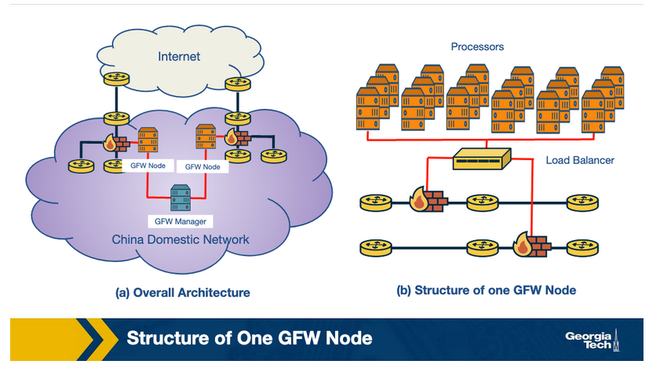
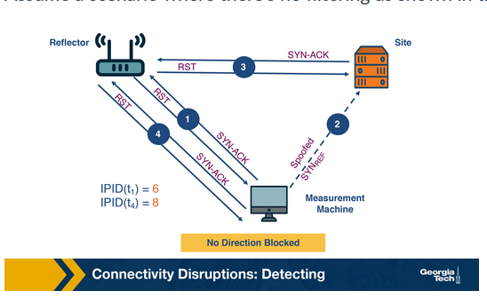
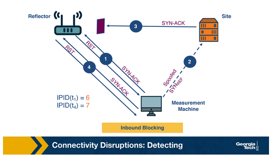
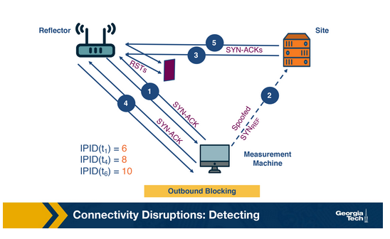

# Internet Surveillance and Censorship

In this lecture, we focus on internet censorship, which is a special case of Internet security. It is a more subtle category of attacks, and it presents its own unique challenges to detect and measure it.  

In this lecture, we learn about techniques that attackers have developed to abuse popular protocols that we have learned about in earlier lectures (such as DNS and BGP) with the goal of controlling access to information.

We will focus on three types of censorship: **Internet connectivity**, **DNS censorship**, and **social media-based censorship**.

## DNS Censorship: What is it?

DNS censorship is a large-scale network traffic filtering strategy opted by a network to enforce control and censorship over Internet infrastructure to suppress material that they deem as objectionable. An example os the Great Firewall of China (GFW).



The GFW (shown in the figure above) works by injecting fake DNS record responses so that access to a domain name is blocked. Since the GFW is an opaque system, several different studies have been performed to deduce the actual nature of the system and its functionality. Researchers have tried to reverse engineer the GFW and to understand how it works. Researchers have started to identify some of the properties:

1. Locality of GFW nodes
   - The majority believe the censorship nodes are present at the edge ISPs
2. Centralized management
   - Since the block-lists obtained from two distinct GFW locations are the same, there is a high possibility of a central management (GFW Manager) entity that orchestrates block-lists.
3. Load balancing
   - GFW load balances between processes based on source and destination IP address. The processes are clustered together to collectively send injected DNS responses.

## DNS Censorship: How does it work?

Researchers have identified (using active probing techniques and measurements) that one of the main first censorship techniques implemented by GFW was based on **DNS injection**.

The GFW uses a rule-set to determine when to inject DNS replies to censor network traffic. To start with, it is important to identify and isolate the networks that use DNS injection for censorship. Researchers use probing techniques and vantage points to search for injected paths and then evaluate the injection.

When tested against probes for restricted and benign domains, the accuracy of DNS open resolvers to accurately pollute the response is recorded over 99.9%. The steps involved in DNS injection are:

1. DNS probe is sent to the open DNS resolvers
2. The probe is checked against the blocklist of domains and keywords
3. For domain-level blocking, a fake DNS A record response is sent back. There are two levels of blocking domains: the first one is by directly blocking the domain, and the second one is by blocking it based on keywords present in the domain

## DNS Censorship: An overview of different techniques

### Packet Dropping

All network traffic going to a set of specific IP addresses is discarded. The censor identifies undesirable traffic and chooses to not properly forward any packets it sees associated with the traversing undesirable traffic instead of following a normal routing protocol.

Strengths:

1. Easy to implement
2. Low cost

Weaknesses:

1. Maintenance of block-list - It is challenging to stay up to date with the list of IP addresses to block
2. Over-blocking - If two websites share the same IP address and the intention is only to block one of them, there’s a risk of blocking both

### DNS Poisoning

When a DNS receives a query for resolving the hostname to an IP address - if there is no answer returned or an incorrect answer is sent to redirect or mislead the user request.

Strengths:

No over-blocking: Since there is an extra layer of hostname translation, access to specific hostnames can be blocked versus blanket IP address blocking.

Weaknesses:

Blocks the entire domain. It is not possible to allow email contact while blocking the website.

### Content Inspection

#### Proxy-based content inspection

This censorship technique is more sophisticated in that it allows for all network traffic to pass through a proxy where the traffic is examined for content, and the proxy rejects requests that serve objectionable content.

Strengths:

1. Precise censorship: A very precise level of censorship can be achieved, down to the level of single web pages or even objects within the web page.
2. Flexible: Works well with hybrid security systems. E.g., with a combination of other censorship techniques like packet dropping and DNS poisoning.

Weaknesses:

Not scalable: They are expensive to implement on a large-scale network as the processing overhead is large (through a proxy)

#### Intrusion detection system (IDS) based content inspection

An alternative approach is to use parts of an IDS to inspect network traffic. An IDS is easier and more cost-effective to implement than a proxy-based system as it is more responsive than reactive in nature in that it informs the firewall rules for future censorship.

### Blocking with Resets

The GFW employs this technique where it sends a TCP reset (RST) to block individual connections that contain requests with objectionable content. We can see this by packet capturing of requests that are normal and requests that contain potentially flag-able keywords.

Consider the following example packet capture.

Request 1: Requesting a benign web page

Here, we see a packet trace from a client in Cambridge (cam 53382) to a website based in China (china(http)) for a web page which is benign.

```txt
cam(53382)  → china(http) [SYN] 

china(http) → cam(53382) [SYN, ACK] 

cam(53382)  → china(http) [ACK] 

cam(53382)  → china(http) GET / HTTP/1.0 

china(http) → cam(53382) HTTP/1.1 200 OK (text/html) etc...

china(http) → cam(53382) ...more of the web page 

cam(53382)  → china(http) [ACK]

            ...and so on until the page was complete
```

Ultimately, the website was served successfully.

Request 2: Requesting with a potentially flaggable text within the HTTP GET request

Here, we have a packet trace which contains flagged text.

```txt
cam(54190)  → china(http) [SYN] 

china(http) → cam(54190) [SYN, ACK] TTL=39 

cam(54190)  → china(http) [ACK] 

cam(54190)  → china(http) GET /?falun HTTP/1.0 

china(http) → cam(54190) [RST] TTL=47, seq=1, ack=1

china(http) → cam(54190) [RST] TTL=47, seq=1461, ack=1 

china(http) → cam(54190) [RST] TTL=47, seq=4381, ack=1 

china(http) → cam(54190) HTTP/1.1 200 OK (text/html) etc...

cam(54190)  → china(http) [RST] TTL=64, seq=25, ack zeroed 

china(http) → cam(54190) ...more of the web page 

cam(54190)  → china(http) [RST] TTL=64, seq=25, ack zeroed 

china(http) → cam(54190) [RST] TTL=47, seq=2921, ack=25
```

After the client (cam54190) sends the request containing flag-able keywords, it receives 3 TCP RSTs corresponding to one request, possibly to ensure that the sender receives a reset. The RST packets received correspond to the sequence number of 1460 sent in the GET request.

### Immediate Reset of Connections

Censorship systems like GFW have blocking rules, in addition to inspecting content, to suspend traffic coming from a source immediately for a  short period of time. After sending a request with flaggable keywords (above), we see a series of packet trace like this:

```txt
cam(54191)  → china(http) [SYN]

china(http) → cam(54191) [SYN, ACK] TTL=41

cam(54191)  → china(http) [ACK]

china(http) → cam(54191) [RST] TTL=49, seq=1
```

The reset packet received by the client is from the firewall. It does not matter that the client sends out legitimate GET requests following one “questionable” request. It will continue to receive resets from the firewall for a particular duration. Running different experiments suggests that this blocking period is variable for “questionable” requests.

## Why is DNS Manipulation Difficult to Measure?

1. Diverse measurements
   - We need widespread longitudinal measurements to understand global Internet manipulation and the heterogeneity of DNS manipulation, across countries, resolvers, and domains.
2. Need for scale
3. Identifying the intent to restrict content access
4. Ethics and Minimizing Risks

## Example Censorship Detection Systems

- CensMon using PlanetLab nodes in different countries.
- OpenNet Initiative
- Augur

## Global Measurement Methodology for DNS Censorship

The figure below shows an overview of the identification process.


In order to counter the lack of diversity while studying DNS manipulation Iris uses open DNS resolvers located all over the globe. In order to avoid using home routers, this dataset is then restricted to a few thousand that are part of the Internet infrastructure. There are two main steps associated with this process:

1. Scanning the Internet’s IPv4 space for open DNS resolvers
2. Identifying Infrastructure DNS Resolvers

After obtaining a global set of open DNS resolvers, we need to perform the measurements. The steps involved in this measurement process are:

1. Performing global DNS queries
2. Annotating DNS responses with auxiliary information
3. Additional PTR and TLS scanning

After annotating the dataset, techniques are performed to clean the dataset and identify whether DNS manipulation is taking place or not. Iris uses two types of metrics to identify this manipulation:

1. Consistency Metrics
   - Domain access should have some consistency, in terms of network properties, infrastructure, or content, even when accessed from different global vantage points. Using one of the domains Iris controls gives a set of high-confidence consistency baselines. Some consistency metrics used are IP address, Autonomous System, HTTP Content, HTTPS Certificate, PTRs for CDN.
2. Independent Verifiability Metrics
   - Some of the independent verifiability metrics used are HTTPS certificate (whether the IP address presents a valid, browser-trusted certificate for the correct domain name when queried without SNI) and HTTPS Certificate with SNI.

If any consistency metric or independent verifiability metric is satisfied, the response is correct. Otherwise, the response is classified as manipulated.

## Censorship Through Connectivity Disruptions

The highest level of Internet censorship is to completely block access to the Internet. Intuitively, this can be done by manually disconnecting the hardware that are critical to connect to the Internet. Although this seems simple, it may not be feasible as the infrastructure could be distributed over a wide area.

A more subtle approach is to use software to interrupt the routing or packet forwarding mechanisms. The following are two mechanisms by which this can be achieved.

1. Routing disruption
   - A routing mechanism decides which part of the network can be reachable.BGP communication is disrupted or disabled on critical routers. Using this approach can be easily detectable, as it involves withdrawing previously advertised prefixes or re-advertising them with different properties and therefore modifying the global routing state of the network, which is the control plane.
2. Packet filtering
   - To disrupt a network’s connectivity, packet filtering is used to block packets matching a certain criteria which disrupts the normal forwarding action.This approach can be harder to detect and might require active probing of the forwarding path or monitoring traffic of the impacted network.

Connectivity disruption can include multiple layers apart from the two methods described above. It can include DNS-based blocking, deep packet inspection by an ISP or the client software blocking the traffic, to list a few.

## Detecting Connectivity Disruptions

In this section, we focus on a system, Augur, which uses a measurement machine to detect filtering between hosts. The system aims to detect if filtering exists between two hosts, a reflector and a site. A reflector is a host which maintains a global IP ID. A site is a host that may be potentially blocked. To identify if filtering exists, it makes use of a third machine called the measurement machine.

### IP ID

Augur's strategy capitalizes on the unique 16-bit IP identifier (IP ID) assigned to each packet sent by a host, crucial for packet reassembly. Typically maintained through a global counter, this IP ID helps track packet generation. Augur also exploits the behavior of hosts, which respond to unexpected TCP packets with a TCP Reset (RST) packet, assuming no complicating factors like cross-traffic or packet loss. Two key mechanisms are employed:

1. Probing
   - The measurement machine monitors the reflector's IP ID by sending a TCP SYN-ACK and receiving a TCP RST in response, containing the reflector's latest IP ID.
2. Perturbation
   - This mechanism increments a host's IP ID counter by sending traffic from various sources, triggering a response packet. The process involves spoofing a TCP SYN packet to the reflector's IP address, receiving a TCP SYN-ACK response from the site, and obtaining a TCP RST from the reflector while incrementing its IP ID counter.

Understanding how to probe and perturb IP ID values, we can analyze potential scenarios, assuming an initial reflector IP ID counter of 5.

### No filtering

Assume a scenario where there’s no filtering as shown in the below figure.



The sequence of events is as follows:

1. The measurement machine probes the IP ID of the reflector by sending a TCP SYN-ACK packet. It receives a RST response packet with IP ID set to 6 (IPID (t1)).
2. Now, the measurement machine performs perturbation by sending a spoofed TCP SYN to the site.
3. The site sends a TCP SYN-ACK packet to the reflector and receives a RST packet as a response. The IP ID of the reflector is now incremented to 7.
4. The measurement machine again probes the IP ID of the reflector and receives a response with the IP ID value set to 8 (IPID (t4)).

The measurement machine thus observes that the difference in IP IDs between steps 1 and 4 is two and infers that communication has occurred between the two hosts.

### Inbound blocking

When filtering occurs from the site to the reflector, termed as inbound blocking, the SYN-ACK packet sent from the site doesn't reach the reflector, preventing a response and stalling the reflector's IP ID. The returned IP ID in step 4 remains at 7 (IPID(t4)). By observing the incremental value of 1 in the IP ID, the measurement machine identifies filtering along the site-reflector path.



### Outbound blocking

Outbound blocking involves filtering on the reflector's outgoing path. The reflector receives the SYN-ACK packet, incrementing the IP ID to 7 in step 3, but the subsequent RST packet doesn't reach the site. The site continues to resend SYN-ACK packets, leading to further IP ID increments on the reflector. In step 6, the measurement machine detects an increase of 2 in the IP ID, indicating packet retransmission and the presence of outbound blocking.


